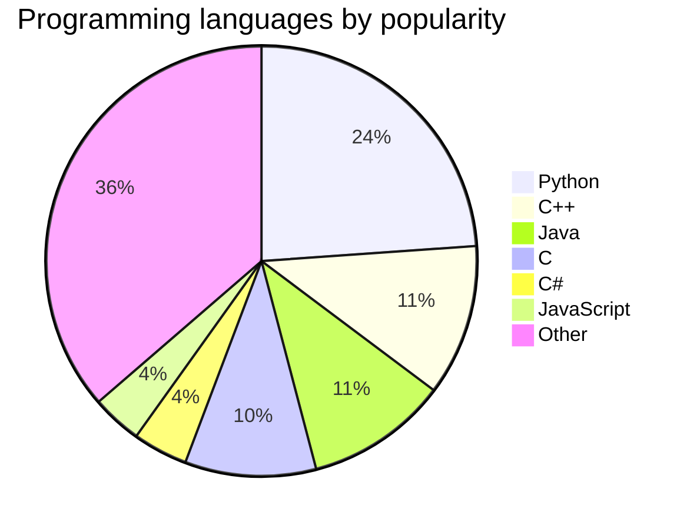
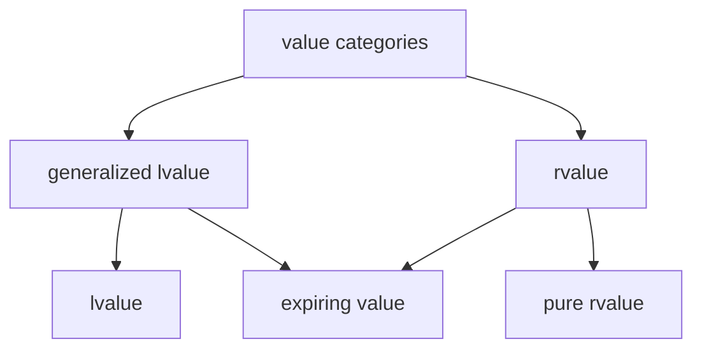

# Example Slides
Showcasing reveal.js features.
---


<https://revealjs.com/>
---
<!-- .slide: data-background-color="white" -->
Black text on white background.
---
```c++ []
import std;

int main()
{
    int x{5};
    some_function(std::move(x));
}
```
What is the value category of `x`?
* lvalue
* xvalue <!-- .element: class="fragment highlight-current-blue" -->
* prvalue

Note:
* Using fragments in markdown.
---
```c++ []
import std;

int main()
{
    int x{5};
    some_function(std::move(x));
}
```
What is the value category of `x`?
<div style="display: flex; justify-content: space-evenly;">
    <div>a) lvalue</div>
    <div class="fragment highlight-current-blue">b) xvalue</div>
    <div>c) prvalue</div>
</div>

Note:
* Using inline HTML.
---

## Mermaid Plugin
<https://mermaid.js.org/ecosystem/tutorials.html>
---


Note:
* Source: <https://www.tiobe.com/tiobe-index/>
---

