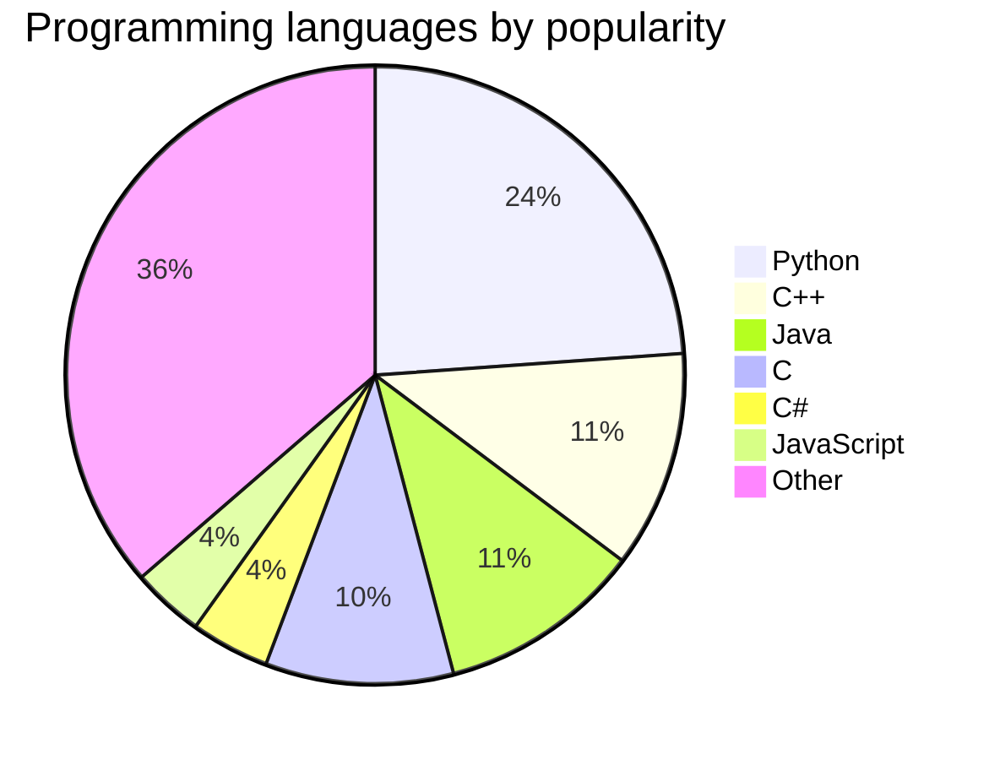
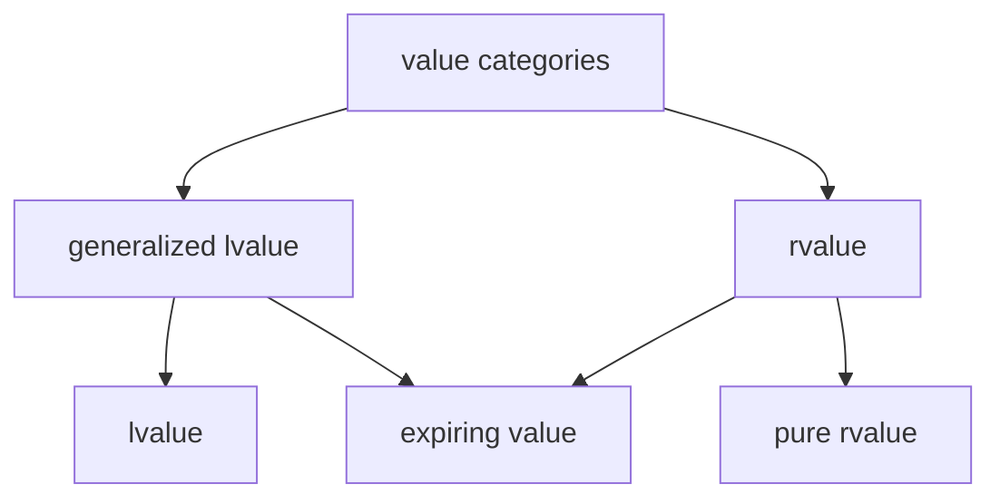

# Example Slides
---

<https://revealjs.com/>
---

## Mermaid Plugin
<https://mermaid.js.org/ecosystem/tutorials.html>
---

```mermaid
pie title Programming languages by popularity
    "Python" : 23.88
    "C++" : 11.37
    "Java" : 10.66
    "C" : 9.84
    "C#": 4.12
    "JavaScript": 3.78
    "Other" : 36.35
```

Note:
* Source: <https://www.tiobe.com/tiobe-index/>
---

```mermaid
graph TD;
    A["value categories"] --> B["generalized lvalue"];
    A --> C["rvalue"];
    B --> D["lvalue"];
    B --> E["expiring value"];
    C --> E;
    C --> F["pure rvalue"];
```
