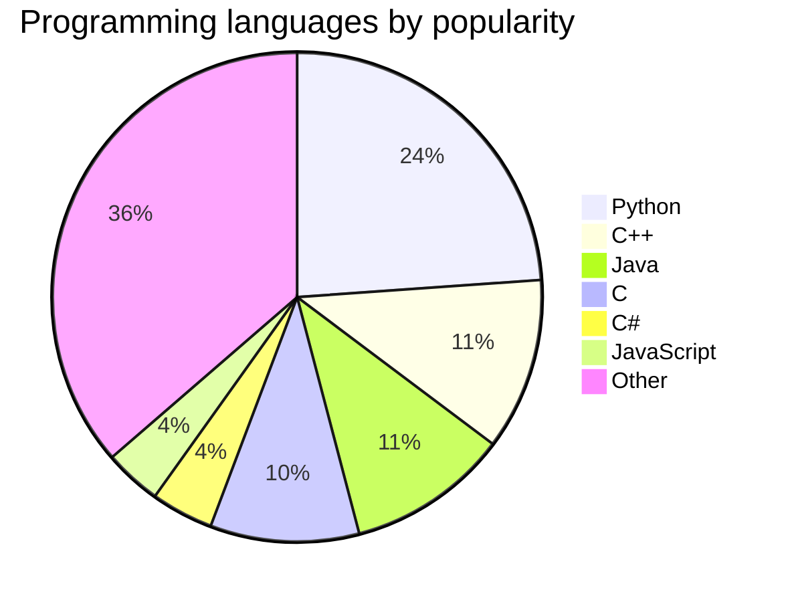
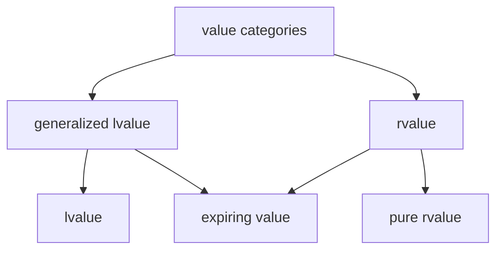

# Example Slides

Showcasing reveal.js features.

---


<https://revealjs.com/>

---

<!-- .slide: data-visibility="hidden" -->

This slide is excluded.

---

<!-- .slide: data-background-color="white" -->

Black text on white background.

---

<!-- .slide: data-background-gradient="linear-gradient(to bottom, #0a0a0a, #1a1a2e, #222222)" -->

```css
.reveal .slides pre.code-wrapper:not(:has(> code.mermaid)) > code {
    background: color-mix(in srgb, currentColor 10%, transparent) !important;
}
```

Background gradient. Use the css above to make code segments semi transparent.

---

```c++ []
import std;

int main()
{
    int x{5};
    some_function(std::move(x));
}
```

What is the value category of `x`?

* lvalue <!-- .element: class="fragment semi-fade-out shrink" data-fragment-index="1" -->
* xvalue <!-- .element: class="fragment highlight-current-blue grow" data-fragment-index="1" -->
* prvalue <!-- .element: class="fragment semi-fade-out shrink" data-fragment-index="1" -->

Note:

* Using fragments in markdown.

---

```c++ []
import std;

int main()
{
    int x{5};
    some_function(std::move(x));
}
```

What is the value category of `x`?

<div style="display: flex; justify-content: space-evenly;">
    <div class="fragment semi-fade-out shrink" data-fragment-index="1">a) lvalue</div>
    <div class="fragment highlight-current-blue grow" data-fragment-index="1">b) xvalue</div>
    <div class="fragment semi-fade-out shrink" data-fragment-index="1">c) prvalue</div>
</div>

Note:

* Using inline HTML.

---


## Mermaid Plugin

<https://mermaid.js.org/ecosystem/tutorials.html>

---



Note:

* Source: <https://www.tiobe.com/tiobe-index/>

---


