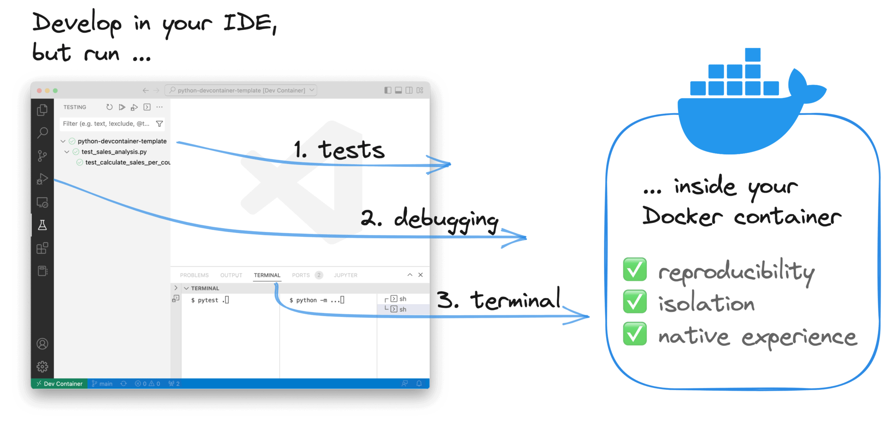
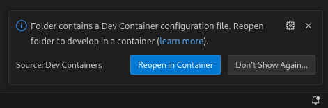
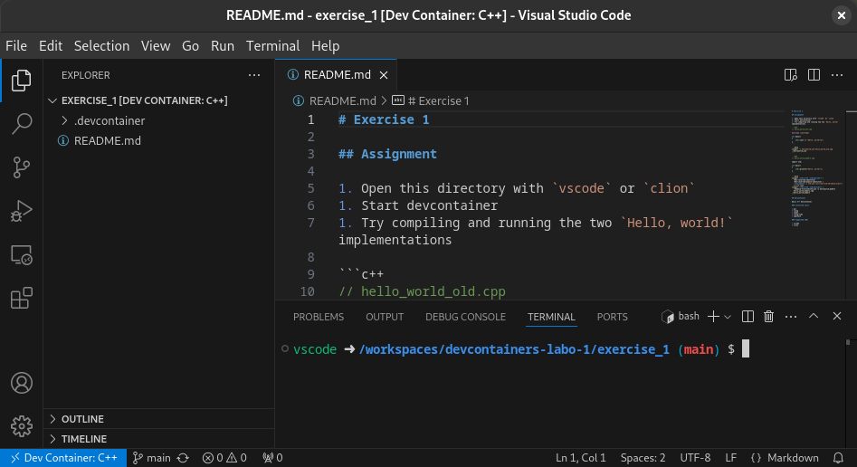

# Development Containers

Crash course docker and development containers.

---

## Problem statement

---

I work on many projects, each with its own tool requirements. Some even use the same tool, but a different version.

---

I have to figure out which tools I need, download and install them, and make sure I use the correct version for each project.
This is hard! ☹️

---

* I don't want to figure out which tools I need &mdash; the project should provide a list.
* I don't want to install the tools system-wide, to avoid version conflicts with other projects.

---

## Solution

---

Create a virtual machine for each project?

(e.g. virtualbox, vmware, ...)

---

Virtual machines are several gigabytes in size, so they can't be added to version control (e.g. a git repository).

---

* I don't want to figure out which tools I need &mdash; the project should provide a list. ⛔️
* I don't want to install the tools system-wide to avoid version conflicts. ✅

---

Can we do better?

---


Note:

* <https://www.docker.com/>

---

Build virtual machines from a text file that lists the required tools.

---

<!--- cSpell:disable --->
```dockerfile
# Pick operating system for virtual machine
FROM mcr.microsoft.com/devcontainers/base:ubuntu-24.04

# Install required tools
RUN apt-get update && export DEBIAN_FRONTEND=noninteractive \
    && apt-get -y install software-properties-common \
                          build-essential cmake valgrind \
                          clang lldb llvm gdb
```
<!--- cSpell:enable --->

### Dockerfile

---

A Dockerfile can be added to version control!

---

* I don't want to figure out which tools I need &mdash; the project should provide a list. ✅
* I don't want to install the tools system-wide, to avoid version conflicts. ✅

---

But I'm still not happy...

---

* I don't want to manually build and run the docker container.
* I don't want to manually configure my IDE for remote development.

---

### Development Containers

Note:

* <https://containers.dev/>

---

<!-- .slide: data-background-color="white" -->



Note:

* Image credit: <https://xebia.com>

---

Add a devcontainer.json file inside a .devcontainer directory to project. Your IDE will automatically detect it, build the
development container, and connect to it.

---

<!--- cSpell:disable --->
```json
{
    "name": "My fancy C++ container",
    "build": {
        "dockerfile": "Dockerfile"
    },
    "customizations": {
        "vscode": {
            "extensions": [
                "ms-vscode.cpptools-extension-pack"
            ]
        }
    },
    "remoteUser": "vscode"
}
```
<!--- cSpell:enable --->

#### devcontainer.json

Note:

* It's a text file, so it can be version controller.
* You can use a Dockerfile or reference an existing image.
* You can configure IDE settings and specify extensions.

---

* I don't want to manually build and run the Docker container. ✅
* I don't want to manually configure my IDE for remote development. ✅

---

Now I'm happy! 😁

---

## Crash course: Development containers

---

### Starting a project in a devcontainer

---

#### Step 1: Open the project directory in your IDE

(vscode, clion)

Note:

* The project directory should contain the .devcontainer folder.

---

#### Step 2: VSCode will prompt you to install the Dev Containers extension &mdash; accept

(Unless it's already installed.)

---

<video controls width="600">
  <source src="./assets/vscode_open_devcontainer.mp4" type="video/mp4">
  
</video>

#### Step 3: VSCode will ask if you want to reopen the project in a devcontainer &mdash; accept

Note:

* This might take a while, as Docker has to build and start the container.

---



#### Step 4: Happy coding 😁

---

### devcontainer.json

---

<!--- cSpell:disable --->
```json
{
    "name": "C++",
    "build": {
        "dockerfile": "Dockerfile",
        "args": {
            "GCC_VERSION": "14",
            "CLANG_VERSION": "19",
            "CMAKE_VERSION": "3.31.4",
            "CPPCHECK_VERSION": "2.16.2"
        }
    },
    "customizations": {
        "vscode": {
            "settings": {
                "C_Cpp.intelliSenseEngine": "Tag Parser",
                "C_Cpp.default.configurationProvider": "ms-vscode.cmake-tools",
                "C_Cpp.codeAnalysis.clangTidy.enabled": false,
                "C_Cpp.codeAnalysis.clangTidy.path": "/usr/bin/clang-tidy",
                "C_Cpp.codeAnalysis.clangTidy.useBuildPath": true,
                "C_Cpp.codeAnalysis.runAutomatically": true,
                "C_Cpp.clang_format_path": "/usr/bin/clang-format",
                "plantuml.server": "https://www.plantuml.com/plantuml"
            },
            "extensions": [
                "ms-vscode.cpptools-extension-pack",
                "jebbs.plantuml",
                "DavidAnson.vscode-markdownlint",
                "cheshirekow.cmake-format"
            ]
        }
    },
    "remoteUser": "vscode"
}
```
<!--- cSpell:enable --->

Example using Dockerfile

---

<!--- cSpell:disable --->
```json
{
    "name": "node.js",
    "image": "mcr.microsoft.com/devcontainers/typescript-node:16-bullseye",
    "postCreateCommand": "npm install",
    "remoteUser": "node"
}
```
<!--- cSpell:enable --->

Example using an existing image

---

For a full reference of the devcontainer.json file, see <https://containers.dev/implementors/json_reference/>

---

## Crash course: Docker

---

### Installing docker on windows

<https://docs.docker.com/desktop/setup/install/windows-install/>

---

Using development containers can leave behind Docker containers and images that take up disk space.

---

```bash
# show the list of docker images
docker images
```

```bash
# show the list of all running and stopped containers
docker ps -a
```

```bash
# remove all images that are not in use by running containers
# remove all stopped containers
docker system prune -af
```

---

Want to learn how to use Docker outside of development containers?

---

<https://cursus.hermans.casa/embedded-linux/embedded-linux-h4/>

<!--- cSpell:disable-next-line --->
Check out this slide deck by Wouter Peetermans.
