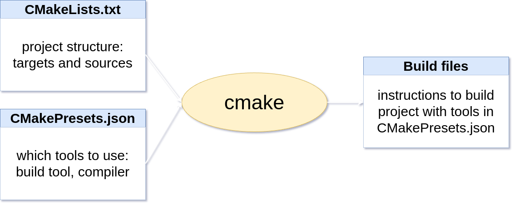
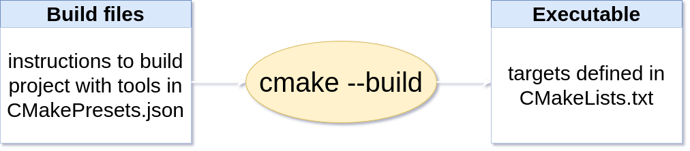
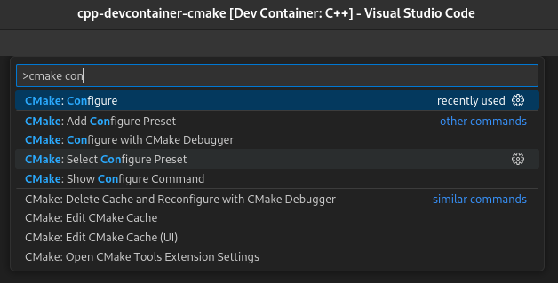
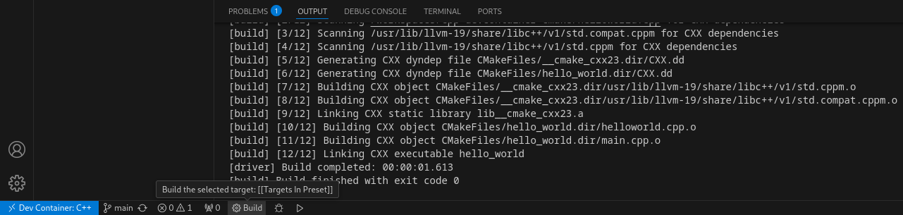

# C/C++ Programming

## Labo 1

---

## Installing the right tools

---

* clang
* clang-tidy
* clang-format
* cmake
* ninja
* ...

---

Long list of tools that all need to be the correct version.

---

Use a devcontainer with all the right tools instead!

---

## Compiling code using clang

<https://clang.llvm.org/>

---

### Why clang?

* Excellent compiler
* Only one that already supports import std 😉

---

### Before C++20

```c++ []
// main.cpp

#include <iostream>

int main()
{
    std::cout << "Hello, world!\n";
}
```

---

### Piece of cake! 😎

```bash
clang++ -o helloworld main.cpp
```

```bash
./helloworld
```

Note:

* helloworld is name of executable
* run with `./helloworld`
* gcc compiler also works
* `g++ -o helloworld main.cpp`

---

### C++23

```c++ []
// main.cpp

import std;

int main()
{
    std::println("Hello, world!");
}
```

---

### Hmmm... 🤔

<!--- cSpell:disable --->
```bash
clang++ -std=c++23 -stdlib=libc++ \
  -Wno-reserved-identifier -Wno-reserved-module-identifier \
  --precompile -o std.pcm /usr/lib/llvm-19/share/libc++/v1/std.cppm
```
<!--- cSpell:enable --->

<!--- cSpell:disable --->
```bash
clang++ -std=c++23 -stdlib=libc++ \
  -fmodule-file=std=std.pcm -o helloworld main.cpp
```
<!--- cSpell:enable --->

* Build std module first
* Then build main.cpp and link std module

---

## Exercise

---

1. Clone <https://gitlab.apstudent.be/cpp-programming/devcontainers-labo-1.git>
2. Open `exercise_1` with `vscode` or `clion`
3. Start devcontainer
4. Try compiling and running the two examples

---

### Multiple source files

---

```c++ []
// helloworld.cpp

export module helloworld;

import std;

export void hello()
{
    std::println("Hello, world!");
}
```

```c++ []
// main.cpp

import helloworld;

int main()
{
    hello();
}
```

---

### Ouch!? 😬

<!--- cSpell:disable --->
```bash
clang++ -std=c++23 -stdlib=libc++ \
  -Wno-reserved-identifier -Wno-reserved-module-identifier \
  --precompile -o std.pcm /usr/lib/llvm-19/share/libc++/v1/std.cppm

clang++ -std=c++23 -stdlib=libc++ \
  -fmodule-file=std=std.pcm --precompile -x c++-module -o helloworld.pcm helloworld.cpp

clang++ -std=c++23 -stdlib=libc++ \
  -fmodule-file=std=std.pcm -fmodule-file=helloworld=helloworld.pcm -o helloworld main.cpp
```
<!--- cSpell:enable --->

```bash
/usr/bin/ld: /tmp/main-2b3cf5.o: in function `main':
main.cpp:(.text+0x5): undefined reference to `hello@helloworld()'
clang++: error: linker command failed with exit code 1 (use -v to see invocation)
```

Note:

* Hard to get right
* Still results in linker error
* We don't want to do this

---

### Let's avoid doing this manually

* Gets complex very quickly
* Use build tool instead! 👍

---


<https://cmake.org/>

---

Build system generator.

Note:

* Generates the required files to build the project with the desired tools
* Two phases: configure and build
* Configure: generate build files from project setup and tools
* Build: produce executable by running build files using build tool and compiler

---



### Step 1: Configure

---



### Step 2: Build

---

### CMakeLists.txt

```cmake
cmake_minimum_required(VERSION 3.30 FATAL_ERROR) # mandatory

# create a c++ project with name HelloWorld
project(HelloWorld LANGUAGES CXX)

# add a new target: executable with name hello_world
add_executable(hello_world)
target_sources(hello_world
    PRIVATE FILE_SET CXX_MODULES FILES
    # add module source files here
    helloworld.cpp
    PRIVATE
    # add old-style source files here
    main.cpp
)
```

Note:

* lines not shown are configuration to support modules
* main.cpp should be the only old-style source file
* all other source files should be modules
* project is allowed to have many targets

---

### CMakePresets.json

<!--- cSpell:disable --->
```json
  "configurePresets": [
      {
          "name": "clang-debug",
          "generator": "Ninja",
          "binaryDir": "${sourceDir}/build/${presetName}",
          "cacheVariables": {
              "CMAKE_CXX_COMPILER": "/usr/bin/clang++",
              "CMAKE_CXX_FLAGS": "-stdlib=libc++ -D_LIBCPP_HARDENING_MODE=_LIBCPP_HARDENING_MODE_DEBUG",
              "CMAKE_EXE_LINKER_FLAGS": "-lc++ -lc++abi",
              "CMAKE_BUILD_TYPE": "Debug"
          }
      }
  ]
```
<!--- cSpell:enable --->

Note:

* where to output object files and executable
* which build system to use
* which compiler to use
* select standard library (and enable bounds checks)
* ...

---

### Commandline CMake

---

```bash
# Step 1: Configure project
cmake --preset configure_preset_name
```

```bash
# Step 2: Build target
cmake --build --preset build_preset_name
```

```bash
# Step 3: Run executable
./build/configure_preset_name/executable_name
```

---

#### Example

```bash
cmake --preset clang-debug
```

```bash
cmake --build --preset clang-debug-build
```

```bash
./build/clang-debug/hello_world
```

Note:

* configure preset = clang-debug
* build preset = clang-debug-build
* target executable = hello_world

---

### VSCode Integration

---

<video controls width="600">
  <source src="./assets/vscode_cmake_select_config.mp4" type="video/mp4">
  
</video>

Select the configuration preset `clang-debug` from the vscode command palette.

Note:

* Open command palette: Ctrl+Shift+P
* But should ask to select preset automatically

---

<video controls width="800">
  <source src="./assets/vscode_cmake_build_run.mp4" type="video/mp4">
  
</video>

Build and run the project using the cmake buttons in the vscode status bar.

Note:

* CMake integration can be found in the status bar
* Build, Run, Debug

---

### Exercise

---

1. Clone <https://gitlab.apstudent.be/cpp-programming/devcontainers-labo-1.git>
2. Open `exercise_2` with `vscode` or `clion`
3. Start devcontainer
4. Try configuring and building the project
5. Try running the project

---

## Compiler warnings, Static analysis, and Code formatting

---

Tools to help you write quality code.

---

### Compiler warnings

---

They exist for a reason.

---

Enable all of them and treat them as errors!

---

<!--- cSpell:disable --->
```cmake
target_compile_options(hello_world PRIVATE
    "-Wall;-Wextra;-Wpedantic;-Wshadow;-Wconversion"
    "-Wsign-conversion;-Wdouble-promotion;-Wextra-semi"
    "-Wnon-virtual-dtor;-Wold-style-cast;-Wcast-align"
    "-Wunused;-Woverloaded-virtual;-Wnull-dereference"
    "-Wimplicit-fallthrough;-Wformat=2;-Werror"
)
```
<!--- cSpell:enable --->

Add to each target in `CMakeLists.txt`.

---

### Static analysis

clang-tidy

---

* Check [C++ Core Guidelines](https://isocpp.github.io/CppCoreGuidelines/CppCoreGuidelines)
* Check for potential bugs
* Check naming conventions

---

```cmake
# look where clang-tidy is installed
find_program(CLANG_TIDY NAMES clang-tidy REQUIRED)

# enable clang-tidy for the hello_world target
set_target_properties(hello_world PROPERTIES CXX_CLANG_TIDY
    "${CLANG_TIDY}"
)
```

Add in `CMakeLists.txt` to run as compilation step.

Note:

* Extra arguments required for clang-tidy to make it work with modules.
* Violations will be listed as compilation errors.

---

### Formatting code

clang-format

---

Automatically format source code.

---

<video controls width="800">
  <source src="./assets/vscode_clang_format.mp4" type="video/mp4">
  vscode clang-format demo
</video>

---

### Exercise

---

1. Clone <https://gitlab.apstudent.be/cpp-programming/devcontainers-labo-1.git>
2. Open `exercise_3` with `vscode` or `clion`
3. Try configuring and building the project
4. Run clang-format in `helloworld.cpp`
5. Solve the clang-tidy error in the `Hello` function
6. Add `// NOLINT(bugprone-exception-escape)` to the `main` function (this is a violation we can't fix yet)
