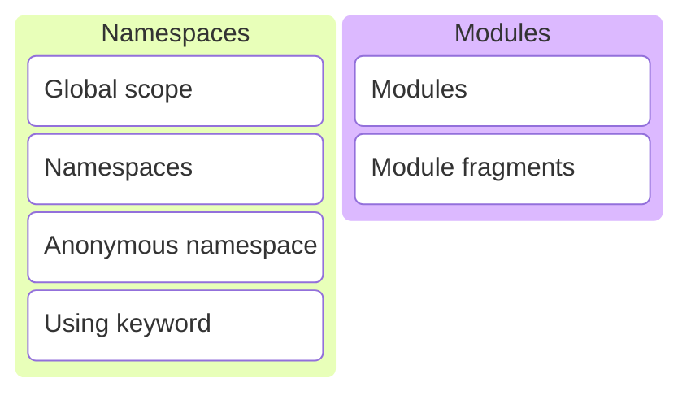

# C/C++ Programming


---



---

So far we added most definitions to the global scope.

---

```c++ [3-7,9-10]
import std;

// function say_hello is defined in the global scope
void say_hello()
{
    std::println("Hello, world!");
}

// variable my_global_var is defined in the global scope
int my_global_var{5};

int main()
{
    say_hello();
}
```

`main.cpp` is a translation unit

---

```c++ []
export module hello;

import std;

export void say_hello()
{
    std::println("Hello, world!");
}
```

```c++ []
// everything exported in module hello is made available
import hello;

int main()
{
    say_hello();
}
```

---

What if two modules both export a function with the same name and arguments? 🤔

---

```c++ []
export module first;

import std;

export void hello()
{
    std::println("First!");
}
```

```c++ []
export module second;

import std;

export void hello()
{
    std::println("Second!");
}
```

Note:

* Both modules export a function named hello with no arguments.

---

```c++ []
import first;
import second;
import std;

int main()
try
{
    hello();
}
catch (std::exception const& e)
{
    std::cerr << e.what() << "\n";
}
```

What will the program print?

<div style="display: flex; justify-content: space-evenly;">
    <div class="fragment semi-fade-out shrink" data-fragment-index="1">a) First!</div>
    <div class="fragment semi-fade-out shrink" data-fragment-index="1">b) Second!</div>
    <div class="fragment highlight-current-blue grow" data-fragment-index="1">c) error</div>
</div>

---

<!-- markdownlint-disable line-length -->
```sh [1-6]
[build] first.cpp:5:13: error: declaration 'hello' attached to named module 'first' cannot be attached to other modules [clang-diagnostic-error]
[build]     5 | export void hello()
[build]       |             ^
[build] second.cpp:5:13: note: also found
[build]     5 | export void hello()
[build]       |             ^
[build] second.cpp:5:13: error: 'hello' has different definitions in different modules; definition in module 'second' first difference is function body [clang-diagnostic-error]
[build]     5 | export void hello()
[build]       |        ~~~~~^~~~~~~
[build]     6 | {
[build]       | ~
[build]     7 |     std::println("Second!");
[build]       |     ~~~~~~~~~~~~~~~~~~~~~~~~
[build]     8 | }
[build]       | ~
[build] first.cpp:5:13: note: but in 'first' found a different body
[build]     5 | export void hello()
[build]       |        ~~~~~^~~~~~~
[build]     6 | {
[build]       | ~
[build]     7 |     std::println("First!");
[build]       |     ~~~~~~~~~~~~~~~~~~~~~~~
[build]     8 | }
[build]       | ~
[build] 190036 warnings and 2 errors generated.
```
<!-- markdownlint-enable line-length -->

Violation of the [One Definition Rule](https://en.cppreference.com/w/cpp/language/definition) (ODR)!

---

How to distinguish symbols with the same name from different libraries?

---

## Namespaces

<https://en.cppreference.com/w/cpp/language/namespace>

---

Namespaces provide a method for preventing name conflicts in large projects.

---

<!-- .slide: data-background-image="./assets/clock.png" data-background-size="contain" data-background-opacity=".5" -->

<countdown time="300" autostart="yes" />

Note:

* Lookup on the Internet what namespaces are and how to use them.

---


### namespaces

--

```c++
namespace a { void hello() { std::println("hello_a"); } }
namespace b { void hello() { std::println("hello_b"); } }
```

```c++
b::hello();
```

What will the program print?

<div style="display: flex; justify-content: space-evenly;">
    <div class="fragment semi-fade-out shrink" data-fragment-index="1">a) hello_a</div>
    <div class="fragment highlight-current-blue grow" data-fragment-index="1">b) hello_b</div>
    <div class="fragment semi-fade-out shrink" data-fragment-index="1">c) error</div>
</div>

Note:

* Directly call the hello function in the b namespace.
* <https://compiler-explorer.com/z/7qebs9eMo>

--

```c++
namespace a { void hello() { std::println("hello_a"); } }
namespace b { void hello() { std::println("hello_b"); } }
```

```c++
using namespace a;
hello();
```

What will the program print?

<div style="display: flex; justify-content: space-evenly;">
    <div class="fragment highlight-current-blue grow" data-fragment-index="1">a) hello_a</div>
    <div class="fragment semi-fade-out shrink" data-fragment-index="1">b) hello_b</div>
    <div class="fragment semi-fade-out shrink" data-fragment-index="1">c) error</div>
</div>

Note:

* Everything in the a namespace is now available in the global scope.
* Calling unqualified hello will call a::hello().
* <https://compiler-explorer.com/z/b14TG9Pqb>

--

```c++
namespace a { void hello() { std::println("hello_a"); } }
namespace b { void hello() { std::println("hello_b"); } }
```

```c++
using b::hello;
hello();
```

What will the program print?

<div style="display: flex; justify-content: space-evenly;">
    <div class="fragment semi-fade-out shrink" data-fragment-index="1">a) hello_a</div>
    <div class="fragment highlight-current-blue grow" data-fragment-index="1">b) hello_b</div>
    <div class="fragment semi-fade-out shrink" data-fragment-index="1">c) error</div>
</div>

Note:

* Bring only the hello function from the b namespace in scope.
* <https://compiler-explorer.com/z/59PfYMs9s>

--

```c++
namespace a { void hello() { std::println("hello_a"); } }
namespace b { void hello() { std::println("hello_b"); } }
```

```c++
using a::hello;
using b::hello;
hello();
```

What will the program print?

<div style="display: flex; justify-content: space-evenly;">
    <div class="fragment semi-fade-out shrink" data-fragment-index="1">a) hello_a</div>
    <div class="fragment semi-fade-out shrink" data-fragment-index="1">b) hello_b</div>
    <div class="fragment highlight-current-blue grow" data-fragment-index="1">c) error</div>
</div>

Note:

* Both hello from a and hello from b are now in scope.
* Compiler does not know which function to call.
* <https://compiler-explorer.com/z/7MqYja1MW>

--

```c++
namespace a {
  void f(int)    { std::println("a::f(int)");    }
  void f(double) { std::println("a::f(double)"); }
}
namespace b {
  void f(int)    { std::println("b::f(int)");    }
  void f(double) { std::println("b::f(double)"); }
  void f(char)   { std::println("b::f(char)");   }
}
```

```c++
using a::f;
using b::f;
f('a');
```

What will the program print?

<div style="display: flex; justify-content: space-evenly;">
    <div class="fragment semi-fade-out shrink" data-fragment-index="1">a) a::f(...)</div>
    <div class="fragment highlight-current-blue grow" data-fragment-index="1">b) b::f(...)</div>
    <div class="fragment semi-fade-out shrink" data-fragment-index="1">c) error</div>
</div>

Note:

* All f functions from both the a and the b namespace are in scope.
* But there is no ambiguity when calling f with a char, there's only one exact match b::f(char).
* <https://compiler-explorer.com/z/h9r4rqo31>

--

```c++
namespace a {
  void f(int)    { std::println("a::f(int)");    }
  void f(double) { std::println("a::f(double)"); }
}
namespace b {
  void f(int)    { std::println("b::f(int)");    }
  void f(double) { std::println("b::f(double)"); }
  void f(char)   { std::println("b::f(char)");   }
}
```

```c++
using a::f;
using b::f;
f(3.14);
```

What will the program print?

<div style="display: flex; justify-content: space-evenly;">
    <div class="fragment semi-fade-out shrink" data-fragment-index="1">a) a::f(...)</div>
    <div class="fragment semi-fade-out shrink" data-fragment-index="1">b) b::f(...)</div>
    <div class="fragment highlight-current-blue grow" data-fragment-index="1">c) error</div>
</div>

Note:

* All f functions from both the a and the b namespace are in scope.
* Call a::f(double) or b::f(double)?
* <https://compiler-explorer.com/z/cGqWzhW5M>

--

```c++
namespace a {
  void f(int)    { std::println("a::f(int)");    }
  void f(double) { std::println("a::f(double)"); }
}
void f(int)      { std::println("f(int)");       }
```

```c++
using namespace a;
// I want to print f(int)
```

How to call `f(int)` in the global namespace?

<div style="display: flex; justify-content: space-evenly;">
    <div class="fragment semi-fade-out shrink" data-fragment-index="1">a) f(5)</div>
    <div class="fragment highlight-current-blue grow" data-fragment-index="1">b) ::f(5)</div>
    <div class="fragment semi-fade-out shrink" data-fragment-index="1">c) not possible</div>
</div>

Note:

* <https://compiler-explorer.com/z/9zYvx74dc>

---

### Summary

---

```c++
namespace a {
    void f();
}
```

```c++
namespace b::c {
    void f();
    void g();
}
```

```c++
namespace a { // extend namespace a
    void g();
}
```

```c++
namespace d = b::c;
```

Namespace definitions.

---

```c++
namespace a {
    void f();
}

namespace b::c {
    void f();
    void g();
}

namespace d = b::c;
```

```c++
using a::f;
using namespace d;

f(); // a::f()
g(); // b::c::g()
```

Using directives.

---

There's still a problem...

---

```c++ []
// first.cpp

import std;

void hello_impl() { std::println("First!"); }
void hello_1()    { hello_impl();           }
```

```c++ []
// second.cpp

import std;

void hello_impl() { std::println("Second!"); }
void hello_2()    { hello_impl();            }
```

Does this work?

<div style="display: flex; justify-content: space-evenly;">
    <div class="fragment semi-fade-out shrink" data-fragment-index="1">a) Yes</div>
    <div class="fragment semi-fade-out shrink" data-fragment-index="1">b) Compiler error</div>
    <div class="fragment highlight-current-blue grow" data-fragment-index="1">c) Linker error</div>
</div>

Note:

* Two translations units.
* Both have an implementation detail function with the same name and arguments `hello_impl`.
* They live in the global scope.
* So this is again a violation of the One Definition Rule.

---

We need a way to mark a definition as private to a translation unit.

---

```c++ [5,7]
// first.cpp

import std;

namespace {
    void hello_impl() { std::println("First!"); }
}

void hello_1() { hello_impl(); }
```

```c++ [5,7]
// second.cpp

import std;

namespace {
    void hello_impl() { std::println("Second!"); }
}

void hello_2() { hello_impl(); }
```

The unnamed or anonymous namespace.

---

### Best practices

---

* Prevent name collisions!
* Don't write using namespace some_ns. <!-- .element: class="fragment" data-fragment-index="1" -->
* Use namespaces in larger projects. <!-- .element: class="fragment" data-fragment-index="2" -->
* Place reusable components in a namespace. <!-- .element: class="fragment" data-fragment-index="3" -->
* Place local definitions in an unnamed namespace. <!-- .element: class="fragment" data-fragment-index="4" -->

Note:

* Writing using namespace some_ns undoes what namespaces try to solve.
* The larger the project, the larger the risk of name collisions.
* Code that may be reused in other projects should be placed in a namespace.
* Avoid placing definitions that are only needed in one translation unit in the global scope.

---

Let's build further on this idea and add some improvements!

---

## Modules

<https://en.cppreference.com/w/cpp/language/modules>

---

Modules are a language feature to share declarations and definitions across translation units.

---

```c++
// helloworld.cpp
export module helloworld;

import std;

export void hello()
{
    std::println("Hello, world!");
}
```

```c++
// main.cpp
import helloworld;

int main()
{
    hello();
}
```

Note:

* The export keyword makes the hello function available to translation units that import the module.

---

```c++ [5-10]
export module helloworld;

import std;

// no export, so not available when imported
// added to the module scope (not the global scope)
void hello_impl()
{
    std::println("Hello, world!");
}

export void hello()
{
    hello_impl();
}
```

Module scope.

Note:

* Definitions in a module that are not exported are added to the module scope.
* They will only be available in the module itself (and its partitions).
* Having multiple definitions with the same name in different modules is not a problem since they are not added to the global
  scope!

---

```c++ [5-7,12]
export module helloworld;

import std;

// in an unnamed namespace
// added to the translation unit scope, not module scope
namespace {
    void hello_impl()
    {
        std::println("Hello, world!");
    }
}

export void hello()
{
    hello_impl();
}
```

Unnamed namespace.

Note:

* Unnamed namespaces can still be useful in modules.
* Makes the definitions only available to the current translation unit (current source file).
* Won't be available in module partitions (see later in the slides).

---

It is possible to add definitions to the global scope in modules.

---

```c++ [1-3]
module;

// anything defined here is added to the global scope

export module helloworld;

export void hello()
{
    std::println("Hello, world!");
}
```

Global module fragment.

---

Only use the global module fragment to include headers of libraries that don't support modules yet.

---

Declarations and definitions can be separated in modules.

Note:

* Before modules:
  * Declarations in header files.
  * Definitions on source files.
* Modules:
  * Typically export on definition, no forward declaration.
  * It is possible to export forward declaration and make definition private.

---

```c++ [3,6,8]
export module helloworld;

// export on declaration
export void hello();

module :private

// definition in private fragment
void hello()
{
    std::println("Hello, world!");
}
```

Private module fragment.

Note:

* Lots of limitations.
* Only primary module is allowed to have private section.
* Know that it exists, you probably won't need it.
* Useful to expose only declaration, so if the definition changes translations units that import the module don't need to be
  recompiled.

---

Large source files negatively affect the readability of source code.

---

```c++ []
export module shapes;

import std;

namespace shapes {

constexpr double two{2.0};
constexpr double four{4.0};

export class Shape
{
public:
    Shape() = default;
    virtual ~Shape() = default;

    Shape(Shape const&) = delete;
    Shape& operator=(Shape const&) = delete;
    Shape(Shape&&) = delete;
    Shape& operator=(Shape&&) = delete;

    [[nodiscard]] virtual double area() const = 0;
    [[nodiscard]] virtual double circumference() const = 0;
};

export class Radius
{
public:
    constexpr Radius() = default;
    constexpr explicit Radius(double value) : value_{value} {}

    [[nodiscard]] constexpr double get() const { return value_; }
    [[nodiscard]] constexpr double& get() { return value_; }

private:
    double value_{};
};

export class Circle : public Shape
{
public:
    constexpr Circle() = default;
    explicit Circle(Radius radius) : radius_{radius} {}

    [[nodiscard]] Radius const& radius() const { return radius_; }

    [[nodiscard]] double area() const override { return std::numbers::pi * radius_.get() * radius_.get(); }
    [[nodiscard]] double circumference() const override { return two * std::numbers::pi * radius_.get(); }

private:
    Radius radius_;
};

export class Side
{
public:
    constexpr Side() = default;
    constexpr explicit Side(double value) : value_{value} {}

    [[nodiscard]] constexpr double get() const { return value_; }
    [[nodiscard]] constexpr double& get() { return value_; }

private:
    double value_{};
};

export class Square : public Shape
{
public:
    explicit Square(Side side) : side_{side} {}

    [[nodiscard]] Side const& side() const { return side_; }

    [[nodiscard]] double area() const override { return side_.get() * side_.get(); }
    [[nodiscard]] double circumference() const override { return four * side_.get(); }

private:
    Side side_;
};

export class Length
{
public:
    constexpr Length() = default;
    constexpr explicit Length(double value) : value_{value} {}

    [[nodiscard]] constexpr double get() const { return value_; }
    [[nodiscard]] constexpr double& get() { return value_; }

private:
    double value_{};
};

export class Width
{
public:
    constexpr Width() = default;
    constexpr explicit Width(double value) : value_{value} {}

    [[nodiscard]] constexpr double get() const { return value_; }
    [[nodiscard]] constexpr double& get() { return value_; }

private:
    double value_{};
};

export class Rectangle : public Shape
{
public:
    explicit Rectangle(Length length, Width width) : length_{length}, width_{width} {}

    [[nodiscard]] Length const& length() const { return length_; }
    [[nodiscard]] Width const& width() const { return width_; }

    [[nodiscard]] double area() const override { return length_.get() * width_.get(); }
    [[nodiscard]] double circumference() const override { return two * (length_.get() + width_.get()); }

private:
    Length length_;
    Width width_;
};

} // namespace shapes
```

This module is getting large... 🙁

Note:

* Shapes module from labo 5.
* This source file has way too many lines of code and all sorts of stuff.
* Interfaces, specific shapes, strong types.

---

Split modules into multiple source files. 👍

---

```c++ [1-9|11-33|35-75|77-115|117-170|172-210]
/////////////////////////////////////////////////////////
// shapes.cpp

export module shapes;

export import :interfaces;
export import :circle;
export import :square;
export import :rectangle;

/////////////////////////////////////////////////////////
// shape_interface.cpp

export module shapes:interfaces;

namespace shapes {

export class Shape
{
public:
    Shape() = default;
    virtual ~Shape() = default;

    Shape(Shape const&) = delete;
    Shape& operator=(Shape const&) = delete;
    Shape(Shape&&) = delete;
    Shape& operator=(Shape&&) = delete;

    [[nodiscard]] virtual double area() const = 0;
    [[nodiscard]] virtual double circumference() const = 0;
};

}

/////////////////////////////////////////////////////////
// circle.cpp

export module shapes:circle;

import :interfaces;
import std;

namespace shapes {

export class Radius
{
public:
    constexpr Radius() = default;
    constexpr explicit Radius(double value) : value_{value} {}

    [[nodiscard]] constexpr double get() const { return value_; }
    [[nodiscard]] constexpr double& get() { return value_; }

private:
    double value_{};
};

export class Circle : public Shape
{
public:
    constexpr Circle() = default;
    explicit Circle(Radius radius) : radius_{radius} {}

    [[nodiscard]] Radius const& radius() const { return radius_; }

    [[nodiscard]] double area() const override { return std::numbers::pi * radius_.get() * radius_.get(); }
    [[nodiscard]] double circumference() const override { return two * std::numbers::pi * radius_.get(); }

private:
    static constexpr double two{2.0};

    Radius radius_;
};

}

/////////////////////////////////////////////////////////
// square.cpp

export module shapes:square;

import :interfaces;

namespace shapes {

export class Side
{
public:
    constexpr Side() = default;
    constexpr explicit Side(double value) : value_{value} {}

    [[nodiscard]] constexpr double get() const { return value_; }
    [[nodiscard]] constexpr double& get() { return value_; }

private:
    double value_{};
};

export class Square : public Shape
{
public:
    explicit Square(Side side) : side_{side} {}

    [[nodiscard]] Side const& side() const { return side_; }

    [[nodiscard]] double area() const override { return side_.get() * side_.get(); }
    [[nodiscard]] double circumference() const override { return four * side_.get(); }

private:
    static constexpr double four{4.0};

    Side side_;
};

}

/////////////////////////////////////////////////////////
// rectangle.cpp

export module shapes:rectangle;

import :interfaces;

namespace shapes {

export class Length
{
public:
    constexpr Length() = default;
    constexpr explicit Length(double value) : value_{value} {}

    [[nodiscard]] constexpr double get() const { return value_; }
    [[nodiscard]] constexpr double& get() { return value_; }

private:
    double value_{};
};

export class Width
{
public:
    constexpr Width() = default;
    constexpr explicit Width(double value) : value_{value} {}

    [[nodiscard]] constexpr double get() const { return value_; }
    [[nodiscard]] constexpr double& get() { return value_; }

private:
    double value_{};
};

export class Rectangle : public Shape
{
public:
    explicit Rectangle(Length length, Width width) : length_{length}, width_{width} {}

    [[nodiscard]] Length const& length() const { return length_; }
    [[nodiscard]] Width const& width() const { return width_; }

    [[nodiscard]] double area() const override { return length_.get() * width_.get(); }
    [[nodiscard]] double circumference() const override { return two * (length_.get() + width_.get()); }

private:
    static constexpr double two{2.0};

    Length length_;
    Width width_;
};

}

/////////////////////////////////////////////////////////
// main.cpp

import std;
import shapes;

namespace {

double area(shapes::Shape const& shape)
{
    return shape.area();
}

double circumference(shapes::Shape const& shape)
{
    return shape.circumference();
}

} // namespace

int main()
try
{
    shapes::Circle const circle{shapes::Radius{1.0}};
    shapes::Square const square{shapes::Side{1.0}};
    shapes::Rectangle const rectangle{shapes::Length{1.0}, shapes::Width{1.0}};

    std::println("circle area = {}", area(circle));
    std::println("square area = {}", area(square));
    std::println("rectangle area = {}", area(rectangle));
    std::println("circle circumference = {}", circumference(circle));
    std::println("square circumference = {}", circumference(square));
    std::println("rectangle circumference = {}", circumference(rectangle));
}
catch (std::exception const& e)
{
    std::cerr << e.what() << '\n';
    return 1;
}
```

Module fragments.

Note:

1. We want to split the shapes module into multiple fragments.
   * The interface.
   * A fragment for circle, one for square, and one for rectangle.
   * `import :fragment` to make the fragment available in the shapes module.
   * `export import :fragment` to make the fragment available to translation units that import the shapes module.
2. Create the module fragment for the interface.
   * `export module shapes:interfaces`.
   * Add the shape interface.
3. Create the module fragment for circle.
   * `export module shapes:circle`.
   * `import :interfaces` because circle inherits from the shape interface.
   * Add the shape class and other related definitions.
4. Create the module fragment for square.
   * `export module shapes:square`.
   * `import :interfaces` because square inherits from the shape interface.
   * Add the square class and other related definitions.
5. Create the module fragment for rectangle.
   * `export module shapes:rectangle`.
   * `import :interfaces` because rectangle inherits from the shape interface.
   * Add the rectangle class and other related definitions.
6. The source file where the shapes module is used.
   * `import shapes` just like before.
   * Everything that is exported in the module fragments is available for use.

---

### Best practices

---

* Prefer modules over header and source files.
* Split modules in fragments. <!-- .element: class="fragment" data-fragment-index="1" -->
* Only use the global module fragment for headers. <!-- .element: class="fragment" data-fragment-index="2" -->
* You probably won't need the private module fragment. <!-- .element: class="fragment" data-fragment-index="3" -->

Note:

* Sometimes you have to include a header file of a library that does not support modules. The global module fragment is where
  you write the include statement `#include <some_header>`.
* The private module fragment has one specific use case: faster compilation speed. But comes at the cost of making definitions
  private so the compiler has a harder time inlining code. Don't use the private module fragment unless you have a very good
  reason.

---

## Exercises
