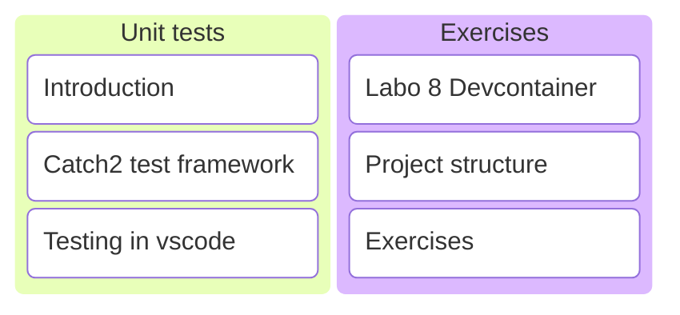
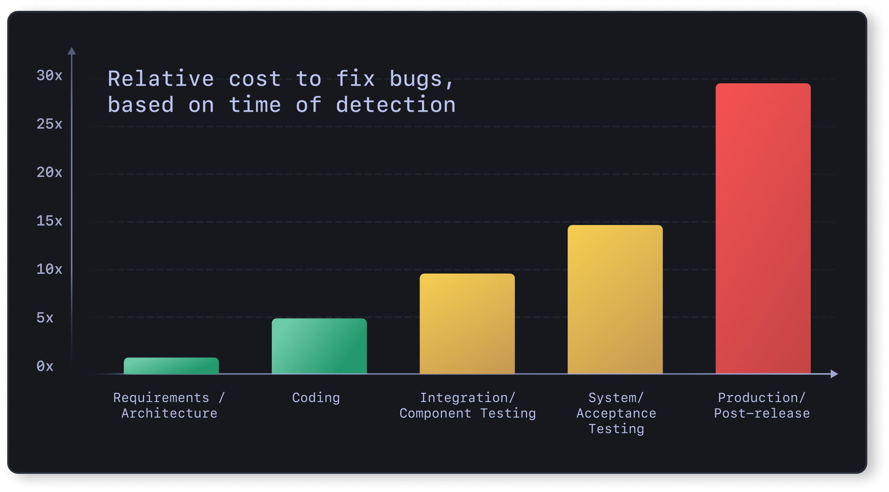
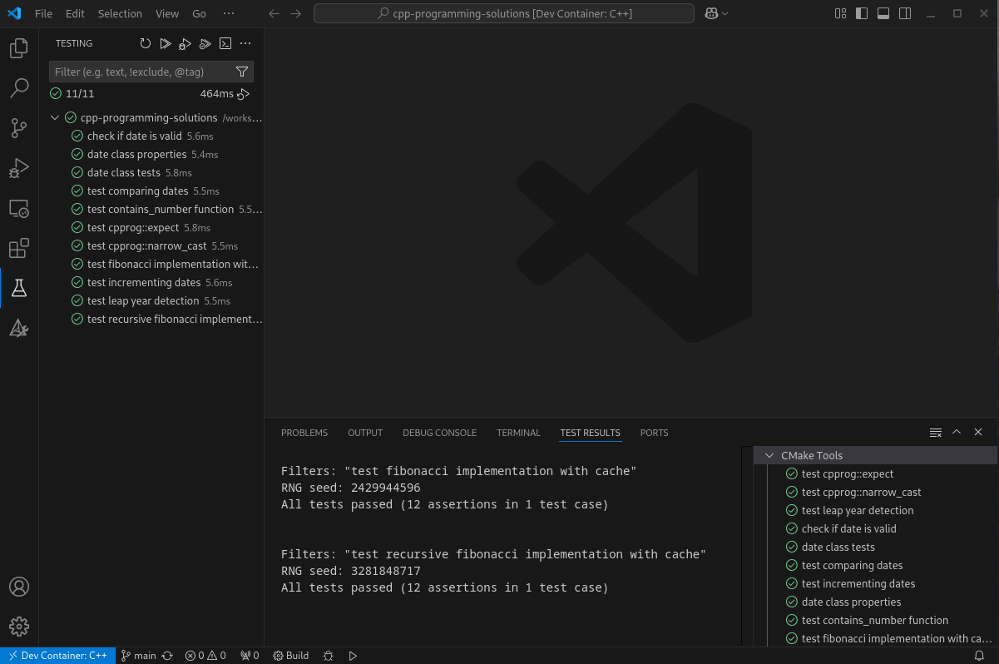

# C/C++ Programming

## Labo 8

---



---

## Unit tests

---

Unit testing is a form of software testing by which isolated source code is tested to validate expected behavior.

---

### Why?

---



---

Tests...

* Catch bugs early before they become hard to find.
* Pinpoint where to look for a bug. <!-- .element: class="fragment" data-fragment-index="1" -->
* Facilitate refactoring by preventing regressions. <!-- .element: class="fragment" data-fragment-index="2" -->
* Encourage writing testable code, improving quality. <!-- .element: class="fragment" data-fragment-index="3" -->
* Serve as documentation. <!-- .element: class="fragment" data-fragment-index="4" -->
* Support implementing CI/CD pipelines. <!-- .element: class="fragment" data-fragment-index="5" -->

---

Testing is a small upfront investment that saves a lot of time in the long run.

---

### Testing in C++

---


---

```c++
#include <catch.hpp>
```

```c++
import fibonacci;
```

```c++
TEST_CASE("compute fibonacci numbers", "[fibonacci][labo_7]")
{
    REQUIRE(fibonacci(3) == 2);
    REQUIRE(fibonacci(4) == 3);
    REQUIRE(fibonacci(5) == 5);
    REQUIRE(fibonacci(6) == 8);
    REQUIRE(fibonacci(7) == 13);
    REQUIRE(fibonacci(8) == 21);
    REQUIRE(fibonacci(9) == 34);
}
```

---

### Read the documentation

* <https://github.com/catchorg/Catch2/blob/devel/docs/tutorial.md>
* <https://github.com/catchorg/Catch2/blob/devel/docs/assertions.md>

---

### Testing in vscode

---

<video controls width="800">
  <source src="./assets/vscode_unit_tests.mp4" type="video/mp4">
  
</video>

---

## Exercises

---

### Devcontainer

<https://gitlab.apstudent.be/cpp-programming/devcontainer-labo-8>

---

* Extends labo 4 devcontainer.
* Add second configuration for `Release` builds.
* Add `vcpkg` package manager.
* Add unittest framework `Catch2`.
* Add `cpprog_add_test` function.
* See [README.md](https://gitlab.apstudent.be/cpp-programming/devcontainer-labo-8/-/blob/main/README.md) file in git repository.

---

```cmake
# ./src/ex_1/CMakeLists.txt
```

```cmake
cpprog_add_library(
    TARGET ex_1_lib         # library will be called ex_1_lib
    CXX_MODULES             # module source files here
    "my_module_1.cpp"
    "my_module_2.cpp"
)
```

```cmake
cpprog_add_executable(
    TARGET ex_1             # executable will be called ex_1
    CXX_SOURCES             # old-style source files here
    "ex_1.cpp"
    DEPENDENCIES            # libraries on which it depends
    ex_1_lib
)
```

Split exercises into a library and an executable with only the main function.

Note:

* This makes it possible to create unit tests that depend on the library.

---

```cmake
# ./test/CMakeLists.txt
```

```cmake
cpprog_add_test(
    TARGET test_ex_1        # test will be called test_ex_1
    CXX_SOURCES             # unittest source files
    "my_module_1.test.cpp"
    DEPENDENCIES            # libraries on which it depends
    ex_1_lib
)
```

Tests depend on the library.

---

Test code depends heavily on macros and often contains a lot of magic numbers. Clang-tidy is disabled for unit tests.

---

### Exercises

See digitap.
