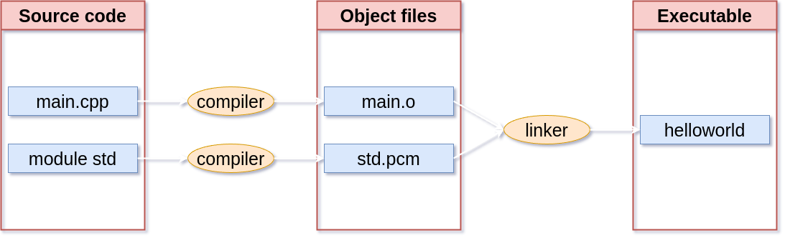

# C/C++ Programming


---

## Hello, world! ☺️

---

```c++
import std;

int main()
{
    std::println("Hello, world!");
}
```

Note:

* What stands out?
* Return at end of main is optional: defaults to `return 0`

---

## Why C++?

---


---


### Siemens Healthineers

---


---


---


### High-frequency trading

---


<https://github.com/nasa/fprime>

---

### Why learn C++ in 2025?

* Performance and Efficiency
* Modern high-level language
* Directly access hardware

---

### You are not alone


<https://www.tiobe.com/tiobe-index/>

---


Note:

* Tiobe index as piechart.

---

## History

---


### Bjarne Stroustrup

Note:

* Inventor of C++
* Born 30 december 1950 (age 74)

---

### C with Classes

#### 1979

* C's ability to use hardware
* Simula's OOP concepts

---

### Renamed to C++

#### 1984

---

### First commercial C++ compiler

#### 1985

Cfront: Translate C++ to C

---

### Standardization

#### 1989 - 1998


---

### ISO C++98

First official ISO standard

---

### ISO C++03

Minor fixes

---

### ISO C++11

* Modern C++
* First major release

---

### ISO WG21 - Standard C++ Foundation


---

### New release model

* Release cycle of 3 years
* Backwards compatible!

---

* ISO C++14
* ISO C++17
* ISO C++20
* ISO C++23
* ISO C++26 (WiP)

---

<!-- .slide: data-visibility="hidden" -->


---

## Compilation Model

Note:

* How to convert source to binary?

---

```c++ []
// main.cpp

import std;

int main()
{
    std::println("Hello, world!");
}
```

---



---

```c++ []
// helloworld.cpp

export module helloworld;

import std;

export void hello()
{
    std::println("Hello, world!");
}
```

```c++ []
// main.cpp

import helloworld;

int main()
{
    hello();
}
```

---


---

### Compilation steps

1. Compile each file
2. Combine results into executable

---

### Source code + 9 Compilation phases = Binary (exe, lib, ...)

---

| Phase | |
|:--|:--|
| 1-4 | Preprocessing |
| 5-7 | Deal with lexical, grammatical, static semantics rules |
| 8 | Template instantiation |
| 9 | Linking |

Note:

* Our goal is to avoid the preprocessor!
* Only use it if we have to include non-module libraries.
* `#include <some_library.h>`

---

```c++
// hello world before modules and println

#include <iostream>

int main()
{
    std::cout << "Hello, world!\n";
}
```

---

## C++ Core Guidelines

Note:

* Compiler checks if code is valid
* Backward compatible
* Old style also valid but unsafe

---

### Help people use modern C++ effectively

---

* Bjarne Stroustrup
* Herb Sutter

---

<https://isocpp.github.io/CppCoreGuidelines/>

* Lots of rules... 🙁
* Use tool to check compliance! 👍
* [clang-tidy](https://clang.llvm.org/extra/clang-tidy/)

---

## Let's learn C++! 🥳
