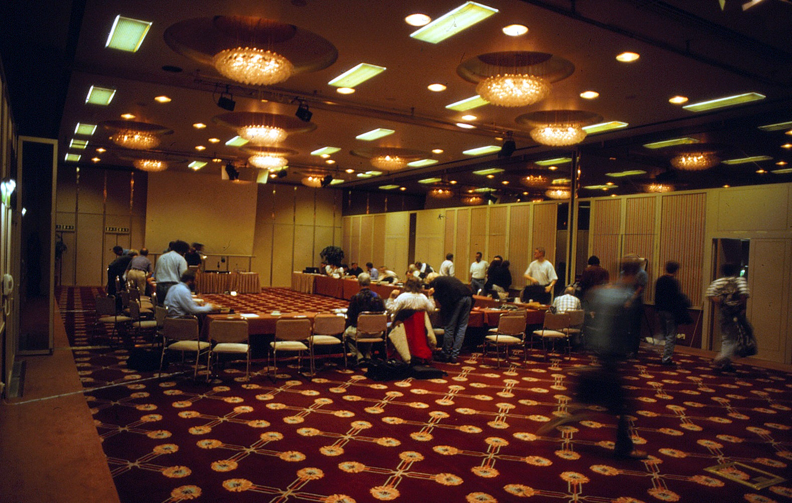

# C/C++ Programming

---
## Hello, world!
---
```c++
import std;

int main()
{
    std::println("Hello, world!");
}
```
---
## Why C++?
---

---

### Siemens Healthineers
---

---

---

### High-frequency trading
---

<https://github.com/nasa/fprime>
---
### Why learn C++ in 2025?
* Performance and Efficiency
* Modern high-level language
* Directly access hardware
* Backwards compatibility
---
### You are not alone

<https://www.tiobe.com/tiobe-index/>
---
## History
---

### Bjarne Stroustrup
---
### C with Classes
#### 1979
* C's ability to use hardware
* Simula's OOP concepts
---
### Renamed to C++
#### 1984
---
### First C++ compiler
#### 1985
---
### Standardization
#### 1989 - 1998

---
### ISO C++98
First official ISO standard
---
### ISO C++03
Minor fixes
---
### ISO C++11
* Modern C++
* First major release
---
### ISO WG21 - Standard C++ Foundation

---
### New release model
* Release cycle of 3 years
* Backwards compatible!
---
* ISO C++14
* ISO C++17
* ISO C++20
* ISO C++23
* ISO C++26 (WiP)
---
## Compilation Model
---
### From source code to binary
```c++ []
import std;

int main()
{
    std::println("Hello, world!");
}
```
---
```c++ []
// helloworld.cpp

export module helloworld;

import std;

export void hello()
{
    std::println("Hello, world!");
}
```
```c++ []
// main.cpp

import helloworld;

int main()
{
    hello();
}
```
---
### Compilation steps
1. Parse files?
1. Compile each file?
1. Combine files into executable?
---
### Source code + 9 Compilation phases = Binary (exe, lib, ...)
---
| Phase | |
|:--|:--|
| 1-4 | Preprocessing |
| 5-7 | Deal with lexical, grammatical, static semantics rules |
| 8 | Template instantiation |
| 9 | Linking |
