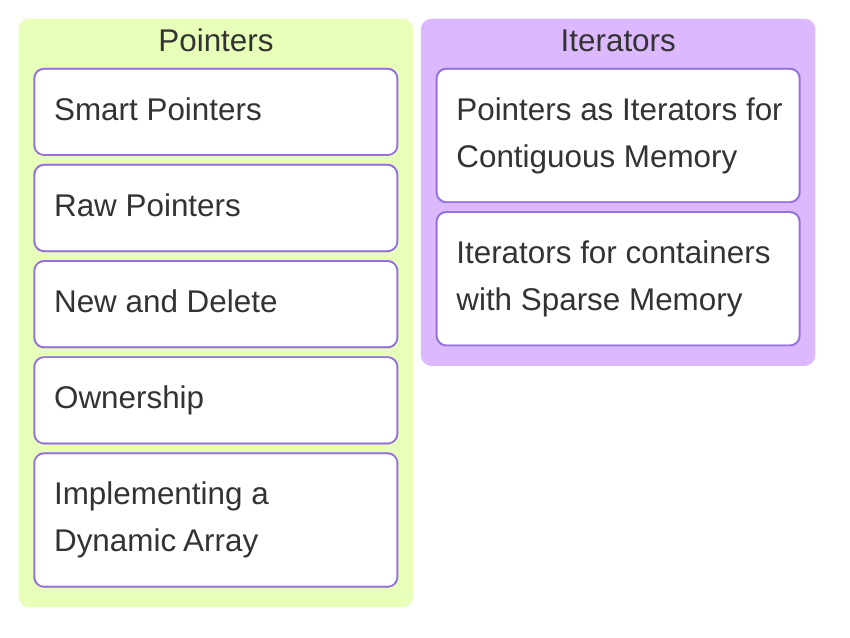
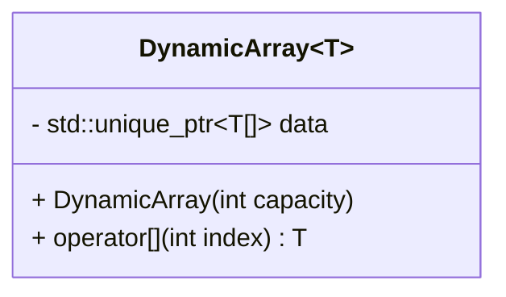

# C/C++ Programming


---



---

## Smart Pointers

---

```c++ []
import std;

struct Cat
{
    void speak() { std::println("meow"); }
};

int main()
{
    auto cat = std::make_unique<Cat>();

    cat->speak();
}
```

This should look familiar... What's this code doing?

Note:

* Create an object of type Cat on the heap.
* The object on the heap is stored in a smart pointer std::unique_ptr.
* The smart pointer ensures that when the object goes out of scope (end of the main function), the memory on the heap is
  released automatically. This is called RAII.
* RAII stands for resource allocation is initialization.
* It makes sure that you cannot forget to released the memory associated with the resource. Which could otherwise easily
  have happened if an exception is thrown before the object is manually.
* Call the speak method on the object, it will print meow.

---

### std::unique_ptr

* Is called a smart pointer.
  <!-- .element: class="fragment" data-fragment-index="1" -->
* Uses RAII to automatically release memory when the object goes out of scope.
  <!-- .element: class="fragment" data-fragment-index="2" -->
* Cannot be copied.
  <!-- .element: class="fragment" data-fragment-index="3" -->
* Very convenient indeed!
  <!-- .element: class="fragment" data-fragment-index="4" -->

Note:

* std::unique_ptr cannot be copied since it is the sole owner of an object on the heap.
* Allowing it to be copied would make it possible to have multiple owners of the same object.
* Who would then be responsible to release the memory?
* Ownership can however be transferred using std::move.

```c++
int main()
{
    auto cat = std::make_unique<Cat>();  // create a cat object on the heap
    auto new_cat_owner = std::move(cat); // transfer ownership to a new owner, original now empty
} // new_cat_owner goes out of scope first and releases memory
  // cat goes out of scope second but it points to an empty object, so does not need to free anything
```

---

Let's design a dynamic array class next.

---

* Let the user decide the value type at compile time.
* Let the user decide the capacity at run time.
* Access any item.

---



Note:

* Use std::unique_ptr, it's convenient after all!

---

```c++ [1-13|11|5|7-8|1-13]
template <typename T>
class DynamicArray
{
public:
    explicit DynamicArray(int capacity);

    T const& operator[](int index) const;
    T& operator[](int index);

private:
    int capacity_{}; // for bounds checking
    std::unique_ptr<T[]> data_{};
};
```

```c++
DynamicArray<int> integers{20};

integers[0] = 5;

std::println("{}", integers[3]);
```

Note:

* This is the way we would like to use the dynamic array and a proposed interface.
* Q: What does `T[]` mean in the `std::unique_ptr` template parameter?
* A: An unbounded raw array. No size is specified since we only know it at run time.
* Q: We want the values to be default initialized. Why?
* A: So they start out with a value, allowing us to read them before assigning a value.
* Q: What does the explicit keyword do again?
* A: Prevent T to be allowed where `DynamicArray<T>` is expected.
* Q: The index operator usually comes in pairs. Why?
* A: A non-const version that allows modifying the object and a const version for read-only access.

---

```c++ [5-10|28-33|12-22]
template <typename T>
class DynamicArray
{
public:
    DynamicArray() = default;

    explicit DynamicArray(int capacity)
      : capacity_{capacity},
        data_{make_array(capacity_)}
    {}

    T const& operator[](int index) const
    {
        cpprog::expect([&, this]{ return (0 <= index) && (index < capacity_;) }, "0 <= index < capacity");
        return data_[index];
    }

    T& operator[](int index)
    {
        cpprog::expect([&, this]{ return (0 <= index) && (index < capacity_;) }, "0 <= index < capacity");
        return data_[index];
    }

private:
    int capacity_{};
    std::unique_ptr<T[]> data_{};

    static std::unique_ptr<T[]> make_array(int capacity)
    {
        cpprog::expect([&]{ return 0 <= capacity; }, "capacity can't be negative");
        return (capacity == 0) ?
            nullptr : std::make_unique<T[]>(capacity);
    }
};
```

Implementation!

Note:

* <https://compiler-explorer.com/z/Gcve48sbP>
* We allow creating empty arrays. This is a choice.
* Creating an empty array can be done using the default constructor or by explicitly passing 0 as size to the constructor.
* We do want to make sure we're not trying to allocate an array of negative size.
* So we add a helper function make_array. This functions checks the size is zero or positive.
* If it is zero, an empty array (`nullptr`) is stored in the `std::unique_ptr<T[]>`.
* If it is positive, an array of the requested size is allocated (`std::make_unique<T[]>(capacity)`).
* std::make_unique default initializes all elements of the array.
* The implementation of both index operator methods is exactly the same. Check bounds and return the element at the index.
* Q: Why do we need both `&` and `this` in the capture list of the lambdas for bounds checking?
* A: `&` to capture the index variable. `this` needs to be capture explicitly and we need it to access `capacity_`.

---

Remember the rule-of-5?

---

* 5+1 special member functions
  * (+1) Default constructor
    <!-- .element: class="fragment" data-fragment-index="1" -->
  * (5) Destructor, Copy constructor, Copy assignment, Move constructor, Move assignment
    <!-- .element: class="fragment" data-fragment-index="2" -->
* Need to implement any of the 5? Implement all 5!
  <!-- .element: class="fragment" data-fragment-index="3" -->
* The default constructor is not generated if any other constructor is implemented!
  <!-- .element: class="fragment" data-fragment-index="4" -->

---

Do we need to implement any of them?

---

* Default constructor &rarr; Check!
* Destructor? <!-- .element: class="fragment" data-fragment-index="1" -->
  * Handled by std::unique_ptr &rarr; not needed! <!-- .element: class="fragment" data-fragment-index="2" -->
* Move constructor and assignment? <!-- .element: class="fragment" data-fragment-index="3" -->
  * std::unique_ptr is movable &rarr; default generated! <!-- .element: class="fragment" data-fragment-index="4" -->
* Copy constructor and assignment? <!-- .element: class="fragment" data-fragment-index="5" -->
  * std::unique_ptr is not copyable &rarr; not generated! <!-- .element: class="fragment" data-fragment-index="6" -->

---

The DynamicArray class it not copyable! Let's fix that.

---

```c++
template <typename T>
class DynamicArray
{
public:
    // the default will do
    ~DynamicArray() = default;
    DynamicArray(DynamicArray&&) = default;
    DynamicArray& operator=(DynamicArray&&) = default;

    // we need to implement copy
    DynamicArray(DynamicArray const&) { /*...*/ }
    DynamicArray& operator=(DynamicArray const&) { /*...*/ }

    // ...
};
```

---

```c++ []
DynamicArray(DynamicArray const& other)
  // first create an array of the right capacity
  : capacity_{other.capacity_}, data_{make_array(capacity_)}
{
    // then copy the elements of the other array to ours
    std::copy_n(other.data_.get(), capacity_, data_.get());
}
```

The copy constructor.

---

```c++ []
DynamicArray& operator=(DynamicArray const& rhs)
{
    // protect against self-assignment
    if (this != &other)
    {
        // reserve enough space
        capacity_ = rhs.capacity_;
        data_ = make_array(capacity_);

        // copy elements
        std::copy_n(rhs.data_.get(), capacity_, data_.get());
    }

    return *this;
}
```

The copy assignment operator.

Note:

* Q: Is there anything wrong with this code?
* A: Yes!
  * I have to remember to add protection against self-assignment.
  * And the implementation itself is the same as the copy constructor.

---

The copy and swap idiom.

---

```c++ []
// take rhs by value, this creates a COPY
// (using the copy constructor)
DynamicArray& operator=(DynamicArray rhs) noexcept
{
    // SWAP this with the copy, now we are the copy!
    swap(*this, rhs);
    return *this;
} // rhs goes out of scope and our old data is destroyed
```

```c++ []
// in the private section of the DynamicArray class
friend void swap(DynamicArray& first, DynamicArray& second) noexcept
{
    using std::swap;
    // how to swap two object? swap each member!
    swap(first.capacity_, second.capacity_);
    swap(first.data_, second.data_);
}
```

Copy and swap.

Note:

* <https://compiler-explorer.com/z/ETznvxoPG>
* Implementing swap in the private section as friend is called the hidden friend idiom.
* It is a best practice to write `using std::swap` in the swap function and then call unqualified swap on members.
* It is not strictly needed in our case, but it will find custom swap functions for member types that way.
* Only swaps, which is noexcept, so the assignment operator can also be marked noexcept!
* The by-value assignment operator also covers move assignment, so we don't need to default the move assignment operator.

---

```c++
DynamicArray<int> first{10};
DynamicArray<int> second{first};
DynamicArray<int> third{5};
third = second;
```

We can now make copies of dynamic arrays!

---

### Best practices

---

* Implement missing special member functions if it makes sense!
* Use the copy-and-swap idiom to implement the copy-assignment operator!
  <!-- .element: class="fragment" data-fragment-index="1" -->
* Implement the swap function as a hidden friend!
  <!-- .element: class="fragment" data-fragment-index="2" -->
* Make the swap function and assignment operator noexcept!
  <!-- .element: class="fragment" data-fragment-index="3" -->
* Bring std::swap in scope and swap member-wise!
  <!-- .element: class="fragment" data-fragment-index="4" -->

---

## Raw Pointers

---

```c++
int* null_pointer = nullptr;
```

```c++
*null_pointer = 5; // try to dereference null-pointer 🔥
```

Note:

* Similar to references, pointers use `*` instead of `&`.
* Unlike references, pointers can point to nothing.
* Dereference a pointer using `*` to access the variable it points to.

---

```c++
int i{5};
```

```c++
int* pointer_to_i = &i;
```

```c++
*pointer_to_i = 6; // i is now equal to 6
```

Note:

* Similar to references, the original variable can be updated through a pointer.

---

```c++
int i{5};
```

```c++
int const* pointer_to_i = &i;
```

```c++
*pointer_to_i = 6; // error, points to a constant
```

Note:

* A pointer to a constant integer.
* Use `&` to get the address of a variable.

---

```c++
int i{5};
int j{6};
```

```c++
int const* pointer_to_i = &i;
```

```c++
pointer_to_i = &j; // now points to j instead of i
```

---

```c++
int i{5};
int j{6};
```

```c++
int const* const pointer_to_i = &i;
```

```c++
pointer_to_i = &j; // error, pointer is itself a constant
```

```c++
*pointer_to_i = 6; // error, points to a constant
```

Note:

* A constant pointer to a constant integer.
* A constant pointer to a non-const integer is also possible. `int* const pointer;`

---

### Manual memory management

---


Note:

* Using raw pointers has lots of disadvantages.
* Including:
  * It is unclear who is the owner.
  * It is easy to forget to free a resource.
  * It is easy to accidentally free a resource multiple times.
* Stick with smart pointers unless you have a really good reason not to!

---

```c++
// ask for memory

int* on_the_heap = new int;    // not initialized! ⚠️
int* on_the_heap = new int{};  // default initialized
int* on_the_heap = new int{5}; // initialized to 5
```

```c++
// release memory

delete on_the_heap;
```

Allocate a single value.

---

```c++
// ask for memory

int* on_the_heap = new int[3];   // not initialized! ⚠️
int* on_the_heap = new int[3]{}; // default initialized
```

```c++
// initialized to 1, 2, 3
int* on_the_heap = new int[3]{1, 2, 3};
```

```c++
// initialized to 1, 2, 0 (default value)
int* on_the_heap = new int[3]{1, 2};
```

```c++
// release memory

delete[] on_the_heap;
```

Allocate an array of values.

---

```c++
int main()
{
    int* ptr = new int{};

    // exception occurs

    delete ptr; // never called, oops!
}
```

Don't forget to free the memory you allocate!

---

```c++
int main()
{
    int* ptr = new int{};

    delete[] ptr; // oops, wrong delete!
}
```

```c++
// syntax is the same (int*), easy to overlook that the
// second one is an array!

int* ptr = new int{};
int* ptr = new int[10]{};
```

Use the correct delete operator!

---

```c++
try
{
    int* ptr = new int[/*large number*/]{};
}
catch (std::bad_alloc const& e)
{
    // oops, out of memory
}
```

Allocating on the heap can fail!

Note:

* Smart pointers have the same problem.
* But what are you going to do anyway?

---

```c++ []
int* func()
{
    return new int{};
}

int* ptr = func();
// Should I call delete? I didn't call new.
```

```c++ []
void func(int* ptr)
{
    // Am I the owner of ptr now? Should I call delete?
}

int* ptr = new int{};
// I called new, but maybe I want to transfer ownership.
func(ptr);
```

Who is responsible to free the memory?

---

#### Best practices

---

* Never use raw pointers to transfer ownership.
* Only use raw pointers to refer to objects owned by someone else. <!-- .element: class="fragment" data-fragment-index="1" -->
* Use smart pointers for ownership. <!-- .element: class="fragment" data-fragment-index="2" -->
* If you have to use raw new and delete, do it in an RAII class. <!-- .element: class="fragment" data-fragment-index="3" -->

---

### Manual memory management for DynamicArray

---

DynamicArray without std::unique_ptr...

---

```c++ [12]
template <typename T>
class DynamicArray
{
public:
    explicit DynamicArray(int capacity);

    T const& operator[](int index) const;
    T& operator[](int index);

private:
    int capacity_{};
    T* data_{};
};
```

---

```c++ [18-23|8]
template <typename T>
class DynamicArray
{
public:
    DynamicArray() = default;
    explicit DynamicArray(int capacity)
      : capacity_{capacity}, data_{make_array(capacity_)} {}
    ~DynamicArray() { delete[] data_; }

    // same as before
    T const& operator[](int index) const;
    T& operator[](int index);

private:
    int capacity_{};
    T* data_{};

    static T* make_array(int capacity)
    {
        cpprog::expect([&]{ return 0 <= capacity; }, "capacity can't be negative");
        return (capacity == 0) ?
            nullptr : new T[static_cast<std::size_t>(capacity)]{};
    }
};
```

Implementation!

Note:

* make_array function changed to use raw new.
* Don't forget to call array delete in the destructor!
* Index operators are the same is before.

---

We had to add a destructor!

---

So we also need to add

* Copy constructor
* Copy assignment operator
* Move constructor
* Move assignment operator

---

```c++
DynamicArray(DynamicArray const& other)
    : capacity_{other.capacity_}, data_{make_array(capacity_)}
{
    std::copy_n(other.data_, capacity_, data_);
}
```

Copy constructor

Note:

* We can reuse the copy constructor from before!
* Just remove the .get() calls.

---

```c++
DynamicArray& operator=(DynamicArray rhs) noexcept
{
    swap(*this, rhs);
    return *this;
}
```

```c++
friend void swap(DynamicArray& first, DynamicArray& second) noexcept
{
    using std::swap;
    swap(first.capacity_, second.capacity_);
    swap(first.data_, second.data_);
}
```

Copy assignment operator

Note:

* Copy-and-swap again.
* The previous copy assignment operator still works.
* The previous swap function still works.

---

But we never implemented the move constructor and move assignment operator before! What are they supposed to do anyway?

---

```c++
class Huge
{
public:
    Huge() : many_integers_{new int[1'000'000'000]{}} {}
    ~Huge() { delete[] many_integers_; }

private:
    int* many_integers_{};
};
```

```c++
Huge make_a_huge_object()
{
    return Huge{};
}
```

```c++
// Before rvalue references copy constructor would be called!
// Copying a billion integers for nothing!
// Make a shallow copy instead!
Huge huge = make_a_huge();
```

Note:

* Do we need to copy the integers?
* No! The original object is an rvalue reference and goes out of scope immediately!
* All we need to do is a shallow copy (set the pointer in the new object to point to the value of the temporary). And make the
  temporary point nowhere to prevent double free.
* Side note: Modern C++ is guaranteed Return Value Optimization. So in this specific situation the move would be optimized away
  and the object would be constructed immediately in the huge variable.

---

```c++
DynamicArray(DynamicArray&& other) noexcept
{
    swap(*this, other);
}
```

Move constructor

Note:

* Default initialize our own members (capacity of zero and data nullptr).
* Swap ourselves with the other object.
* Now we have the contents of the other object and the other object is empty.
* All move and swap operations should be noexcept.

---

```c++
// We already have this one, it works just fine!

// rhs initialized with an lvalue &rarr; copy constructor called
// rhs initialized with an rvalue &rarr; move constructor called

DynamicArray& operator=(DynamicArray rhs) noexcept
{
    swap(*this, rhs);
    return *this;
}
```

Move assignment operator

Note:

* <https://compiler-explorer.com/z/b9TeofdEG>
* No need to add a new assignment operator.
* The one we wrote for copy assignment works just fine!

---

#### Best practices

---

* Avoid raw new and delete!
* Implement the move constructor by default constructing and swapping.
  <!-- .element: class="fragment" data-fragment-index="1" -->
* Mark the assignment operator, swap function, and move constructor noexcept.
  <!-- .element: class="fragment" data-fragment-index="2" -->

---

## Iterators

---

```c++
DynamicArray<int> integers{20};
```

```c++
// set all 20 values to 42
std::ranges::fill(integers, 42);
```

```c++
// iterate over the array
for (auto const& value : integers)
{
    std::print("{},", value);
}
```

I want my own container to work with STL algorithms!

Note:

* This does not work yet.
* We'll have to write some code.

---

All algorithms expect a range, bounded by a begin iterator and an end iterator.

---

```c++
// roughly how all STL algorithms work

for (Iterator it = range.begin(); it != range.end(); ++it)
{
    // do something with the value, accessed by *it
}
```

* The begin iterator points to the first element.
* The end iterator points past the last element.
* Increment and compare must be supported.
* End much be reachable from begin in a finite number of steps.

---

```c++
class ForwardIterator
{
public:
    ForwardIterator(/*...*/);

    ValueType& operator*() const;  // dereference
    ValueType* operator->() const; // dereference

    ForwardIterator& operator++(); // increment

    bool operator!=(ForwardIterator const&) const; // compare

private:
    /*...*/
};
```

The interface of a forward iterator class.

Note:

* Forward because only operator++ is supported.
* There's many other types such as bidirectional (++, --) and random access (++, --, []).

---

How to implement an iterator for DynamicArray?

---

```c++
template <typename T>
class DynamicArray
{
public:
    // return a pointer to the first element
    T* begin() const { return data_.get(); }

    // return a pointer to one past the last element
    T* end() const { return data_.get() + capacity_; }

    // ...
};
```

Piece of cake!

---

Wait, does that actually work?

* Begin iterator points to first element? Check! <!-- .element: class="fragment" data-fragment-index="1" -->
* End iterator points one past last element? Check! <!-- .element: class="fragment" data-fragment-index="2" -->
* Pointer can be incremented? Check! <!-- .element: class="fragment" data-fragment-index="3" -->
* End is reachable from begin? Check! <!-- .element: class="fragment" data-fragment-index="4" -->
* Pointers can be compared? Check! <!-- .element: class="fragment" data-fragment-index="5" -->

---

How to implement an iterator for CircularBuffer?

---

Items are not stored contiguously in memory anymore once the buffer wrapped around. We need to implement an actual iterator!

---

```c++ []
class Iterator
{
public:
    Iterator(CircularBuffer const& buffer, int index)
        : buffer_{buffer}, index_{index} {}

    T& operator*() const {
        return buffer_.get().data_[(buffer_.get().front_ + index_) % N];
    }
    T* operator->() const {
        return &buffer_.get().data_[(buffer_.get().front_ + index_) % N];
    }

    Iterator& operator++() { ++index_; return *this; }

    bool operator!=(Iterator const& rhs) const {
        return (&buffer_.get() == &rhs.buffer_.get()) && (index_ == rhs.index_);
    }

private:
    std::reference_wrapper<CircularBuffer const> buffer_;
    int index_;
};

Iterator begin() const { return Iterator{*this, 0}; }
Iterator end() const { return Iterator{*this, N}; }
```

A bit harder to implement...

Note:

* Disclaimer: code not tested!

---

### Best practices

---

* Make custom containers work with STL algorithms!
* If container memory is sparse, implement iterators! <!-- .element: class="fragment" data-fragment-index="1" -->
* If container memory is contiguous, pointers will do! <!-- .element: class="fragment" data-fragment-index="2" -->

---

## Exercises
