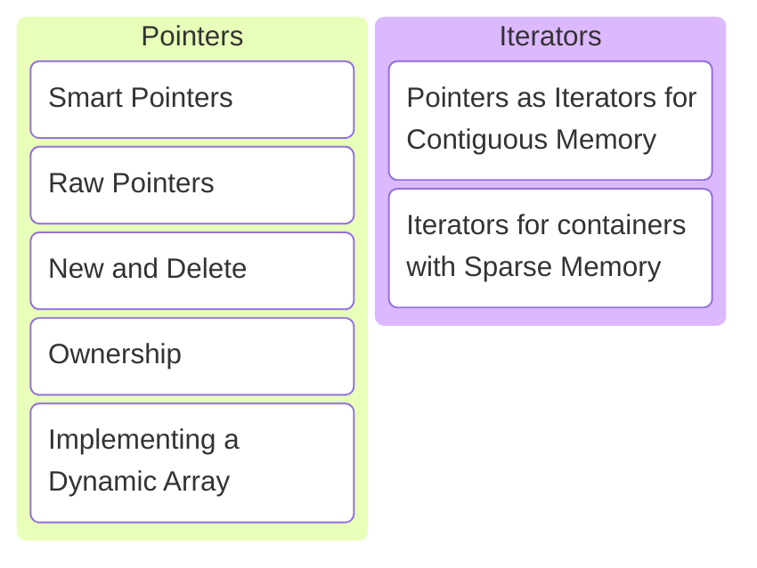
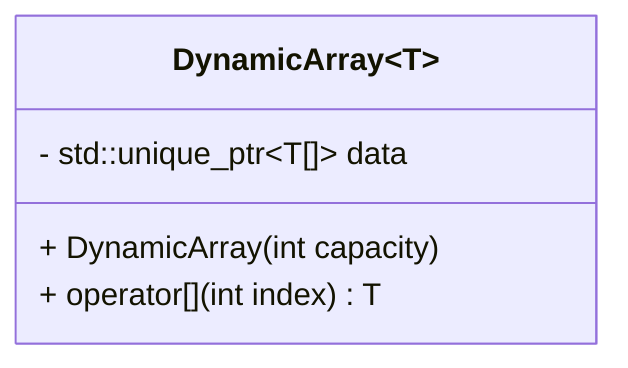

# C/C++ Programming


---



---

## Smart Pointers

---

```c++ []
import std;

struct Cat
{
    void speak() { std::println("meow"); }
};

int main()
{
    auto cat = std::make_unique<Cat>();

    cat->speak();
}
```

This should look familiar... What's this code doing?

Note:

* Create an object of type Cat on the heap.
* The object on the heap is stored in a smart pointer std::unique_ptr.
* The smart pointer ensures that when the object goes out of scope (end of the main function), the memory on the heap is
  released automatically. This is called RAII.
* RAII stands for resource allocation is initialization.
* It makes sure that you cannot forget to released the memory associated with the resource. Which could otherwise easily
  have happened if an exception is thrown before the object is manually.
* Call the speak method on the object, it will print meow.

---

### std::unique_ptr

* Is called a smart pointer.
  <!-- .element: class="fragment" data-fragment-index="1" -->
* Uses RAII to automatically release memory when the object goes out of scope.
  <!-- .element: class="fragment" data-fragment-index="2" -->
* Cannot be copied.
  <!-- .element: class="fragment" data-fragment-index="3" -->
* Very convenient indeed!
  <!-- .element: class="fragment" data-fragment-index="4" -->

Note:

* std::unique_ptr cannot be copied since it is the sole owner of an object on the heap.
* Allowing it to be copied would make it possible to have multiple owners of the same object.
* Who would then be responsible to release the memory?
* Ownership can however be transferred using std::move.

```c++
int main()
{
    auto cat = std::make_unique<Cat>();  // create a cat object on the heap
    auto new_cat_owner = std::move(cat); // transfer ownership to a new owner, original now empty
} // new_cat_owner goes out of scope first and releases memory
  // cat goes out of scope second but it points to an empty object, so does not need to free anything
```

---

Let's design a dynamic array class next.

---

* Let the user decide the value type at compile time.
* Let the user decide the capacity at run time.
* Access any item.

---



Note:

* Use std::unique_ptr, it's convenient after all!

---

```c++ [1-13|11|5|7-8|1-13]
template <typename T>
class DynamicArray
{
public:
    explicit DynamicArray(int capacity);

    T const& operator[](int index) const;
    T& operator[](int index);

private:
    int capacity_{}; // for bounds checking
    std::unique_ptr<T[]> data_{};
};
```

```c++
DynamicArray<int> integers{20};

integers[0] = 5;

std::println("{}", integers[3]);
```

Note:

* This is the way we would like to use the dynamic array and a proposed interface.
* Q: What does `T[]` mean in the `std::unique_ptr` template parameter?
* A: An unbounded raw array. No size is specified since we only know it at run time.
* Q: We want the values to be default initialized. Why?
* A: So they start out with a value, allowing us to read them before assigning a value.
* Q: What does the explicit keyword do again?
* A: Prevent T to be allowed where `DynamicArray<T>` is expected.
* Q: The index operator usually comes in pairs. Why?
* A: A non-const version that allows modifying the object and a const version for read-only access.

---

```c++ [5-10|28-33|12-22]
template <typename T>
class DynamicArray
{
public:
    DynamicArray() = default;

    explicit DynamicArray(int capacity)
      : capacity_{capacity},
        data_{make_array(capacity_)}
    {}

    T const& operator[](int index) const
    {
        cpprog::expect([&, this]{ return (0 <= index) && (index < capacity_;) }, "0 <= index < capacity");
        return data_[index];
    }

    T& operator[](int index)
    {
        cpprog::expect([&, this]{ return (0 <= index) && (index < capacity_;) }, "0 <= index < capacity");
        return data_[index];
    }

private:
    int capacity_{};
    std::unique_ptr<T[]> data_{};

    static std::unique_ptr<T[]> make_array(int capacity)
    {
        cpprog::expect([&]{ return 0 <= capacity; }, "capacity can't be negative");
        return (capacity == 0) ?
            nullptr : std::make_unique<T[]>(capacity);
    }
};
```

Implementation!

Note:

* <https://compiler-explorer.com/z/Gcve48sbP>
* We allow creating empty arrays. This is a choice.
* Creating an empty array can be done using the default constructor or by explicitly passing 0 as size to the constructor.
* We do want to make sure we're not trying to allocate an array of negative size.
* So we add a helper function make_array. This functions checks the size is zero or positive.
* If it is zero, an empty array (`nullptr`) is stored in the `std::unique_ptr<T[]>`.
* If it is positive, an array of the requested size is allocated (`std::make_unique<T[]>(capacity)`).
* std::make_unique default initializes all elements of the array.
* The implementation of both index operator methods is exactly the same. Check bounds and return the element at the index.
* Q: Why do we need both `&` and `this` in the capture list of the lambdas for bounds checking?
* A: `&` to capture the index variable. `this` needs to be capture explicitly and we need it to access `capacity_`.

---

Remember the rule-of-5?

---

* 5+1 special member functions
  * (+1) Default constructor
    <!-- .element: class="fragment" data-fragment-index="1" -->
  * (5) Destructor, Copy constructor, Copy assignment, Move constructor, Move assignment
    <!-- .element: class="fragment" data-fragment-index="2" -->
* Need to implement any of the 5? Implement all 5!
  <!-- .element: class="fragment" data-fragment-index="3" -->
* The default constructor is not generated if any other constructor is implemented!
  <!-- .element: class="fragment" data-fragment-index="4" -->

---

Do we need to implement any of them?

---

* Default constructor &rarr; Check!
* Destructor? <!-- .element: class="fragment" data-fragment-index="1" -->
  * Handled by std::unique_ptr &rarr; not needed! <!-- .element: class="fragment" data-fragment-index="2" -->
* Move constructor and assignment? <!-- .element: class="fragment" data-fragment-index="3" -->
  * std::unique_ptr is movable &rarr; default generated! <!-- .element: class="fragment" data-fragment-index="4" -->
* Copy constructor and assignment? <!-- .element: class="fragment" data-fragment-index="5" -->
  * std::unique_ptr is not copyable &rarr; not generated! <!-- .element: class="fragment" data-fragment-index="6" -->

---

The DynamicArray class it not copyable! Let's fix that.

---

```c++
template <typename T>
class DynamicArray
{
public:
    // the default will do
    ~DynamicArray() = default;
    DynamicArray(DynamicArray&&) = default;
    DynamicArray& operator=(DynamicArray&&) = default;

    // we need to implement copy
    DynamicArray(DynamicArray const&) { /*...*/ }
    DynamicArray& operator=(DynamicArray const&) { /*...*/ }

    // ...
};
```

---

```c++ []
DynamicArray(DynamicArray const& other)
  // first create an array of the right capacity
  : capacity_{other.capacity_}, data_{make_array(capacity_)}
{
    // then copy the elements of the other array to ours
    std::copy_n(other.data_.get(), capacity_, data_.get());
}
```

The copy constructor.

---

```c++ []
DynamicArray& operator=(DynamicArray const& rhs)
{
    // protect against self-assignment
    if (this != &other)
    {
        // reserve enough space
        capacity_ = rhs.capacity_;
        data_ = make_array(capacity_);

        // copy elements
        std::copy_n(rhs.data_.get(), capacity_, data_.get());
    }

    return *this;
}
```

The copy assignment operator.

Note:

* Q: Is there anything wrong with this code?
* A: Yes!
  * I have to remember to add protection against self-assignment.
  * And the implementation itself is the same as the copy constructor.

---

The copy and swap idiom.

---

```c++ []
// take rhs by value, this creates a COPY
// (using the copy constructor)
DynamicArray& operator=(DynamicArray rhs)
{
    // SWAP this with the copy, now we are the copy!
    swap(*this, rhs);
    return *this;
} // rhs goes out of scope and our old data is destroyed
```

```c++ []
// in the private section of the DynamicArray class
friend void swap(DynamicArray& first, DynamicArray& second) noexcept
{
    using std::swap;
    // how to swap two object? swap each member!
    swap(first.capacity_, second.capacity_);
    swap(first.data_, second.data_);
}
```

Copy and swap.

Note:

* <https://compiler-explorer.com/z/e979rah1P>
* Implementing swap in the private section as friend is called the hidden friend idiom.
* It is a best practice to write `using std::swap` in the swap function and then call unqualified swap on members.
* It is not strictly needed in our case, but it will find custom swap functions for member types that way.

---

```c++
DynamicArray<int> first{10};
DynamicArray<int> second{first};
DynamicArray<int> third{5};
third = second;
```

We can now make copies of dynamic arrays!

---

### Best practices

---

* Implement missing special member functions if it makes sense!
* Use the copy-and-swap idiom to implement the copy-assignment operator!
  <!-- .element: class="fragment" data-fragment-index="1" -->
* Implement the swap function as a hidden friend!
  <!-- .element: class="fragment" data-fragment-index="2" -->
* Bring std::swap in scope and swap member-wise!
  <!-- .element: class="fragment" data-fragment-index="3" -->

---

## Raw Pointers

---

## Iterators

---

## Exercises
