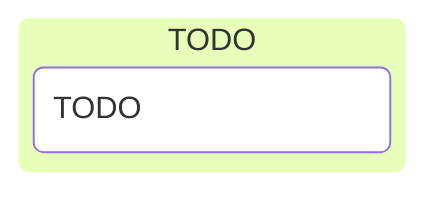

# C/C++ Programming


---



---

## Introduction

---

```c []
#include <stdio.h>

int main(void)
{
    printf("Hello, world!\n");
}
```

Hello, world!

---


### Dennis Richie

1941 - 2011, Inventor of C

---

<div style="display: flex; justify-content: space-evenly; align-items: center;">

<div style="padding-right: 45px;">


</div>

<div>

* Created in 1972
* Dennis Richie
* Releases
  * K&R C 1978 (book)
  * ANSI C 98
  * ISO C 90,95,99,11,17,23
* <https://c-language.org>

</div>

</div>

---

## Why bother with C?

---


---

<div style="display: flex; justify-content: space-evenly; align-items: center;">

<div style="padding-right: 45px;">


</div>

<div>

* Linus Torvalds
* First release: 1991
* Written in C89
* 2022: Upgrade to C11
* 37.05m lines of code

</div>

</div>

### Linux kernel

---

TODO

---

## Summary: C vs C++

---

| Feature          | C++                  | C                  |
|------------------|----------------------|--------------------|
| Resources        | RAII                 | Manual malloc/free |
| Initialization   | Constructor          | Manual init        |
| Error handling   | Exceptions           | Manual checks      |
| Classes          | OOP                  | Only struct        |
| Meta-programming | Templates, constexpr | Only preprocessor  |
| Type safety      | Stronger             | Weaker             |
