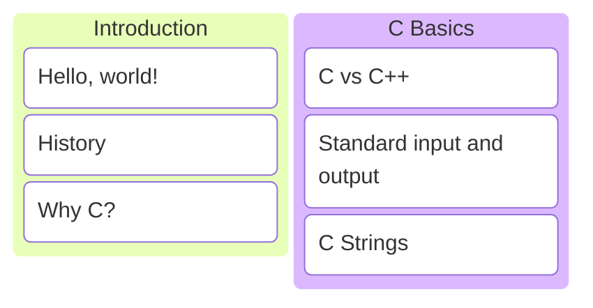
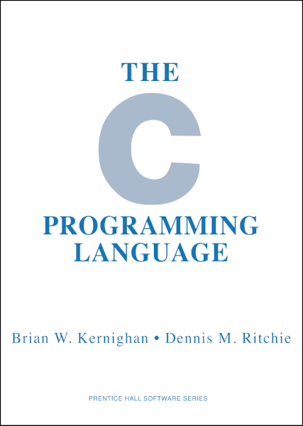

# C/C++ Programming


---



---

## Hello, world

---

```c []
#include <stdio.h>

int main(void)
{
    printf("Hello, world!\n");
}
```

Note:

* What are the differences with C++?
* No modules, use `#include`
* `void` to indicate that the main function does not have arguments
* Up until C23 writing `function()` meant any number of arguments
* `printf` function with manual newline
* `printf` does not check that arguments match format specifiers!
* <https://compiler-explorer.com/z/oee8G77oK>

---


### Dennis Richie

1941 - 2011, Inventor of C

---

<div style="display: flex; justify-content: space-evenly; align-items: center;">

<div style="padding-right: 45px;">



</div>

<div>

* Created in 1972
* Dennis Richie
* Releases
  * K&R C 1978
  * ANSI C 89
  * ISO C 90,95,99,11,17,23
* <https://c-language.org>

</div>

</div>

---

C is a medium-level procedural language.

Note:

* There is an almost direct mapping between C and assembly.
* The only programming paradigm C supports is procedural (writing functions).

---

## Why bother with C?

---

Mostly legacy code.

Note:

* C is still everywhere!
* Hardware vendors often still only supply a C library.

---

<div style="display: flex; justify-content: space-evenly; align-items: center;">

<div style="padding-right: 45px;">


</div>

<div>

* Linus Torvalds
* First release: 1991
* Written in C89
* 2022: Upgrade to C11
* 37.05m lines of code

</div>

</div>

And the Linux kernel.

---

## C vs C++

---

C++

```c++
char   a_char   {'a'};
int    an_int   {-1};
double a_double {3.14};
bool   a_bool   {false};
```

C

```c
char   a_char   = 'a';
int    an_int   = -1;
double a_double = 3.14;
```

```c
#include <stdbool.h>
bool a_bool = false;
// bool is not a native type in c! it is an alias for int
```

### Built-in types

Note:

* In C bool and the boolean constants true and false are defined as integers.
* They are only available if the stdbool header is included.

---

C++

```c++
import std;
```

```c++
std::array an_array{1, 2, 3, 4, 5};
auto length = an_array.size();
```

c

```c
int an_array[] = {1, 2, 3, 4, 5};
int length     = sizeof(an_array) / sizeof(an_array[0]);
```

### Fixed sized arrays

Note:

* To calculate the length of an array in C, we divide the size of the entire array by the size of the first element.
* The `sizeof` operator returns the number of bytes a variable occupies in memory.
* `sizeof(an_array) = 20 bytes` (5 integer that are 4 bytes each)
* `sizeof(an_array[0]) = 4 bytes` (the first element is an integer, so its size is 4 bytes)
* `sizeof(an_array) / sizeof(an_array[0]) = 20 bytes / 4 bytes = 5`

---

C++

```c++
import std;
```

```c++
std::vector a_dynamic_array{1, 2, 3, 4, 5};
```

C

```c
#include <stdlib.h>
```

```c
int* a_dynamic_array = malloc(5 * sizeof(int));
```

```c
// use array
// but keep in mind that malloc does not initialize memory!
```

```c
free(a_dynamic_array);
```

### Dynamically sized array

Note:

* In C we have to manage memory manually.
* `malloc` allocates the requested amount of space on the heap.
* We want enough room for 5 integers, so we pass `5 * sizeof(int)`.
* Malloc does not initialize memory!
* We initialize manually.
* Don't forget to `free` the array again when we no longer need it!

---

C++

```c++
void my_func(); // does not take any arguments
```

C

```c
void my_func(); // takes any number of arguments
```

```c
void my_func(void); // does not take any arguments
```

### Functions with no arguments

---

C++

```c++
import std;
```

```c++
// span has items and size
void my_func(std::span<int> int_array);
```

```c++
std::array an_array{1, 2, 3, 4, 5};
my_func(an_array);
```

C

```c
// size info lost, need to add extra argument
void my_func(int int_array[], int size);
```

```c
int an_array[] = {1, 2, 3, 4, 5};
int length = sizeof(an_array) / sizeof(an_array[0]);
my_func(an_array, length);
```

### Array as function argument

Note:

* In C an array function argument is just a pointer, it only knows the address of the first item.
* So it is necessary to manually pass the length of the array as a function argument.

---

C++

```c++
import std;
```

```c++
std::string a_string{"Hello"};
auto length = a_string.size();
```

C

```c
#include <string.h>
```

```c
char a_string[] = "Hello";
int length = strlen(a_string);
```

### Strings

Note:

* C has no string, type only char arrays!
* C documentation about strings: <https://en.cppreference.com/w/c/string/byte>.

---

```c []
int strlen(char str[])
{
    int result = 0;
    for (; str[result] != '\0'; ++result) {}
    return result;
}
```

```c
// '\0' is automagically added at the end
char a_string[] = "Hello";
```

How does strlen work?

Note:

* It assumes the last character is `'\0'` to mark the end.
* We have to somehow indicate where the string ends.
* This is done by adding an extra character at the end of the string with value 0.
* There is nothing in the language that can enforce this.

---

```c
// OK, '\0' automatically added to string literals
char str[] = "test";
int len = strlen(str);
```
<!-- .element: class="fragment" data-fragment-index="1" -->

```c
// OK, zero-terminated string
char str[] = {'t', 'e', 's', 't', '\0'};
int len = strlen(str);
```
<!-- .element: class="fragment" data-fragment-index="2" -->

```c
// ERROR, loop will continue past string, buffer overflow
char str[] = {'t', 'e', 's', 't'};
int len = strlen(str);
```
<!-- .element: class="fragment" data-fragment-index="3" -->

You are responsible for the zero terminator!

Note:

* <https://compiler-explorer.com/z/3n4b9jKnW>
* <https://compiler-explorer.com/z/hxMjG1q7r>
* <https://compiler-explorer.com/z/ME58EYh5z>

---


C has a lot of string helper functions. Some add the zero terminator automatically, some don't.

Note:

* Safe versions of string functions were standardized in C11.
* But not a single standard library implementation actually has them.

---

C++

```c++
namespace {

void implementation_detail();

}
```

C

```c
static void implementation_detail(void);
```

### Translation unit scope

Note:

* In C++ we can use unnamed namespaces.
* In C we mark the function as static.
* The result is the same, the function is only available in the current translation unit.

---

C++

```c++
class MyType {
public:
    MyType();  // runs when object is created
    ~MyType(); // runs when object goes out of scope
private:
    int data_{};
};
```

C

```c
typedef struct {
    int data;
} MyType;
```

```c
void MyType_Init(MyType* self);    // call manually
void MyType_Destroy(MyType* self); // call manually
```

### Data collections

---

## Hello, ${name}

Standard input and output.

---

C++

```c++
import std;
```

```c++
int main()
{
    std::println("Hello, {}!", "Jefke");
}
```

C

```c
#include <stdio.h>
```

```c
int main(void)
{
    printf("Hello, %s!\n", "Jefke");
}
```

Hard coded.

Note:

* <https://compiler-explorer.com/z/dW48bn7x1>
* printf uses format specifiers
  * `%s` for strings
  * `%d` for integers
  * `%f` for floating points
  * ...

---

```c []
#include <stdio.h>
```

```c []
static void say_hello(char name[])
{
    printf("Hello, %s\n", name);
}
```

```c []
int main(void)
{
    say_hello("Jefke");
}
```

Create a separate function.

Note:

* <https://compiler-explorer.com/z/vE1Ejhbnx>

---

```c []
#include <stdio.h>
```

```c []
static void say_hello(char name[])
{
    printf("Hello, %s\n", name);
}
```

```c []
int main(void)
{
    char name[20] = {0};
    scanf("%s", name);
    say_hello(name);
}
```

Ask input from the user.

Note:

* <https://compiler-explorer.com/z/o9x7cr5j7>

---

```c []
char name[20] = {0};
scanf("%s", name);
```

<!-- markdownlint-disable line-length -->
<!--- cSpell:disable --->
```sh []
=================================================================
==1==ERROR: AddressSanitizer: stack-buffer-overflow on address 0x7a9f50e09034 at pc 0x7e9f53b269bc bp 0x7ffe6542c4f0 sp 0x7ffe6542bcb0
WRITE of size 29 at 0x7a9f50e09034 thread T0
    #0 0x7e9f53b269bb  (/opt/compiler-explorer/gcc-15.1.0/lib64/libasan.so.8+0xaa9bb) (BuildId: f3722c88f6a9d6f23162523d828eaae8bffb1fff)
    #1 0x7e9f53b66ed8 in __isoc99_vsscanf (/opt/compiler-explorer/gcc-15.1.0/lib64/libasan.so.8+0xeaed8) (BuildId: f3722c88f6a9d6f23162523d828eaae8bffb1fff)
    #2 0x7e9f53b6761c in __isoc99_sscanf (/opt/compiler-explorer/gcc-15.1.0/lib64/libasan.so.8+0xeb61c) (BuildId: f3722c88f6a9d6f23162523d828eaae8bffb1fff)
    #3 0x0000004011fc in main /app/example.c:12
    #4 0x7e9f53229d8f  (/lib/x86_64-linux-gnu/libc.so.6+0x29d8f) (BuildId: 490fef8403240c91833978d494d39e537409b92e)
    #5 0x7e9f53229e3f in __libc_start_main (/lib/x86_64-linux-gnu/libc.so.6+0x29e3f) (BuildId: 490fef8403240c91833978d494d39e537409b92e)
    #6 0x0000004012e4 in _start (/app/output.s+0x4012e4) (BuildId: bbf5ee4c0b6b681c145125f55fd9f627856f2e76)
```
<!--- cSpell:enable --->
<!-- markdownlint-enable line-length -->
<!-- .element: class="fragment" data-fragment-index="1" -->

What if I enter 20 characters or more?

Note:

* <https://compiler-explorer.com/z/K59TGGvod>

---

```c
char name[20] = {0};
scanf("%19s", name); // needs space for '\0'
```

Tell scanf to read max 19 characters.

Note:

* <https://compiler-explorer.com/z/x536KxW31>
* This works, but it's all hard-coded.

---


```c
#define TO_STRING_HELPER(x) #x
#define TO_STRING(x) TO_STRING_HELPER(x)
#define MAX_STRLEN 19
char name[MAX_STRLEN + 1] = {0};
scanf("%" TO_STRING(MAX_STRLEN) "s", name);
```

Note:

* <https://compiler-explorer.com/z/7MrasfsaW>
* Preprocessor magic needed to somewhat remove hardcoded values.
* Generate the format string using macro magic.
* Still need to remember to allocate space for the zero terminator.
* #x converts an expression to a string.

```c
// prints literally MAX_STRLEN
#define TO_STRING(x) #x
printf(TO_STRING(MAX_STRLEN));
```

```c
// prints the value of MAX_STRLEN
#define TO_STRING_HELPER(x) #x
#define TO_STRING(x) TO_STRING_HELPER(x)
printf(TO_STRING(MAX_STRLEN));
```

---

```c []
#include <stdio.h>
```

```c []
static void say_hello(char name[], int age)
{
    printf("Hello %s, you are %d years old.\n", name, age);
}
```

```c []
int main(void)
{
    char name[20] = {0};
    int age = 0;
    scanf("%19s %d", name, &age);
    say_hello(name, age);
}
```

Ask both name and age.

Note:

* <https://compiler-explorer.com/z/hTrj8sfGz>

---

What if the user enters invalid input?

```c
int result = scanf(/*...*/);
if (result != /* number of values to read */)
{
    // invalid input!
}
```
<!-- .element: class="fragment" data-fragment-index="1" -->

Check the scanf return value!
<!-- .element: class="fragment" data-fragment-index="1" -->

Note:

* Scanf returns the number of values it read successfully.

---

## Source and header files

How to split code in multiple translation units?

---

```c
// hello.h

void say_hello(har name[], int age);
```

```c
// hello.c

#include <stdio.h>

void say_hello(char name[], int age)
{
    printf("Hello %s, you are %d years old.\n", name, age);
}
```

Declarations in hello.h, definitions in hello.c.

---

```c
// main.c
```

```c
#include "hello.h"
```

```c
int main(void)
{
    char name[20] = {0};
    int age = 0;
    scanf("%19s %d", name, &age);
    say_hello(name, age);
}
```

Include header and use function.

---

## Summary

---

* C is a small procedural language.
* It does not have strings. <!-- .element: class="fragment" data-fragment-index="1" -->
* It does not have automatic memory management. <!-- .element: class="fragment" data-fragment-index="2" -->
* The language may be small, but it is easy to make mistakes! <!-- .element: class="fragment" data-fragment-index="3" -->

---

## Exercises
