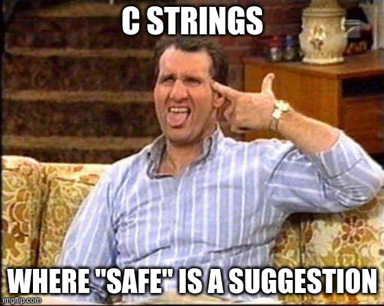

# C/C++ Programming


---


---

## Hello, world

---

```c []
#include <stdio.h>

int main(void)
{
    printf("Hello, world!\n");
}
```

Note:

* What are the differences with C++?
* No modules, use `#include`
* `void` to indicate that the main function does not have arguments
* Up until C23 writing `function()` meant any number of arguments
* `printf` function with manual newline
* `printf` does not check that arguments match format specifiers!
* <https://compiler-explorer.com/z/oee8G77oK>

---


### Dennis Richie

1941 - 2011, Inventor of C

---

<div style="display: flex; justify-content: space-evenly; align-items: center;">

<div style="padding-right: 45px;">


</div>

<div>

* Created in 1972
* Dennis Richie
* Releases
  * K&R C 1978
  * ANSI C 89
  * ISO C 90,95,99,11,17,23
* <https://c-language.org>

</div>

</div>

---

C is a medium-level procedural language.

---

|                         | C                    | C++                               |
|:------------------------|:---------------------|:----------------------------------|
| **Paradigm**            | Procedural           | Procedural, OOP, functional, meta |
| **Resource Management** | Manual (malloc/free) | Automatic (RAII, smart pointers)  |
| **Error Handling**      | Return code, errno   | Exceptions, std::expected         |
| **Standard Library**    | Minimal              | Rich (STL)                        |

---

## Why bother with C?

---

Mostly legacy code.

Note:

* Hardware vendors often still only supply a C library.

---

<div style="display: flex; justify-content: space-evenly; align-items: center;">

<div style="padding-right: 45px;">


</div>

<div>

* Linus Torvalds
* First release: 1991
* Written in C89
* 2022: Upgrade to C11
* 37.05m lines of code

</div>

</div>

And the Linux kernel.

---

## Hello, ${name}

---

```c []
#include <stdio.h>
```

```c []
int main(void)
{
    printf("Hello, %s!\n", "Glenn");
}
```

Hard coded.

Note:

* <https://compiler-explorer.com/z/dW48bn7x1>

---

```c []
#include <stdio.h>
```

```c []
void say_hello(char name[])
{
    printf("Hello, %s\n", name);
}
```

```c []
int main(void)
{
    say_hello("Jefke");
}
```

Create a separate function.

Note:

* <https://compiler-explorer.com/z/vE1Ejhbnx>

---

```c []
void say_hello(char name[])
{
    printf("Hello, %s\n", name);
}
```

```c
say_hello("Jefke");
```

* No string type, just a char array.
* We don't know the length up front.
* Char array must be zero-terminated.

Note:

* We have to somehow indicate where the string ends.
* This is done by adding an extra character at the end of the string with value 0.
* There is nothing in the language that can enforce this.

---

```c []
int string_length(char str[])
{
    int result = 0;
    for (; str[result] != '\0'; ++result) {}
    return result;
}
```

```c
// OK, '\0' automatically added to string literals
char str[] = "test";
int len = string_length(str);
```
<!-- .element: class="fragment" data-fragment-index="1" -->

```c
// OK, zero-terminated string
char str[] = {'t', 'e', 's', 't', '\0'};
int len = string_length(str);
```
<!-- .element: class="fragment" data-fragment-index="2" -->

```c
// ERROR, loop will continue past string, buffer overflow
char str[] = {'t', 'e', 's', 't'};
int len = string_length(str);
```
<!-- .element: class="fragment" data-fragment-index="3" -->

Note:

* <https://compiler-explorer.com/z/3n4b9jKnW>
* <https://compiler-explorer.com/z/hxMjG1q7r>
* <https://compiler-explorer.com/z/ME58EYh5z>

---

```c []
#include <stdio.h>
```

```c []
void say_hello(char name[])
{
    printf("Hello, %s\n", name);
}
```

```c []
int main(void)
{
    char name[20] = {0};
    scanf("%s", name);
    say_hello(name);
}
```

Ask input from the user.

Note:

* <https://compiler-explorer.com/z/o9x7cr5j7>

---

```c []
char name[20] = {0};
scanf("%s", name);
```

<!-- markdownlint-disable line-length -->
<!--- cSpell:disable --->
```sh []
=================================================================
==1==ERROR: AddressSanitizer: stack-buffer-overflow on address 0x7a9f50e09034 at pc 0x7e9f53b269bc bp 0x7ffe6542c4f0 sp 0x7ffe6542bcb0
WRITE of size 29 at 0x7a9f50e09034 thread T0
    #0 0x7e9f53b269bb  (/opt/compiler-explorer/gcc-15.1.0/lib64/libasan.so.8+0xaa9bb) (BuildId: f3722c88f6a9d6f23162523d828eaae8bffb1fff)
    #1 0x7e9f53b66ed8 in __isoc99_vsscanf (/opt/compiler-explorer/gcc-15.1.0/lib64/libasan.so.8+0xeaed8) (BuildId: f3722c88f6a9d6f23162523d828eaae8bffb1fff)
    #2 0x7e9f53b6761c in __isoc99_sscanf (/opt/compiler-explorer/gcc-15.1.0/lib64/libasan.so.8+0xeb61c) (BuildId: f3722c88f6a9d6f23162523d828eaae8bffb1fff)
    #3 0x0000004011fc in main /app/example.c:12
    #4 0x7e9f53229d8f  (/lib/x86_64-linux-gnu/libc.so.6+0x29d8f) (BuildId: 490fef8403240c91833978d494d39e537409b92e)
    #5 0x7e9f53229e3f in __libc_start_main (/lib/x86_64-linux-gnu/libc.so.6+0x29e3f) (BuildId: 490fef8403240c91833978d494d39e537409b92e)
    #6 0x0000004012e4 in _start (/app/output.s+0x4012e4) (BuildId: bbf5ee4c0b6b681c145125f55fd9f627856f2e76)

Address 0x7a9f50e09034 is located in stack of thread T0 at offset 52 in frame
    #0 0x0000004010cf in main /app/example.c:9

  This frame has 2 object(s):
    [32, 52) 'name' (line 11) <== Memory access at offset 52 overflows this variable
    [96, 125) 'simulate_user_input' (line 10)
HINT: this may be a false positive if your program uses some custom stack unwind mechanism, swapcontext or vfork
      (longjmp and C++ exceptions *are* supported)
SUMMARY: AddressSanitizer: stack-buffer-overflow /app/example.c:12 in main
Shadow bytes around the buggy address:
  0x7a9f50e08d80: 00 00 00 00 00 00 00 00 00 00 00 00 00 00 00 00
  0x7a9f50e08e00: 00 00 00 00 00 00 00 00 00 00 00 00 00 00 00 00
  0x7a9f50e08e80: 00 00 00 00 00 00 00 00 00 00 00 00 00 00 00 00
  0x7a9f50e08f00: 00 00 00 00 00 00 00 00 00 00 00 00 00 00 00 00
  0x7a9f50e08f80: 00 00 00 00 00 00 00 00 00 00 00 00 00 00 00 00
=>0x7a9f50e09000: f1 f1 f1 f1 00 00[04]f2 f2 f2 f2 f2 00 00 00 05
  0x7a9f50e09080: f3 f3 f3 f3 00 00 00 00 00 00 00 00 00 00 00 00
  0x7a9f50e09100: 00 00 00 00 00 00 00 00 00 00 00 00 00 00 00 00
  0x7a9f50e09180: 00 00 00 00 00 00 00 00 00 00 00 00 00 00 00 00
  0x7a9f50e09200: 00 00 00 00 00 00 00 00 00 00 00 00 00 00 00 00
  0x7a9f50e09280: 00 00 00 00 00 00 00 00 00 00 00 00 00 00 00 00
Shadow byte legend (one shadow byte represents 8 application bytes):
  Addressable:           00
  Partially addressable: 01 02 03 04 05 06 07
  Heap left redzone:       fa
  Freed heap region:       fd
  Stack left redzone:      f1
  Stack mid redzone:       f2
  Stack right redzone:     f3
  Stack after return:      f5
  Stack use after scope:   f8
  Global redzone:          f9
  Global init order:       f6
  Poisoned by user:        f7
  Container overflow:      fc
  Array cookie:            ac
  Intra object redzone:    bb
  ASan internal:           fe
  Left alloca redzone:     ca
  Right alloca redzone:    cb
==1==ABORTING
```
<!--- cSpell:enable --->
<!-- markdownlint-enable line-length -->
<!-- .element: class="fragment" data-fragment-index="1" -->

What if I enter 20 characters or more?

Note:

* <https://compiler-explorer.com/z/K59TGGvod>

---

```c
char name[20] = {0};
scanf("%19s", name); // needs space for '\0'
```

Tell scanf to read max 19 characters.

Note:

* <https://compiler-explorer.com/z/x536KxW31>
* This works, but it's all hard-coded.

---

```c
#define TO_STRING_HELPER(x) #x
#define TO_STRING(x) TO_STRING_HELPER(x)
```

```c
#define MAX_STRLEN 19
```

```c
char name[MAX_STRLEN + 1] = {0};
```

```c
scanf("%" TO_STRING(MAX_STRLEN) "s", name);
```

Macro magic to avoid hard-coded values.

Note:

* <https://compiler-explorer.com/z/7MrasfsaW>
* Preprocessor magic needed to somewhat remove hardcoded values.
* Generate the format string using macro magic.
* Still need to remember to allocate space for the zero terminator.
* #x converts an expression to a string.

```c
// prints literally MAX_STRLEN
#define TO_STRING(x) #x
printf(TO_STRING(MAX_STRLEN));
```

```c
// prints the value of MAX_STRLEN
#define TO_STRING_HELPER(x) #x
#define TO_STRING(x) TO_STRING_HELPER(x)
printf(TO_STRING(MAX_STRLEN));
```

---

<div style="display: flex; justify-content: space-evenly; align-items: center;">

<div style="padding-right: 45px;">


</div>

<div>



</div>

</div>

Welcome to the C programming language.

Note:

* Safe versions of scan and string functions were standardized in C11.
* But not a single standard library implementation actually has them.

---

```c []
#include <stdio.h>
```

```c []
void say_hello(char name[], int age)
{
    printf("Hello %s, you are %d years old.\n", name, age);
}
```

```c []
int main(void)
{
    char name[20] = {0};
    int age = 0;
    scanf("%19s %d", name, &age);
    say_hello(name, age);
}
```

Ask both name and age.

Note:

* <https://compiler-explorer.com/z/hTrj8sfGz>

---

What if the user enters invalid input?

```c
int result = scanf(/*...*/);
if (result != /* number of values to read */)
{
    // invalid input!
}
```
<!-- .element: class="fragment" data-fragment-index="1" -->

Check the scanf return value!
<!-- .element: class="fragment" data-fragment-index="1" -->

Note:

* Scanf returns the number of values it read successfully.

---

TODO
