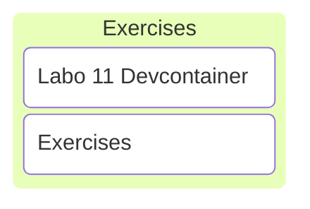

# C/C++ Programming

## Labo 11

---



---

## Exercises

---

### Devcontainer

<https://gitlab.apstudent.be/cpp-programming/devcontainer-labo-11>

---

* Clangd for intellisense.
* Add support for C.

---

```cmake
cpprog_add_executable(
    TARGET ex_1   # executable will be called ex_1
    CXX_SOURCES   # old-style source files here (C or C++)
    "ex_1.c"
)
```

`CXX_SOURCES` accepts both c and c++ source files.

---

## No Exercises

Time to work on the project. 🙂
