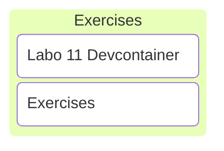

# C/C++ Programming

## Labo 11

---

```mermaid
kanban
  column1[Exercises]
    task1[Labo 11 Devcontainer]
    task2[Exercises]
```

---

## Exercises

---

### Devcontainer

TODO: Create devcontainer.

---

### Exercises

See digitap.
