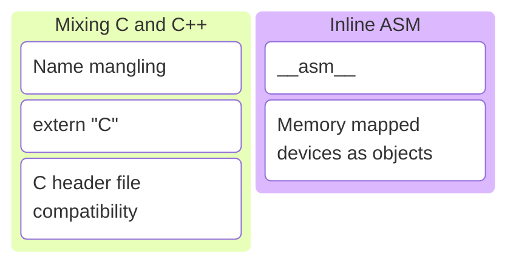

# C/C++ Programming


---



---

## Mixing C and C++

Note:

* <https://en.cppreference.com/w/cpp/language/language_linkage>

---

```c++
int sum(int a, int b) { return a + b; }
double sum(double a, double b) { return a + b; }
```

```c++
std::println("{}", sum(3, 4));
std::println("{}", sum(3.14, 4.25));
```

C++ has function overloading.

Note:

* It is allowed to define multiple functions with the same name in C++ if and only if they have different arguments.
* The return type is ignored for this rule!

---

With function overloading there can be multiple functions with the same name.

---

What to do when compiling to assembly code?

---

<!--- cSpell:disable --->
```asm []
; int sum(int a, int b)
sum: push  rbp
     mov   rbp, rsp
     mov   dword ptr [rbp - 4], edi
     mov   dword ptr [rbp - 8], esi
     mov   eax, dword ptr [rbp - 4]
     add   eax, dword ptr [rbp - 8]
     pop   rbp
     ret
```
<!--- cSpell:enable --->

<!--- cSpell:disable --->
```asm []
; double sum(double a, double b)
sum: push  rbp
     mov   rbp, rsp
     movsd qword ptr [rbp - 8], xmm0
     movsd qword ptr [rbp - 16], xmm1
     movsd xmm0, qword ptr [rbp - 8]
     addsd xmm0, qword ptr [rbp - 16]
     pop   rbp
     ret
```
<!--- cSpell:enable --->

Using the same label twice does not work!

---

### Name mangling

Generate a unique label that incorporates the function argument types in the name.

Note:

* Name mangling is applied to all symbols in C++. Not only for overloaded functions.

---

<!--- cSpell:disable --->
```asm []
; int sum(int a, int b)
_Z3sumii: push  rbp
          mov   rbp, rsp
          mov   dword ptr [rbp - 4], edi
          mov   dword ptr [rbp - 8], esi
          mov   eax, dword ptr [rbp - 4]
          add   eax, dword ptr [rbp - 8]
          pop   rbp
          ret
```
<!--- cSpell:enable --->

<!--- cSpell:disable --->
```asm []
; double sum(double a, double b)
_Z3sumdd: push  rbp
          mov   rbp, rsp
          movsd qword ptr [rbp - 8], xmm0
          movsd qword ptr [rbp - 16], xmm1
          movsd xmm0, qword ptr [rbp - 8]
          addsd xmm0, qword ptr [rbp - 16]
          pop   rbp
          ret
```
<!--- cSpell:enable --->

Name mangling makes the labels unique!

Note:

* <https://compiler-explorer.com/z/6qcTWa6eP>

---


Note:

* Breakdown of the mangled name for the `int sum(int a, int b)` function.

---

```c++ []
namespace some_ns {             // 7 some_ns

class SomeClass                 // 9 SomeClass
{
public:
    void some_func()            // 9 some_func v
    {
        std::println("Hello!");
    }
};

}
```

```text
_ZN7some_ns9SomeClass9some_funcEv
```

```c++
// _Z is always used
// N...E for list of symbol names (namespace, class, function)
// v because function has no arguments (void)
```

A function inside a class, inside a namespace.

Note:

* <https://compiler-explorer.com/z/W43dds1qW>

---

```c++ []
template <typename t, typename U> // I i d E
class TemplateClass               // 13 TemplateClass
{
public:
    void some_func()              // 9 some_func v
    {
        std::println("Hello!");
    }
};

TemplateClass<int, double> obj;   // instantiates template
```

```text
_ZN13TemplateClassIidE9some_funcEv
```

```c++
// _Z is always used
// N...E for list symbol names (class and function)
// I...E for template arguments
```

Template arguments are also included.

Note:

* <https://compiler-explorer.com/z/P6366nja7>

---

* In C++ all symbol names are mangled.
* How to mangle is not defined in the standard.
  <!-- .element: class="fragment" data-fragment-index="1" -->
* Each compiler can define its own mangling scheme.
  <!-- .element: class="fragment" data-fragment-index="2" -->
* GCC, Clang, IAR, ... use the same scheme.
  <!-- .element: class="fragment" data-fragment-index="3" -->
* Microsoft Visual C++ uses a different scheme.
  <!-- .element: class="fragment" data-fragment-index="4" -->
* C does not have name mangling.
  <!-- .element: class="fragment" data-fragment-index="5" -->

---

## Inline Assembly

---

TODO

---

## No Exercises

Time to work on the project. 🙂
