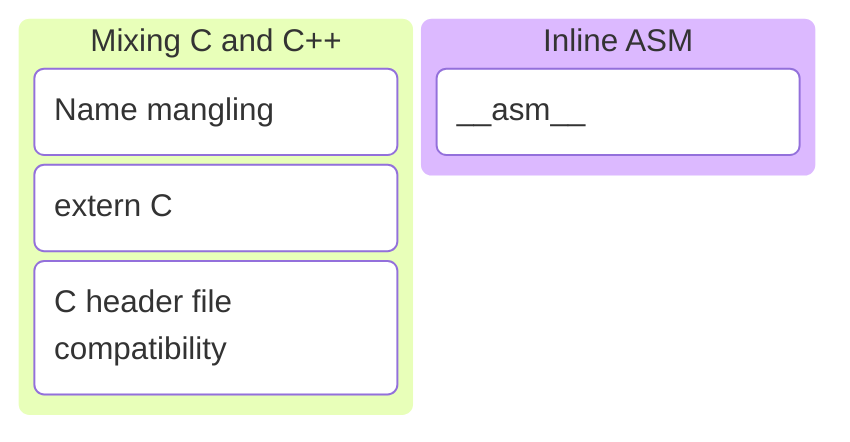

# C/C++ Programming

---

```mermaid
kanban
  column1[Mixing C and C++]
    task1[Name mangling]
    task2[extern C]
    task3[C header file compatibility]
  column2[Inline ASM]
    task1[\_\_asm\_\_]
```

---

## TODO

---

## No Exercises

Time to work on the project. 🙂
