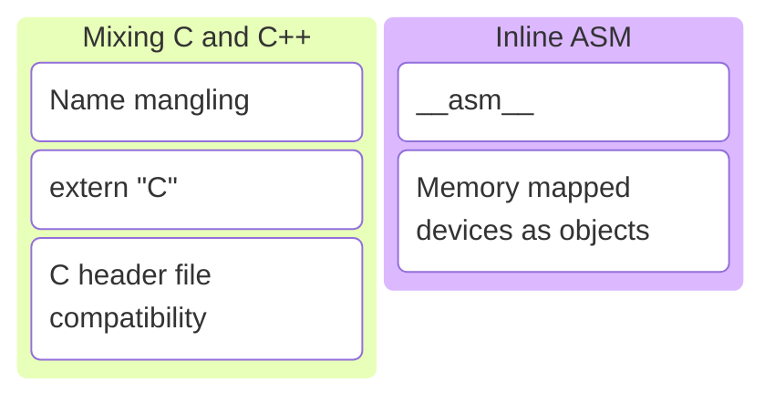
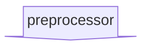
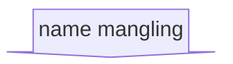
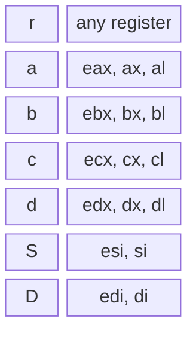

# C/C++ Programming


---



---

## Mixing C and C++

Note:

* <https://en.cppreference.com/w/cpp/language/language_linkage>

---

```c++
int sum(int a, int b) { return a + b; }
double sum(double a, double b) { return a + b; }
```

```c++
std::println("{}", sum(3, 4));
std::println("{}", sum(3.14, 4.25));
```

C++ has function overloading.

Note:

* It is allowed to define multiple functions with the same name in C++ if and only if they have different arguments.
* The return type is ignored for this rule!

---

With function overloading there can be multiple functions with the same name.

---

What to do when compiling to assembly code?

---

<!--- cSpell:disable --->
```asm []
; int sum(int a, int b)
sum: push  rbp
     mov   rbp, rsp
     mov   dword ptr [rbp - 4], edi
     mov   dword ptr [rbp - 8], esi
     mov   eax, dword ptr [rbp - 4]
     add   eax, dword ptr [rbp - 8]
     pop   rbp
     ret
```
<!--- cSpell:enable --->

<!--- cSpell:disable --->
```asm []
; double sum(double a, double b)
sum: push  rbp
     mov   rbp, rsp
     movsd qword ptr [rbp - 8], xmm0
     movsd qword ptr [rbp - 16], xmm1
     movsd xmm0, qword ptr [rbp - 8]
     addsd xmm0, qword ptr [rbp - 16]
     pop   rbp
     ret
```
<!--- cSpell:enable --->

Using the same label twice does not work!

---

### Name mangling

Generate a unique label that incorporates the function argument types in the name.

Note:

* Name mangling is applied to all symbols in C++. Not only for overloaded functions.

---

<!--- cSpell:disable --->
```asm []
; int sum(int a, int b)
_Z3sumii: push  rbp
          mov   rbp, rsp
          mov   dword ptr [rbp - 4], edi
          mov   dword ptr [rbp - 8], esi
          mov   eax, dword ptr [rbp - 4]
          add   eax, dword ptr [rbp - 8]
          pop   rbp
          ret
```
<!--- cSpell:enable --->

<!--- cSpell:disable --->
```asm []
; double sum(double a, double b)
_Z3sumdd: push  rbp
          mov   rbp, rsp
          movsd qword ptr [rbp - 8], xmm0
          movsd qword ptr [rbp - 16], xmm1
          movsd xmm0, qword ptr [rbp - 8]
          addsd xmm0, qword ptr [rbp - 16]
          pop   rbp
          ret
```
<!--- cSpell:enable --->

Name mangling makes the labels unique!

Note:

* <https://compiler-explorer.com/z/6qcTWa6eP>

---


Note:

* Breakdown of the mangled name for the `int sum(int a, int b)` function.

---

```c++ []
namespace some_ns {             // 7 some_ns

class SomeClass                 // 9 SomeClass
{
public:
    void some_func()            // 9 some_func v
    {
        std::println("Hello!");
    }
};

}
```

```text
_ZN7some_ns9SomeClass9some_funcEv
```

```c++
// _Z is always used
// N...E for list of symbol names (namespace, class, function)
// v because function has no arguments (void)
```

A function inside a class, inside a namespace.

Note:

* <https://compiler-explorer.com/z/W43dds1qW>

---

```c++ []
template <typename t, typename U> // I i d E
class TemplateClass               // 13 TemplateClass
{
public:
    void some_func()              // 9 some_func v
    {
        std::println("Hello!");
    }
};

TemplateClass<int, double> obj;   // instantiates template
```

```text
_ZN13TemplateClassIidE9some_funcEv
```

```c++
// _Z is always used
// N...E for list symbol names (class and function)
// I...E for template arguments
```

Template arguments are also included.

Note:

* <https://compiler-explorer.com/z/P6366nja7>

---

* In C++ all symbol names are mangled.
* How to mangle is not defined in the standard.
  <!-- .element: class="fragment" data-fragment-index="1" -->
* Each compiler can define its own mangling scheme.
  <!-- .element: class="fragment" data-fragment-index="2" -->
* GCC, Clang, IAR, ... use the same scheme.
  <!-- .element: class="fragment" data-fragment-index="3" -->
* Microsoft Visual C++ uses a different scheme.
  <!-- .element: class="fragment" data-fragment-index="4" -->
* C does not have name mangling.
  <!-- .element: class="fragment" data-fragment-index="5" -->

---

Let's try to mix C and C++ code.

---

### Use case

Using a C library in a C++ project.

--

sum.h

```c
#ifndef SUM_H
#define SUM_H

int sum(int a, int b);

#endif
```

sum.c

```c
#include "sum.h"

int sum(int a, int b)
{
    return a + b;
}
```

A fancy C math library to calculate sums.

--

main.cpp

```c++
#include "sum.h"

int main()
{
    return sum(5, 6);
}
```

A C++ application that uses the C math library.

Does it compile?

<div style="display: flex; justify-content: space-evenly;">
    <div class="fragment semi-fade-out shrink" data-fragment-index="1">a) yes</div>
    <div class="fragment highlight-current-blue grow" data-fragment-index="1">b) no</div>
</div>

Note:

* There will be a linker error.

--

```c++
#include "sum.h"
int main()
{
    return sum(5, 6);
}
```


<!-- .element: class="fragment" data-fragment-index="1" -->

```c++
int sum(int a, int b);
int main()
{
    return sum(5, 6);
}
```
<!-- .element: class="fragment" data-fragment-index="1" -->


<!-- .element: class="fragment" data-fragment-index="2" -->

```c++
int _Z3sumii(int a, int b);
int main()
{
    return _Z3sumii(5, 6);
}
```
<!-- .element: class="fragment" data-fragment-index="2" -->

Note:

* The preprocessor replaced the include directive with the contents of the sum.h file.
* The names in the C++ part of the project are mangled.
* The names in the C part of the project are not mangled.

--

sum.c

```c
int sum(int a, int b) // definition of sum
{
    return a + b;
}
```

main.cpp

```c++
int main()
{
    return _Z3sumii(5, 6); // trying to use sum
}
```

Linker error! Cannot resolve symbol `_Z3sumii`.

Note:

* We try to call a function named `_Z3sumii`.
* But the function is actually called `sum`.
* So the linker cannot find the definition!

--

Solution: Tell C++ to not mangle C symbol names!

--

main.cpp

```c++
extern "C" {
#include "sum.h"
}
```

```c++
int main()
{
    return sum(5, 6);
}
```

Prevent name mangling for symbols in sum.h.

--

Adding **extern "C"** around each include of a C header is a bit annoying.

--

sum.h

```c
#ifndef SUM_H
#define SUM_H
```

```c
#ifdef __cplusplus
extern "C" {
#endif
```
<!-- .element: class="fragment" data-fragment-index="1" -->

```c
int sum(int a, int b);
```

```c
#ifdef __cplusplus
}
#endif
```
<!-- .element: class="fragment" data-fragment-index="1" -->

```c
#endif
```

If possible, solve it in the C header.

Note:

* Make C libraries compatible with C++!
* Automatically wrap the declarations in the C header in extern "C" if the C++ programming language is detected.

---

### Best practices

---

* Make your C libraries compatible with C++!

---

## Mixing Assembly and C++

Note:

* <https://en.cppreference.com/w/c/language/asm>
* <https://www.ibiblio.org/gferg/ldp/GCC-Inline-Assembly-HOWTO.html>

---

```c++
import std;
```

```c++
int main()
{
    int x{5};
    int y{6};

    auto sum = x + y; // How to calculate sum in assembly?

    std::println("{} + {} = {}", x, y, sum);
}
```

```text
5 + 6 = 10
```

--

```c++
import std;
```

```c++
int main()
{
    int x{5};
    int y{6};

    int sum{};
```

```c++
    __asm__(
        "addl %%ebx,%%eax"  // add instruction
        : "=a" (sum)        // store result in sum variable
        : "a" (x), "b" (y)  // pass x and y variables
    );
```
<!-- .element: class="fragment" data-fragment-index="1" -->

```c++
    std::println("{} + {} = {}", x, y, sum);
}
```

```text
5 + 6 = 10
```

Note:

* <https://compiler-explorer.com/z/Pbb6z4xhK>

--

```c++
__asm__(
    "addl %%ebx,%%eax"
    : "=a" (sum)
    : "a" (x), "b" (y)
);
```

```c++
// eax += ebx
addl %%ebx,%%eax
```
<!-- .element: class="fragment" data-fragment-index="1" -->

```c++
// read the eax register and store the result in sum
: "=a" (sum)
```
<!-- .element: class="fragment" data-fragment-index="2" -->

```c++
// load the value of x in the eax register
// load the value of y in the ebx register
: "a" (x), "b" (y)
```
<!-- .element: class="fragment" data-fragment-index="3" -->

--

```c++
__asm__(
    "addl %%ebx,%%eax"
    : "=a" (sum)
    : "a" (x), "b" (y)
);
```



* General purpose registers: eax, ebx, ecx, edx
* Function argument registers: esi, edi

---

### Best practices

---

* It is possible to use assembly code in C++.
* Don't unless you have a very good reason to.

---

## No Exercises

Time to work on the project. 🙂
