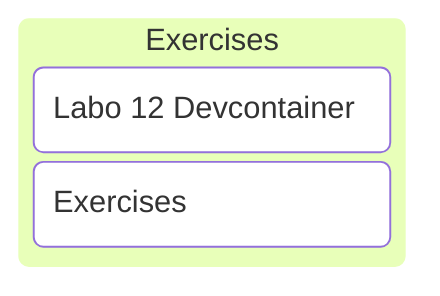

# C/C++ Programming

## Labo 12

---

---

## Devcontainer

<https://gitlab.apstudent.be/cpp-programming/devcontainer-labo-11>

Note:

* Keep using the labo 11 devcontainer.

---

## No Exercises

Time to work on the project. 🙂
