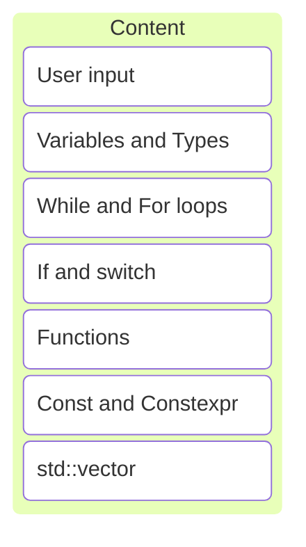
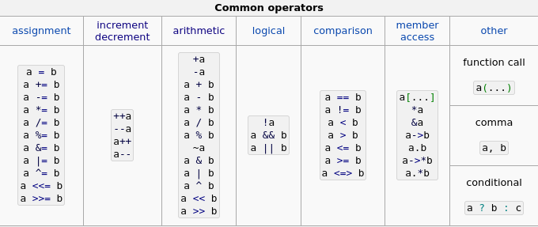

# C/C++ Programming

<!--- cSpell:ignore Mieke Joske Marieke Jefke --->


---



---

```c++
import std;

int main()
{
    std::println("Hello, world!");
}
```

---

## Asking user input

---

```c++ []
import std;

int main()
{
    std::print("Enter your first name: ");
    std::string first_name{};
    std::cin >> first_name;
    std::println("Hello, {}!", first_name);
}
```

---

```c++ []
import std;

int main()
{
    // print text on screen without newline
    std::print("Enter your first name: ");
    std::string first_name{};
    std::cin >> first_name;
    std::println("Hello, {}!", first_name);
}
```

---

```c++ []
import std;

int main()
{
    std::print("Enter your first name: ");
    // create a variable of type string, called first_name
    // no value yet, initialize to empty with {}
    std::string first_name{};
    std::cin >> first_name;
    std::println("Hello, {}!", first_name);
}
```

---

```c++ []
import std;

int main()
{
    std::print("Enter your first name: ");
    std::string first_name{};
    // read from console input to first_name variable
    std::cin >> first_name;
    std::println("Hello, {}!", first_name);
}
```

---

```c++ []
import std;

int main()
{
    std::print("Enter your first name: ");
    std::string first_name{};
    std::cin >> first_name;
    // print text on screen with newline
    // {} is placeholder to fill in variable
    std::println("Hello, {}!", first_name);
}
```

---

```c++ []
import std;

int main()
{
    std::print("Enter your first name and age: ");
    std::string first_name{};
    int age{0};
    std::cin >> first_name >> age;
    std::println("{} is {} years old.", first_name, age);
}
```

---

```c++ []
import std;

int main()
{
    std::print("Enter your first name and age: ");
    std::string first_name{};
    // we need an integer variable to hold the age
    // initialize it to zero
    int age{0};
    // cin can read multiple items at once
    // cin is aware of the types
    // cin uses whitespace (space, enter) as separator
    std::cin >> first_name >> age;
    std::println("{} is {} years old.", first_name, age);
}
```

---

```c++ []
import std;

int main()
{
    std::string words{};
    std::string word{};
    std::println("Enter as many words as you like");
    while (std::cin >> word)
    {
        words += word + ' ';
    }
    std::println("Entered words: {}", words);
}
```

Allow user to enter as much input as she likes.

Note:

* While condition evaluates to true execute code
* std::cin >> word evaluates to true on success
* Stop by pressing Ctrl+Z and Enter on Windows or Ctrl+D on Linux

---

```c++
// classic while loop
while (/*condition*/)
{
    // statements to execute
}
```

```c++
// classic for loop
for (/*init-statement*/; /*condition*/; /*expression*/)
{
    // statements to execute
}
```

```c++
// range for loop (foreach)
for (/*item-declaration*/: /*range or container*/)
{
    // statements to execute
}
```

Note:

* We'll cover the range for loop later
* do...while also exists, but rarely used

---

```c++
// print numbers 0, 1, 2, 3, 4, 5, 6, 7, 8, 9
for (int i{0}; i < 10; ++i)
{
    std::println("{}", i);
}
```

```c++
// infinite loop
for (/*empty*/;/*empty*/;/*empty*/)
{
    std::println("Hello!");
}
```

Note:

* In a for loop all items are optional

---

```c++ []
std::string words{};
std::string word{};
while (std::cin >> word)
{
    words += word;
}
// word variable available here, but not needed
std::println(words);
```

---

```c++ []
std::string words{}
for (std::string word{}; std::cin >> word; /*empty*/)
{
    // word variable only available in for loop, better!
    words += word;
}
std::println(words);
```

Always limit the scope of variables.

---

## Variables

---

```c++ []
bool tap_on{true};       // bool for logical variables
int number_of_steps{39}; // int for integers
double flying_time{3.5}; // double for floating-point numbers
char decimal_point{'.'}; // char for individual characters
std::string name{"Jef"}; // string for character strings
```

Note:

* basic types
* many other types exist

---

### Naming

---

Use descriptive names!

---

* Lowercase letters: a..z
* Uppercase letters: A..Z
* Digits: 0..9
* Underscore: _

---

* Case sensitive
* Must start with letter
* Keywords not allowed

Note:

* Must start with letter: starting with _ is reserved for implementation/system
* Cannot use keywords: int if = 5; is illegal

---

### Types

---

A type defines a set of possible values and a set of operations.

---

Every object is given a type when it is defined, and that type never changes.

---

```c++ []
int a{5};      // a starts out with value 5
a = 6;         // change a to hold value 6
int b{a};      // b starts as a copy of a's value
b += 3;        // increment b by 3, value is now 9
++b;           // increment b by 1, value is now 10
a = b * 5;     // a is now 50
b = "test";    // illegal: can't assign string to int
```

#### Integers

Note:

* Assigning a variable to another creates a copy

---



<https://en.cppreference.com/w/cpp/language/expressions>

Note:

* Don't use a++ or a--

---

```c++ []
std::string a{"hello"}; // a starts out with value "hello"
a += " world";          // a now contains "hello world"
std::string b{a};       // b is "hello world", a copy of a
b[0] = 'j';             // b now "jello world", a unchanged
b += 33;                // unexpected: converts 33 to char
b -= "test";            // illegal: -= not defined for string
bool c{a < b};          // c true, lexicographical comparison
```

#### Strings

Note:

* Copying a primitive type is cheap
* Copying long strings is expensive!
* Lexicographical comparison = dictionary ordering
* char(33) is `!`

---

* Can compare strings: ==, !=, <=, <, >=, >
* Can add strings together with +
* Cannot subtract strings
* Available operations depend on type

<https://en.cppreference.com/w/cpp/string/basic_string>

---

## Type safety

---

A program is type-safe if all objects are used according to the rules of their type.

---

Complete type safety is the ideal and general rule of the language.

---

### Initialization

---

```c++
int main()
{
    double x;           // forgot to initialize
    double y = x;       // value of y is undefined
    double z = 2.0 + x; // value of z is undefined
}
```

Always initialize your variables!

---

<!--- cSpell:disable --->
```text
[build] main.cpp:4:33: error: variable 'x' is uninitialized
        when used here [-Werror,-Wuninitialized]
[build]     4 |     double y = x;
[build]       |                ^
[build] main.cpp:3:13: note: initialize the variable 'x' to
        silence this warning
[build]     3 |     double x;
[build]       |            ^
[build]       |             = 0.0
[build] 1 error generated.
```
<!--- cSpell:enable --->

Luckily we have compiler warnings enabled. 😉

---

### Conversions

---

```c++
char c{'x'};
int i1{c};          // c converted to int
int i2{c + 1000};   // c converted to int plus 1000
double d{i2 + 7.3}; // i2 converted to double plus 7.3
```

Conversion happens automagically.

---

|        | Bytes | Min value      | Max value     |
|--------|-------|----------------|---------------|
| char   | 1     | -128           | 127           |
| int    | 4     | -2.147.483.648 | 2.147.483.647 |
| double | 8     | 2,22e-308      | 1,79e+308     |

---

```c++
double x{2.7};
int y = x;     // x converted to int, becomes 2
int z{1000};
char c = z;    // z converted to char, becomes -24
```

Also converted when the value does not fit...

---

Implicit conversions inherited from C. ☹️

---

#### Widening conversion

```c++
// char -> int
// char -> double
// int  -> double
```

Target type is large enough to fit original type. Conversion is safe.

Note:

* Widening conversions are usually convenient

---

#### Narrowing conversion

```c++
// int    -> char
// double -> char
// double -> int
```

Target type is too small to fit original type. Information may get lost.

Note:

* Narrowing conversions are dangerous

---

No compiler warnings when assignment operator is used. ☹️

---

<!--- cSpell:disable --->
```txt
[build] main.cpp:4:14: error: narrowing conversion from 'int'
        to signed type 'char' is implementation-defined
        [bugprone-narrowing-conversions,cppcoreguidelines-
        narrowing-conversions,-warnings-as-errors]
[build]     4 |     char c = x;
[build]       |              ^
```
<!--- cSpell:enable --->

clang-tidy finds these problems!

Note:

* Static analysis to the rescue

---

```c++
int x0 = 7.8;   // narrows, compiler accepts, clang-tidy warns
int x1(7.8);    // narrows, compiler accepts, clang-tidy warns
```

```c++
int x2{7.8};    // illegal, {} does not allow narrowing
int x3 = {7.8}; // illegal, {} does not allow narrowing
```

Multiple ways to initialize variables.

Note:

* {} and ={} are modern C++ constructs inspired by early C

---

```c++
type x = value;   // unsafe for initialization, don't use
type x(value);    // unsafe, old style, avoid unless needed
```

```c++
type x{value};    // safe, modern way of initialization
type x = {value}; // safe, not used as often
```

Avoid those that allow narrowing.

Note:

* type x(value) is sometimes needed, see later
* Spoiler: initializer_list has precedence over constructor
* std::vector v1{2, 1}; -> init list vector with value 2 and 1
* std::vector v2(2, 1); -> constructor vector with twice value 1

---

* Always initialize your variables
* Always use brace initialization {}
* Enable compiler warnings
* Use static analyzer

---

## Branches

Note:

* We haven't covered branches yet, so it's probably time we do

---

```c++
if (/*condition*/)
{
    // statements to execute
}
else if (/* other condition*/)
{
    // statements to execute
}
else
{
    // statements to execute
}
```

Note:

* No real surprises on how if statements work

---

```c++
int x{0};
if (x == 0)
{
    // do something with x
}
// x still in scope, but not needed
```

```c++
if (int x{0}; x == 0)
{
    // x only in scope in if statement
}
else if (x == 1) // this is also part of the if
{
    // and so is this
}
// but here x is not in scope!
```

Note:

* Variables can be declared in if

---

```c++
std::println("Pick an operation: 1: +, 2: -, 3: *: ");
int operation{};
std::cin >> operation;
```

```c++
if (operation == 1) {
    // do +
} else if (operation == 2) {
    // do -
} else if (operation == 3) {
    // do *
} else {
    // invalid operation
}
```

### Common pattern

Note:

* repetition of `operation == x` in each branch

---

```c++
switch (operation)
{
    case 0:
        // do +
        break;
    case 1:
        // do -
        break;
    case 2:
        // do *
        break;
    default:
        // invalid operation
        break;
}
```

---

* Don't forget to break after each case!
* Without break next case will also be executed!

---

```c++
switch (operation)
{
    case 0:
        // do + and run case 1
    case 1:
        // do -
        break;
    // ...
}
```

Looks like a bug!

---

```c++
switch (operation)
{
    case 0:
        // do + and run case 1
        [[fallthrough]];
    case 1:
        // do -
        break;
    // ...
}
```

Make it explicit if you really want to do this!

Note:

* Attributes provide extra information
* Attributes are written between `[[attribute]]`

---

## Functions

Note:

* We've already seen examples of functions: main and hello

---

### Why functions?

---

Shows intent by naming the algorithm.

---

Makes the program text easier to understand.

Note:

* Short functions with a clear name

---

Makes reuse possible.

Note:

* Call function multiple times instead of copying code

---

Makes it easier to test the code.

---

### Examples

---

```c++
// result is int, one argument of type int
```

```c++
int square(int x)
{
    return x*x;
}
```

```c++
int result1{square(5)};    // use brace initialization
auto result2 = square(10); // use return type from function
```

---

```c++
// void means function does not return anything
```

```c++
void print_square(int x)
{
    std::println("{}", x*x);
}
```

```c++
print_square(5);
```

---

```c++
// nothing to return, no arguments
```

```c++
void say_hi()
{
    std::println("Hi1");
}
```

```c++
say_hi();
```

---

```c++
// result is int, two arguments of type int
```

```c++
int div_or_a(int a, int b)
{
    if (b == 0)
    {
        return a;
    }
    // not reachable if b is equal to 0
    return a / b;
}
```

```c++
auto result1 = div_or_a(7, 5);
auto result2 = div_or_a(7, 0);
```

---

### Declaration vs Definition

---

```c++
// function declaration
int square(int x);
```

```c++
// function definition
int square(int x)
{
    return x*x;
}
```

---

```c++
int square(int x);
```

* Declaration has all the info we need to know how to use the function.
* Declarations are provided in old-style header files.

---

```c++
int square(int x)
{
    return x*x;
}
```

* Definition tells what the function does.
* Only one definition is allowed!

Note:

* ODR = One Definition Rule

---

```c++ []
// square.hpp

int square(int x);
```

```c++ []
// square.cpp

#include "square.hpp"

int square(int x)
{
    return x*x;
}
```

```c++ []
// main.cpp

#include "square.hpp"

int main()
{
    std::println("{}", square(6));
}
```

Note:

* Old-style header example

---

We use modules instead.

Note:

* Forward declarations are sometimes still needed.

---

```c++ []
// square.cpp

export module square;

export int square(int x)
{
    return x*x;
}
```

```c++ []
// main.cpp

import square;

int main()
{
    std::println("{}", square(6));
}
```

Note:

* Module example, how we write code
* Forward declarations usually not needed

---

## Const and constexpr

---

Variables are mutable by default.

---

But often the value of a variable does not change once it has been calculated.

---

### const

---

```c++
int side{};
std::print("Enter the side of the square: ");
std::cin >> side;
```

```c++
int const area{side * side}; // area is a constant
```

```c++
area = 5; // illegal, can't assign to a constant
```

---

Best practice: Mark variables const when possible!

* New languages work the other way around.
* In Rust variables are const by default.

---

Often values are already known or can be calculated at compile time.

---

### constexpr

---

```c++
// pi is a constant expression (a compile-time constant)
constexpr double pi{3.14159265359};
```

```c++
pi = 5; // illegal, can't assign to a constant
```

```c++
double radius{};
std::print("Enter the radius of the circle: ");
std::cin >> radius;
```

```c++
double const area{pi*radius*radius}; // area is constant
```

---

```c++
constexpr int max{100};
```

```c++
// we can use the value of max to calculate higher_max
constexpr int higher_max{max * 5};
```

```c++
int n{};
std::cin >> n;

// illegal, value of n is not known at compile-time
constexpr int does_not_work{max + n};
```

---

```c++
// constexpr functions can be called at compile-time
constexpr int square(int x)
{
    return x*x;
}
```

```c++
// function called at compile-time
constexpr int a{5};
constexpr int b{square(a)};
```

```c++
// function called at runtime
int a{5};
int b{square(a)};
```

---

```c++
// consteval function can only be called at compile-time
consteval int square(int x)
{
    return x*x;
}
```

```c++
// ok, function called at compile-time
constexpr int a{square(5)};
int b{square(a)};
```

```c++
// illegal, cannot call at runtime
int a{5};
int b{square(a)};
```

---

```c++
constexpr void function()
{
    if consteval {
        // running at compile-time
    } else {
        // running at runtime
    }
}
```

Note:

* We can ask the compiler if a function is being called at runtime or compile-time

---

Best practice: Use constant expressions instead of magic values!

---

## std::vector

---

A vector is a dynamic array. It can store multiple values of the same type.

---

```c++
// create a vector of integers
std::vector<int> v1{3, 5, 2, 4, 1};
// append another int at the end
v1.push_back(6);
// access an element directly
std::println("{}", v1[1]);
```

```c++
// create a vector of strings
std::vector<std::string> v2{"Mieke","Joske","Marieke","Jefke"};
// sort it
std::ranges::sort(v2);
```

---

<https://en.cppreference.com/w/cpp/container/vector>

---

```c++
import std;

int main()
{
    std::vector<int> const vec{1, 2, 3, 4, 5};

    // loop with read-only access to elements
    for (auto const& value : vec)
    {
        std::println("{}", value);
    }
}
```

Note:

* foreach loop to read elements
* convention: use auto const& value

---

```c++
import std;

int main()
{
    std::vector<int> vec{1, 2, 3, 4, 5};
    vec.push_back(6);

    // loop where elements can be modified
    for (auto&& value : vec)
    {
        value += 5;
    }
}
```

Note:

* foreach loop to modify elements
* convention: use auto&& value

---

## Exercises
