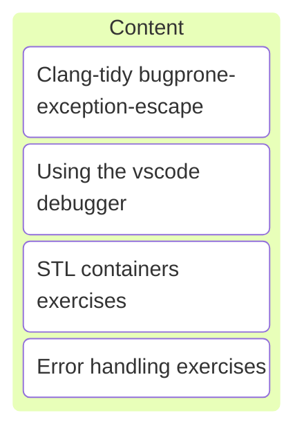

# C/C++ Programming

## Labo 3

---



---

## Devcontainer

<https://gitlab.apstudent.be/cpp-programming/devcontainer-labo-3>

---

* Similar to labo 2 devcontainer.
* Uses a src subdirectory.
* Has a cpprog module with expect() function.
* See [README.md](https://gitlab.apstudent.be/cpp-programming/devcontainer-labo-3/-/blob/main/README.md) file in git repository.

---

```c++
import cpprog;

int my_division(int numerator, int denominator)
{
    cpprog::expect([&]{ return denominator != 0; },
                   "cannot divide by zero");

    return numerator / denominator;
}
```

Note:

* How to use the expect() function for pre-conditions?
* See also hello-contracts example in devcontainer.

---

## Clang-tidy

### bugprone-exception-escape

---

Finds functions which may throw an exception directly or indirectly, but they should not. The functions which should not throw exceptions are the following:

Note:

* <https://clang.llvm.org/extra/clang-tidy/checks/bugprone/exception-escape.html>

---

* Destructors <!-- .element: class="fragment semi-fade-out shrink" data-fragment-index="1" -->
* Move constructors <!-- .element: class="fragment semi-fade-out shrink" data-fragment-index="1" -->
* Move assignment operators <!-- .element: class="fragment semi-fade-out shrink" data-fragment-index="1" -->
* The main() functions <!-- .element: class="fragment highlight-current-blue grow" data-fragment-index="1" -->
* swap() functions <!-- .element: class="fragment semi-fade-out shrink" data-fragment-index="1" -->
* iter_swap() functions <!-- .element: class="fragment semi-fade-out shrink" data-fragment-index="1" -->
* iter_move() functions <!-- .element: class="fragment semi-fade-out shrink" data-fragment-index="1" -->
* Functions marked with throw() or noexcept <!-- .element: class="fragment semi-fade-out shrink" data-fragment-index="1" -->
* Other functions given as option <!-- .element: class="fragment semi-fade-out shrink" data-fragment-index="1" -->

Note:

* When an exception escapes the main function, the application crashes.
* Don't worry about the other functions yet. 😉

---

### Solution

Catch exceptions in the main function!

---

```c++ []
using std;

int main()
try
{
    // ...
    return 0;
}
catch (std::exception const& e)
{
    std::cerr << e.what() << '\n';
    return 1;
}
```

Note:

* Print error message to the console error stream (STDERR).
* Return 0 for success.
* Return 1 for failure.
* This is a convention.

---

## Debugger demo

Note:

* breakpoints
* step, resume
* variable watch
* call stack (will be covered in a later session)

---

<video controls width="600">
  <source src="./assets/vscode_debugger_demo.mp4" type="video/mp4">
  
</video>

---

## Exercises

See digitap.
