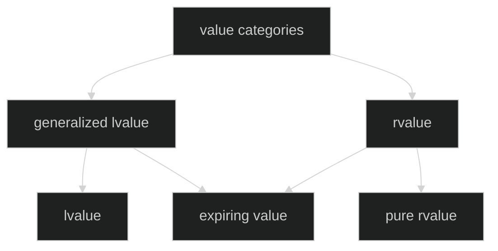

# C/C++ Programming

---
TODO
---
* Function overloading
* References
* Classes
* RAII
* Operator overloading
* Inheritance
* Run-time polymorphism
* Value categories
* Rule-of-5
---
## Value Categories
---

