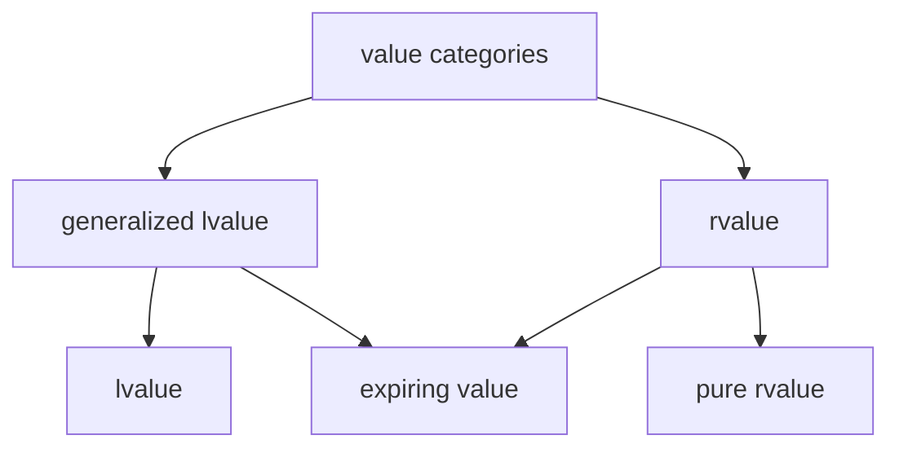

# C/C++ Programming

---
* References
* Classes and Enums
* RAII
* Operator overloading
* Value categories
* Rule-of-5
---
## References
---
```c++
void my_func_1(int x)
{
    // use x
}
```
```c++
void my_func_2(std::string str)
{
    // use str
}
```
### pass-by-value
---
```c++
void my_func(std::vector<int> ints)
{
    // use items in ints
}
```
```c++
std::vector ints{1, 2, 3, 4, 5}; // imagine a huge list
my_func(ints);
```
Creates a copy, expensive for large types.
---
```c++
void my_func(std::vector<int> const& ints)
{
    // use items in ints
}
```
```c++
std::vector ints{1, 2, 3, 4, 5}; // imagine a huge list
my_func(ints);
```
* Pass the vector by const reference.
* Creates an alias instead of making a copy. 👍

Note:
* As always, add const to show we don't intend to make modifications.
---
```c++
void my_func(std::vector<int> ints)
{
    ints.push_back(6); // only modifies local copy
}
```
```c++
std::vector ints{1, 2, 3, 4, 5};
my_func(ints);
```
```c++
// ints still {1, 2, 3, 4, 5}
```
Not possible to modify the original.
---
```c++
void my_func(std::vector<int>& ints)
{
    ints.push_back(6);
}
```
```c++
std::vector ints{1, 2, 3, 4, 5};
my_func(ints);
```
* Pass the vector by reference.
* Function argument is an alias, so we are adding directly to the original. 👍
---
```c++
void my_func(int a, int b, int& sum)
{
    sum = a + b;
}
```
```c++
int sum{};
my_func(4, 5, sum);
```
This makes me sad... 😭

Note:
* Don't use references for output parameters.
---
<div style="display: flex; justify-content: space-evenly;">
<div>

```c++
void my_func(int a, int b, int& sum)
{
    if (b != 0)
    {
        sum = a + b;
    }
}
```
```c++
int sum;                 // forgot to initialize
my_func(5, 0, sum);      // does not set sum
std::println("{}", sum); // 💥🐈🐕🌩
```

</div>
<div>

Undefined Behavior.


</div>

Note:
* Attempting to read an uninitialized variable.
---
```c++
int my_func(int a, int b)
{
    if (b != 0)
    {
        return a + b;
    }
    return 0; // I have to return something here
}
```
```c++
auto sum = my_func(4, 5);
```
Use return values instead of output arguments! 👍
---
```c++ []
int a{5};           // define an integer a with value 5
int& b{a};          // b is an alias for a
b = 15;             // a is updated to the value 15
int const& c{b};    // c is a read-only alias for b (and a)
c = 30;             // not allowed, can't write to c
```
References are not restricted to function arguments.
---
### Best practice
---
* Use pass-by-value to pass very small objects.
* Use pass-by-const-reference to pass large objects you don't need to modify. <!-- .element: class="fragment" data-fragment-index="1" -->
* Return a result rather than modifying an object through a reference argument. <!-- .element: class="fragment" data-fragment-index="2" -->
* Use pass-by-reference only when you have to. <!-- .element: class="fragment" data-fragment-index="3" -->
---
## Classes and Enums
Create your own type.
---
TODO date example?
* date class has year, month, day
* month is enum
---
## RAII
Resource Allocation Is Initialization.
---
```c++
import std;
```
```c++
class MyType
{
public:
    MyType() { std::println("MyType::MyType()"); }
    ~MyType() { std::println("MyType::~MyType()"); }
};
```
```c++
int main()
{
    MyType my_value{};
}
```

Note:
* Constructor is called when object is created.
* Destructor is automatically called when object goes out of scope.
---
This is very useful when we are managing resources!
---
```c++
int main()
{
    auto file = open("file.txt", "r");

    // 1) do something with file
    // 2) something goes wrong, exception

    close(file); // 3) not called
}
```
---
```c++
class File
{
public:
    File(std::string name) : file_{open(name, "r")} {}
    ~File() { close(file_); }

private:
    FileHandle file_;
};
```
```c++
int main()
{
    File file{"file.txt"};

    // file automatically closed at end of scope
    // exception safe
}
```
---
## Operator overloading
---
## Value Categories
---


Note:
* Expanded with C++11.
* Before: Only lvalues and rvalues.
* lvalue: A thing with a name.
* rvalue: Something on the right side of an equals sign.
---
### lvalues
---
```c++
int my_int{5};                  // my_int
std::array my_array{1, 2, 3};   // my_array
auto first_value = my_array[0]; // first_value, my_array[0]
```
```c++
int my_func(int a)              // my_func, a
{
    return a + 5;
}
```
```c++
class MyType
{
private:
    int my_int_{6};             // my_int_
};
```
The name of a value, function or data member.
---
```c++
class MyType
{
public:
    int& some_func()
    {
        return a_;
    }

private:
    int a_{6};
};

MyType obj{};                   // obj
auto& value = obj.some_func();  // value, obj.some_func()
```
A function call whose return type is an lvalue reference.
---
```c++
std::string my_str{"hello"};    // my_str, "hello"
```
A string literal.

Note:
* String literals are stored in the binary and are valid for the entire lifetime of the application.
---
### pure rvalues
---
```c++
int a{5};                       // 5
bool b{true};                   // true
char c{'a'};                    // 'a'
```
```c++
enum class MyEnum
{
    first,                      // first
    second                      // second
};
```
Literals (except for string literal) and enumerators.
---
```c++
class MyObject
{
public:
    int& some_func()
    {
        return this->a_;        // this
    }

private:
    int a_{6};
};
```
```c++
// Note: Don't use this explicitly.
```
The this pointer.
---
```c++
int my_func()
{
    return 5;                   // 5
}

auto a = my_func();             // my_func
```
```c++
int a{5};                       // 5
int b{6};                       // 6
auto c = a + b;                 // a + b
```
A function call whose return type is non-reference.
---
```c++
some_func(MyObject{});          // MyObject{}
std::string a{"hello"};
auto c = a + std::string{"!"};  // std::string{"!"}
```
Anonymous objects.
---
### expiring values
---
```c++
std::string my_str{"hello"};    // starts out as an lvalue
```
```c++
some_function(std::move(str));  // converted to an rvalue
```
```c++
// my_str does not exist here anymore, it expired
// we say my_str is an expiring value (xvalue)
```
A function call whose return type is an rvalue reference.

Note:
* Here we explicitly convert my_str to an rvalue.
---
```c++
class MyType
{
public:
    int my_int{5};
};
```
```c++
auto a = MyType{}.my_int;       // MyType{}.my_int
```
A member of object expression where the object is an rvalue.
---
```c++
auto a = std::array{1, 2}[1];   // std::array{1, 2, 3}[1]
```
The build-int subscript expression where the array is an rvalue.
---

---
```c++ []
import std;

int main()
{
    int x{5};
    some_function(std::move(x));
}
```
What is the value category of `x`?
<div style="display: flex; justify-content: space-evenly;">
    <div>a) lvalue</div>
    <div class="fragment highlight-current-blue">b) xvalue</div>
    <div>c) prvalue</div>
</div>

Note:
* std::move always turns its argument into an xvalue.
---
```c++ []
import std;

int main()
{
    int x{5};
    some_function(std::move(x));
}
```
What is the value category of `5`?
<div style="display: flex; justify-content: space-evenly;">
    <div>a) lvalue</div>
    <div>b) xvalue</div>
    <div class="fragment highlight-current-blue">c) prvalue</div>
</div>

Note:
* All non-string literals are prvalues.
---
```c++ []
import std;

int main()
{
    int x{5};
    some_function(std::move(x));
}
```
What is the value category of `some_function`?
<div style="display: flex; justify-content: space-evenly;">
    <div class="fragment highlight-current-blue">a) lvalue</div>
    <div>b) xvalue</div>
    <div>c) prvalue</div>
</div>

Note:
* Function names are lvalues.
---
```c++ []
void some_function(std::string&& x)
{
    // ...
}
```
What is the value category of `x`?
<div style="display: flex; justify-content: space-evenly;">
    <div class="fragment highlight-current-blue">a) lvalue</div>
    <div>b) xvalue</div>
    <div>c) prvalue</div>
</div>

Note:
* std::string&& is an rvalue reference to an std::string.
* But the rvalue reference itself has a name x, so it is an lvalue.
---
```c++
std::string const& some_function(std::string const& str)
{
    return str;
}
```
```c++
std::string my_str{"empty"};
auto other = some_function(my_str);
```
What is the value category of `some_function(my_str)`?
<div style="display: flex; justify-content: space-evenly;">
    <div class="fragment highlight-current-blue">a) lvalue</div>
    <div>b) xvalue</div>
    <div>c) prvalue</div>
</div>

Note:
* Function returns a reference to an lvalue.
---
## Rule of 5
