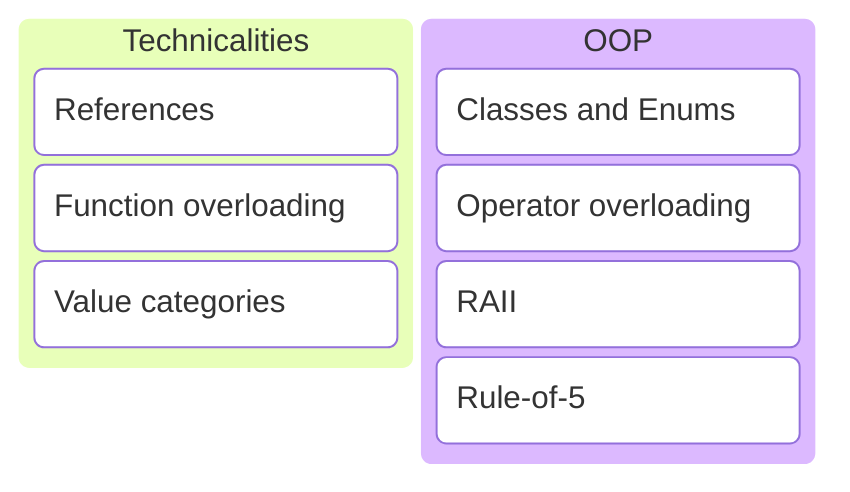
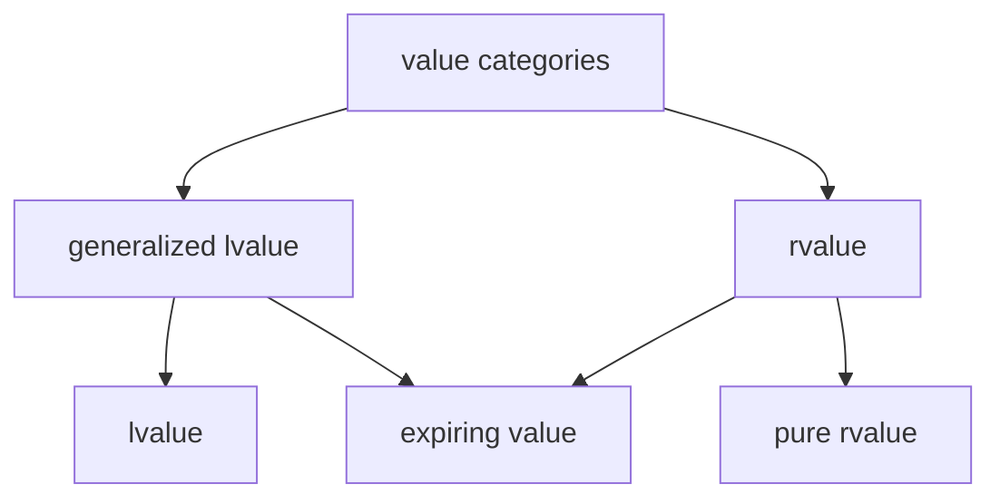

# C/C++ Programming

---

---
## References
---
```c++
void my_func_1(int x)
{
    // use x
}
```
```c++
void my_func_2(std::string str)
{
    // use str
}
```
### pass-by-value
---
```c++
void my_func(std::vector<int> ints)
{
    // use items in ints
}
```
```c++
std::vector ints{1, 2, 3, 4, 5}; // imagine a huge list
my_func(ints);
```
Creates a copy, expensive for large types.
---
```c++
void my_func(std::vector<int> const& ints)
{
    // use items in ints
}
```
```c++
std::vector ints{1, 2, 3, 4, 5}; // imagine a huge list
my_func(ints);
```
* Pass the vector by const reference.
* Creates an alias instead of making a copy. 👍

Note:
* As always, add const to show we don't intend to make modifications.
---
```c++
void my_func(std::vector<int> ints)
{
    ints.push_back(6); // only modifies local copy
}
```
```c++
std::vector ints{1, 2, 3, 4, 5};
my_func(ints);
```
```c++
// ints still {1, 2, 3, 4, 5}
```
Not possible to modify the original.
---
```c++
void my_func(std::vector<int>& ints)
{
    ints.push_back(6);
}
```
```c++
std::vector ints{1, 2, 3, 4, 5};
my_func(ints);
```
* Pass the vector by reference.
* Function argument is an alias, so we are adding directly to the original. 👍
---
```c++
void my_func(int a, int b, int& sum)
{
    sum = a + b;
}
```
```c++
int sum{};
my_func(4, 5, sum);
```
This makes me sad... 😭

Note:
* Don't use references for output parameters.
---
<div style="display: flex; justify-content: space-evenly;">
<div>

```c++
void my_func(int a, int b, int& sum)
{
    if (b != 0)
    {
        sum = a + b;
    }
}
```
```c++
int sum;                 // forgot to initialize
my_func(5, 0, sum);      // does not set sum
std::println("{}", sum); // 💥🐈🐕🌩
```

</div>
<div>

Undefined Behavior.


</div>

Note:
* Attempting to read an uninitialized variable.
---
```c++
int my_func(int a, int b)
{
    if (b != 0)
    {
        return a + b;
    }
    return 0; // I have to return something here
}
```
```c++
auto sum = my_func(4, 5);
```
Use return values instead of output arguments! 👍
---
```c++
auto my_func(int a, int b) -> int
{
    if (b != 0)
    {
        return a + b;
    }
    return 0;
}
```
Trailing return type.

Note:
* Since C++11 it is allowed to write the return type at the end.
* Syntax: auto func() -> return_type
* Useful in metaprogramming when return type depends on function arguments.
---
```c++
std::unordered_map dict{
    {"word 1": "explanation of word 1"},
    {"word 2": "explanation of word 2"}
};

for (auto const& [word, explanation] : dict)
{
    // ...
}
```
References are not restricted to function arguments.

Note:
* We've already used references in for loops.
---
```c++ []
int a{5};           // define an integer a with value 5
int& b{a};          // b is an alias for a
b = 15;             // a is updated to the value 15
int const& c{b};    // c is a read-only alias for b (and a)
c = 30;             // not allowed, can't write to c
```
References can be used anywhere.
---
### Best practices
---
* Use pass-by-value to pass very small objects.
* Use pass-by-const-reference to pass large objects you don't need to modify. <!-- .element: class="fragment" data-fragment-index="1" -->
* Return a result rather than modifying an object through a reference argument. <!-- .element: class="fragment" data-fragment-index="2" -->
* Use pass-by-reference only when you have to. <!-- .element: class="fragment" data-fragment-index="3" -->
---
```c++
void read_func(std::span<int const> readonly_array);
void modify_func(std::span<int> writable_array)
```
```c++
std::array my_array{1, 2, 3, 4, 5};
read_func(my_aray);
modify_func(my_array);
```
Remember to use std::span for arrays.
---
## Function overloading
---
C++ allows multiple functions to have the same name as long as they have different arguments.

Note:
* Function overloading is based on the function name and the type or number of its arguments.
* The return type alone does not distinguish overloaded functions!
---
```c++
void print(int a) { std::println("{}", a); }
void print(int a, int b) { std::println("{} {}", a, b); }
void print(double a) { std::println("{}", a); }
void print(std::string const& a) { std::println("{}", a); }
```
---
```c++
int add(int a, int b) { return a + b; }
```
```c++
double add(double a, double b) { return a + b; } // OK
```
```c++
double add(int a, int b) { return a + b; } // error
```
---
### Which candidate function to call?

Note:
* <https://en.cppreference.com/w/cpp/language/overload_resolution>
---
```c++
void print(int a) { std::println("{}", a); }
void print(std::string const& a) { std::println("{}", a); }
```
```c++
print(5);
```
Exact match, easy.
---
```c++
void print(int a) { std::println("{}", a); }
void print(std::string const& a) { std::println("{}", a); }
```
```c++
print('a');
```
No exact match found. Char is promoted to int.

Note:
* Widening conversion.
---
```c++
void print(int a) { std::println("{}", a); }
void print(std::string const& a) { std::println("{}", a); }
```
```c++
print(3.5);
```
No exact match found. Narrowing conversion from double to int. Compiler may warn.
---
```c++
void print(int a) { std::println("{}", a); }
void print(std::string const& a) { std::println("{}", a); }
```
```c++
print("Hello!");
```
No exact match found. Implicit conversion from string literal to std::string.

Note:
* std::string has an implicit constructor that takes a string literal.
* This constructor is used.
---

### function overloading
---
```c++
void my_func(int a)    { std::println("f1"); }
void my_func(double a) { std::println("f2"); }
```
```c++
my_func("test");
```
What will the program print?
<div style="display: flex; justify-content: space-evenly;">
    <div class="fragment semi-fade-out shrink" data-fragment-index="1">a) f1</div>
    <div class="fragment semi-fade-out shrink" data-fragment-index="1">b) f2</div>
    <div class="fragment highlight-current-blue grow" data-fragment-index="1">c) error</div>
</div>

Note:
* No conversion from a string literal to either an int or a double.
* No viable functions found.
---
```c++
void my_func(int a)            { std::println("f1"); }
void my_func(int a, int b = 0) { std::println("f2"); }
```
```c++
my_func(5, 6);
```
What will the program print?
<div style="display: flex; justify-content: space-evenly;">
    <div class="fragment semi-fade-out shrink" data-fragment-index="1">a) f1</div>
    <div class="fragment highlight-current-blue grow" data-fragment-index="1">b) f2</div>
    <div class="fragment semi-fade-out shrink" data-fragment-index="1">c) error</div>
</div>

Note:
* Exact match found.
---
```c++
void my_func(int a)            { std::println("f1"); }
void my_func(int a, int b = 0) { std::println("f2"); }
```
```c++
my_func(5.6);
```
What will the program print?
<div style="display: flex; justify-content: space-evenly;">
    <div class="fragment semi-fade-out shrink" data-fragment-index="1">a) f1</div>
    <div class="fragment semi-fade-out shrink" data-fragment-index="1">b) f2</div>
    <div class="fragment highlight-current-blue grow" data-fragment-index="1">c) error</div>
</div>

Note:
* Call to my_func is ambiguous.
* Both functions are viable candidates.
---
```c++
void my_func(std::string& a)       { std::println("f1"); }
void my_func(std::string const& a) { std::println("f2"); }
```
```c++
my_func("test");
```
What will the program print?
<div style="display: flex; justify-content: space-evenly;">
    <div class="fragment semi-fade-out shrink" data-fragment-index="1">a) f1</div>
    <div class="fragment highlight-current-blue grow" data-fragment-index="1">b) f2</div>
    <div class="fragment semi-fade-out shrink" data-fragment-index="1">c) error</div>
</div>

Note:
* String literal promoted to std::string. Literal cannot be modified, so const.
---
```c++
void my_func(std::string& a)       { std::println("f1"); }
void my_func(std::string const& a) { std::println("f2"); }
```
```c++
std::string str{"test"};
my_func(str);
```
What will the program print?
<div style="display: flex; justify-content: space-evenly;">
    <div class="fragment highlight-current-blue grow" data-fragment-index="1">a) f1</div>
    <div class="fragment semi-fade-out shrink" data-fragment-index="1">b) f2</div>
    <div class="fragment semi-fade-out shrink" data-fragment-index="1">c) error</div>
</div>

Note:
* String literal promoted to std::string. Literal cannot be modified, so const.
---
## Classes and Enums
Create your own type.
---
Suppose we want to create a type for a date.
---
How would we represent a date?

Note:
* day
* month
* year
* all integers
---
```c++
class Date
{
public:
    int year;
    int month;
    int day;
};
```
```c++
Date today{2025, 2, 26};
Date wrong{2025, 14, 312}; // oops
Date not_initialized;      // ouch
```
---
We want to check if the date is valid!
---
```c++ []
class Date
{
public:
    Date(int year, int month, int date)
      : year_{year}, month_{month}, date_{date}
    {
        expect([&]{ return /*valid*/; }, "Invalid date!");
    }

private:
    int year_{};
    int month_{};
    int day_{};
};
```

Note:
* Make members private, so user can't access them directly.
* Initialize private members.
* Add constructor to initialize the object with the desired values.
* Add precondition to constructor that date must be valid.
* Good practice to default init private members with {}. Makes sure we can't end up with unitialized values. Constructor will overwrite these values.
---
Let's add some functionality.
---
I want to read the values of year, month, day.
---
```c++ [10-12]
class Date
{
public:
    Date(int year, int month, int day)
      : year_{year}, month_{month}, day_{day}
    {
        expect([&]{ return /*valid*/; }, "Invalid date!");
    }

    [[nodiscard]] int year() const { return year_; }
    [[nodiscard]] int month() const { return month_; }
    [[nodiscard]] int day() const { return day_; }

private:
    int year_{};
    int month_{};
    int day_{};
};
```
---
```c++
Date today{2025, 2, 26};

std::println("today is {}-{}-{}",
             today.day(), today.month(), today.year());
```
```text
today is 26-2-2025
```

Note:
* Functions are in public section so user can access them.
---
```c++
[[nodiscard]] int year() const { return year_; }
```
```c++
Date const tomorrow{2025, 2, 27};
auto year = today.year(); // ok because const method
```
```c++
Date today{2025, 2, 26};
auto year = today.year(); // ok
today.year();             // compiler warning b/c nodiscard
```

Note:
* ```[[nodiscard]]``` is a function attribute that causes a compiler warning if the return value is ignored.
* Add this attributes to functions where ignoring the return value is likely a bug.
* Add ```const``` to member functions that don't modify any member variables.
---
### class vs struct

<div style="display: flex; justify-content: space-evenly;">
<div>

```c++
class Date
{
    int y;
    int m;
    int d;
};
```
```c++
Date d;
d.y = 2025;
```

Error, y is private.

</div>
<div>

```c++
struct Date
{
    int y;
    int m;
    int d;
};
```
```c++
Date d;
d.y = 2025;
```

Ok, y is public.

</div>
</div>

Note:
* class: private by default
* struct: public by default
---
```c++ []
class Date
{
public:
    Date(int year, int month, int day)
      : year_{year}, month_{month}, day_{day}
    {
        expect([&]{ return /*valid*/; }, "Invalid date!");
    }

    [[nodiscard]] int year() const { return year_; }
    [[nodiscard]] int month() const { return month_; }
    [[nodiscard]] int day() const { return day_; }

private:
    int year_{};
    int month_{};
    int day_{};
};
```
It's still easy to accidentally misuse this class.

Note:
* Does anyone have an idea what's wrong?
---
```c++
Date today{26, 2, 2025}; // oops, swapped arguments
```
```c++
Date today{2, 26, 2025}; // american style?
```
---
```c++
class Year
{
public:
    explicit Year(int year) : year_{year} {}

    [[nodiscard]] int get() const { return year_; }
    [[nodiscard]] int& get() { return year_; }

private:
    int year_{};
};
```
```c++
class Month { /*...*/ };
class Day { /*...*/ };
```

Note:
* Why the overloaded get methods? (const and non-const)
* Non-const version that returns a reference added so we can modify the value.
---
```c++ []
class Date
{
public:
    Date(Year year, Month month, Day day)
      : year_{year}, month_{month}, day_{day}
    {
        expect([&]{ return /*valid*/; }, "Invalid date!");
    }

    [[nodiscard]] Year year() const { return year_; }
    [[nodiscard]] Month month() const { return month_; }
    [[nodiscard]] Day day() const { return day_; }

private:
    Year year_{};
    Month month_{};
    Day day_{};
};
```
---
```c++
Date today{Year{2025}, Month{2}, Day{26}}; // ok
```
```c++
Date today{Month{2}, Day{26}, Year{2025}}; // compiler error!
```
```c++
// explicit disables implicit conversion
Date today{2025, 2, 26};                   // compiler error!
```
---
Can we do even better?

Note:
* Does anyone have an idea?
---
* Year: probably not
* Day: probably not
* Month: yes!
---
### Enum
---
```c++
enum class Month
{
    jan = 1, feb, mar, apr, may, jun, jul, aug, sep, oct, nov, dec
};
```
```c++
Month m1{Month::jan};
auto m2 = Month::feb;
```

Note:
* Underlying type is integer by default.
* Starts counting at zero.
* Allowed to explicitly assign unique values to all elements.
* If only assigned to first, that's where count starts.
* Setting jan = 1 results in feb = 2, mar = 3, ...
---
```c++
// explicit conversion from int is allowed 🙁

Month m{15};
```
```c++
// sadly can't add constructor to enum
// best we can do

Month month_from_int(int x)
{
    expect([&]{ return (1 <= x) && (x <= 12); },
           "invalid month");

    return Month{x};
};

auto m = month_from_int(15); // runtime expect error
```
---
```c++
// conversion to int is not allowed 👍

int m{Month::jun;} // error
```
```c++
// must convert explicitly

int m{std::to_underlying(Month::jun)};
```
---
```c++
class Date { /* unchanged */ };
```
```c++
Date today{Year{2025}, Month::feb, Day{26}};
```
Use the type system to let the compiler check as much as possible!
---
```c++ []
class Date
{
public:
    Date() {} // add a default constructor

    /* other constructor and getters */

private:
    Year year_{1970};
    Month month_{Month::jan};
    Day day_{1};
};
```
```c++
Date today{Year{2025}, Month::feb, Day{26}};
Date epoch_time{}; // 1970-01-01
```

Note:
* Illustrative, probably not really useful to add a default constructor to Date.
---
## Operator overloading
---
C++ allows the implementation of operators for custom types.

Note:
* <https://en.cppreference.com/w/cpp/language/operators>
* <https://stackoverflow.com/questions/4421706/what-are-the-basic-rules-and-idioms-for-operator-overloading#4421719>
* Prefer the hidden friend idiom.
---
Make sure operators do what the user expects!

Note:
* Don't abuse operators to do something else entirely.
* (Unless building a Domain Specific Language)
---
```c++
bool operator==(Date const& rhs, Date const& lhs)
{
    return (lhs.year().get() == rhs.year().get())
        && (lhs.month() == rhs.month())
        && (lhs.day().get() == rhs.day().get());
}
```
```c++
bool operator!=(Date const& rhs, Date const& lhs)
{
    return !(lhs == rhs);
}
```
```c++
Date today {Year{2025}, Month::feb, Day{26}};
Date tomorrow{Year{2025}, Month::feb, Day{27}};
bool equal = today == tomorrow;
```
Check if two dates are equal.

Note:
* If you want to compare for equality, always implement both operator== and operator!=.
* Implement operator!= in terms of operator==.
---
```c++
Month operator++(Month& month)
{
    month = (month == Month::dec) ?
        Month::jan : Month{std::to_underlying(month) + 1};
    return month;
}
```
```c++
auto m = Month::oct;
++m; // nov
++m; // dec
++m; // jan
```
Increase a month to the next.
---
## RAII
The power of constructors and destructors.
---
Resource Allocation Is Initialization
---
```c++
import std;
```
```c++
class MyType
{
public:
    MyType() { std::println("MyType::MyType()"); }
    ~MyType() { std::println("MyType::~MyType()"); }
};
```
```c++
int main()
{
    MyType my_value{};
}
```

Note:
* Constructor is called when object is created.
* Destructor is automatically called when object goes out of scope.
---
This is very useful when we are managing resources!
---
```c++
int main()
{
    auto file = open("file.txt", "r");

    // 1) do something with file
    // 2) something goes wrong, exception

    close(file); // 3) not called
}
```
---
```c++
class File
{
public:
    explicit File(std::string name) : file_{open(name, "r")} {}
    ~File() { close(file_); }

private:
    FileHandle file_;
};
```
```c++
int main()
{
    File file{"file.txt"};

    // file automatically closed at end of scope
    // exception safe
}
```

Note:
* Keyword explicit added to prevent implicit conversion from std::string to File.
* Best practice: always add explicit to constructors that only take one argument.
---
## Value Categories
---


Note:
* Expanded with C++11.
* Before: Only lvalues and rvalues.
* lvalue: A thing with a name.
* rvalue: Something on the right side of an equals sign.
---
### lvalues
---
```c++
int my_int{5};                  // my_int
std::array my_array{1, 2, 3};   // my_array
auto first_value = my_array[0]; // first_value, my_array[0]
```
```c++
int my_func(int a)              // my_func, a
{
    return a + 5;
}
```
```c++
class MyType
{
private:
    int my_int_{6};             // my_int_
};
```
The name of a value, function or data member.
---
```c++
class MyType
{
public:
    int& some_func()
    {
        return a_;
    }

private:
    int a_{6};
};

MyType obj{};                   // obj
auto& value = obj.some_func();  // value, obj.some_func()
```
A function call whose return type is an lvalue reference.
---
```c++
std::string my_str{"hello"};    // my_str, "hello"
```
A string literal.

Note:
* String literals are stored in the binary and are valid for the entire lifetime of the application.
---
### pure rvalues
---
```c++
int a{5};                       // 5
bool b{true};                   // true
char c{'a'};                    // 'a'
```
```c++
enum class MyEnum
{
    first,                      // first
    second                      // second
};
```
Literals (except for string literal) and enumerators.
---
```c++
class MyObject
{
public:
    int& some_func()
    {
        return this->a_;        // this
    }

private:
    int a_{6};
};
```
```c++
// Note: Don't use this explicitly.
```
The this pointer.
---
```c++
int my_func()
{
    return 5;                   // 5
}

auto a = my_func();             // my_func
```
```c++
int a{5};                       // 5
int b{6};                       // 6
auto c = a + b;                 // a + b
```
A function call whose return type is non-reference.
---
```c++
some_func(MyObject{});          // MyObject{}
std::string a{"hello"};
auto c = a + std::string{"!"};  // std::string{"!"}
```
Anonymous objects.
---
### expiring values
---
```c++
std::string my_str{"hello"};    // starts out as an lvalue
```
```c++
some_function(std::move(str));  // converted to an rvalue
```
```c++
// my_str does not exist here anymore, it expired
// we say my_str is an expiring value (xvalue)
```
A function call whose return type is an rvalue reference.

Note:
* Here we explicitly convert my_str to an rvalue.
---
```c++
class MyType
{
public:
    int my_int{5};
};
```
```c++
auto a = MyType{}.my_int;       // MyType{}.my_int
```
A member of object expression where the object is an rvalue.
---
```c++
auto a = std::array{1, 2}[1];   // std::array{1, 2}[1]
```
The build-in subscript expression where the array is an rvalue.
---

### value categories
---
```c++ []
import std;

int main()
{
    int x{5};
    some_function(std::move(x));
}
```
What is the value category of `x`?
<div style="display: flex; justify-content: space-evenly;">
    <div class="fragment semi-fade-out shrink" data-fragment-index="1">a) lvalue</div>
    <div class="fragment highlight-current-blue grow" data-fragment-index="1">b) xvalue</div>
    <div class="fragment semi-fade-out shrink" data-fragment-index="1">c) prvalue</div>
</div>

Note:
* std::move always turns its argument into an xvalue.
---
```c++ []
import std;

int main()
{
    int x{5};
    some_function(std::move(x));
}
```
What is the value category of `5`?
<div style="display: flex; justify-content: space-evenly;">
    <div class="fragment semi-fade-out shrink" data-fragment-index="1">a) lvalue</div>
    <div class="fragment semi-fade-out shrink" data-fragment-index="1">b) xvalue</div>
    <div class="fragment highlight-current-blue grow" data-fragment-index="1">c) prvalue</div>
</div>

Note:
* All non-string literals are prvalues.
---
```c++ []
import std;

int main()
{
    int x{5};
    some_function(std::move(x));
}
```
What is the value category of `some_function`?
<div style="display: flex; justify-content: space-evenly;">
    <div class="fragment highlight-current-blue grow" data-fragment-index="1">a) lvalue</div>
    <div class="fragment semi-fade-out shrink" data-fragment-index="1">b) xvalue</div>
    <div class="fragment semi-fade-out shrink" data-fragment-index="1">c) prvalue</div>
</div>

Note:
* Function names are lvalues.
---
```c++ []
void some_function(std::string&& x)
{
    // ...
}
```
What is the value category of `x`?
<div style="display: flex; justify-content: space-evenly;">
    <div class="fragment highlight-current-blue grow" data-fragment-index="1">a) lvalue</div>
    <div class="fragment semi-fade-out shrink" data-fragment-index="1">b) xvalue</div>
    <div class="fragment semi-fade-out shrink" data-fragment-index="1">c) prvalue</div>
</div>

Note:
* std::string&& is an rvalue reference to an std::string.
* But the rvalue reference itself has a name x, so it is an lvalue.
---
```c++
std::string const& some_function(std::string const& str)
{
    return str;
}
```
```c++
std::string my_str{"empty"};
auto other = some_function(my_str);
```
What is the value category of `some_function(my_str)`?
<div style="display: flex; justify-content: space-evenly;">
    <div class="fragment highlight-current-blue grow" data-fragment-index="1">a) lvalue</div>
    <div class="fragment semi-fade-out shrink" data-fragment-index="1">b) xvalue</div>
    <div class="fragment semi-fade-out shrink" data-fragment-index="1">c) prvalue</div>
</div>

Note:
* Function returns a reference to an lvalue.
---
### rvalue references
---
Added in C++11.
---
#### Why?
---

#### Performance!
---
Distinguish between temporary objects and persistent objects to avoid unnecessary copies.

Note:
* For now enough to know they exist and what they are.
* They will come in handy when we learn about resource management and the heap.
---
#### How?
---
T&&
---
```c++
void my_func(std::string&& str);
void my_func(std::vector<int>&& vec);
```
str and vec are rvalue references.
---
```c++
void my_func(std::vector<int>&& vec);
```
```c++
my_func(std::vector{1, 2, 3}); // OK
```
```c++
std::vector my_vec{1, 2, 3};
my_func(my_vec);               // error, no matching function
```
Only rvalues bind to rvalue references.
---

### rvalue references and function overloading

Note:
* <https://compiler-explorer.com/z/caoPha635>
---
```c++
void my_func(std::string&& str)      { std::println("f1"); }
void my_func(std::string const& str) { std::println("f2"); }
void my_func(std::string& str)       { std::println("f3"); }
```
```c++
my_func("hello");
```
What will the program print?
<div style="display: flex; justify-content: space-evenly;">
    <div class="fragment highlight-current-blue grow" data-fragment-index="1">a) f1</div>
    <div class="fragment semi-fade-out shrink" data-fragment-index="1">b) f2</div>
    <div class="fragment semi-fade-out shrink" data-fragment-index="1">c) f3</div>
</div>

Note:
* temporary std::string is created from string literal.
---
```c++
void my_func(std::string&& str)      { std::println("f1"); }
void my_func(std::string const& str) { std::println("f2"); }
void my_func(std::string& str)       { std::println("f3"); }
```
```c++
my_func(std::string{"hello"});
```
What will the program print?
<div style="display: flex; justify-content: space-evenly;">
    <div class="fragment highlight-current-blue grow" data-fragment-index="1">a) f1</div>
    <div class="fragment semi-fade-out shrink" data-fragment-index="1">b) f2</div>
    <div class="fragment semi-fade-out shrink" data-fragment-index="1">c) f3</div>
</div>

Note:
* temporary string is created by the programmer
---
```c++
void my_func(std::string&& str)      { std::println("f1"); }
void my_func(std::string const& str) { std::println("f2"); }
void my_func(std::string& str)       { std::println("f3"); }
```
```c++
std::string const cstr{"hello"};
my_func(cstr);
```
What will the program print?
<div style="display: flex; justify-content: space-evenly;">
    <div class="fragment semi-fade-out shrink" data-fragment-index="1">a) f1</div>
    <div class="fragment highlight-current-blue grow" data-fragment-index="1">b) f2</div>
    <div class="fragment semi-fade-out shrink" data-fragment-index="1">c) f3</div>
</div>

Note:
* Only const option is const&.
---
```c++
void my_func(std::string&& str)      { std::println("f1"); }
void my_func(std::string const& str) { std::println("f2"); }
void my_func(std::string& str)       { std::println("f3"); }
```
```c++
std::string str{"hello"};
my_func(str);
```
What will the program print?
<div style="display: flex; justify-content: space-evenly;">
    <div class="fragment semi-fade-out shrink" data-fragment-index="1">a) f1</div>
    <div class="fragment semi-fade-out shrink" data-fragment-index="1">b) f2</div>
    <div class="fragment highlight-current-blue grow" data-fragment-index="1">c) f3</div>
</div>

Note:
* str is an lvalue.
* Overload resolution picks & over const&.
---
```c++
void my_func(std::string&& str)      { std::println("f1"); }
void my_func(std::string const& str) { std::println("f2"); }
void my_func(std::string& str)       { std::println("f3"); }
```
```c++
std::string str{"hello"};
my_func(std::as_const(str));
```
What will the program print?
<div style="display: flex; justify-content: space-evenly;">
    <div class="fragment semi-fade-out shrink" data-fragment-index="1">a) f1</div>
    <div class="fragment highlight-current-blue grow" data-fragment-index="1">b) f2</div>
    <div class="fragment semi-fade-out shrink" data-fragment-index="1">c) f3</div>
</div>

Note:
* Explicitly convert str to a constant.
* Only const option is const&.
---
```c++
void my_func(std::string&& str)      { std::println("f1"); }
void my_func(std::string const& str) { std::println("f2"); }
void my_func(std::string& str)       { std::println("f3"); }
```
```c++
std::string str{"hello"};
my_func(std::move(str));
```
What will the program print?
<div style="display: flex; justify-content: space-evenly;">
    <div class="fragment semi-fade-out shrink" data-fragment-index="1">a) f1</div>
    <div class="fragment semi-fade-out shrink" data-fragment-index="1">b) f2</div>
    <div class="fragment highlight-current-blue grow" data-fragment-index="1">c) f3</div>
</div>

Note:
* std::move makes str an xvalue.
---
## Rule of 5
---
### Special member functions
---
```c++
class MyType
{
public:
  MyType();                             // default constructor
  ~MyType();                            // destructor

  MyType(MyType const& other);          // copy constructor
  MyType(MyType&& other) noexcept;      // move constructor

  MyType& operator=(MyType const& rhs); // copy assignment
  MyType& operator=(MyType&& rhs) noexcept; // move assignment
};
```

Note:
* It is important to make the move constructor and move assignment member functions noexcept.
* Doing so enables a lot of optimizations!
---
5 + 1 special member functions.
---
* 5
  * destructor
  * copy constructor
  * move constructor
  * copy assignment
  * move assignment
* +1  <!-- .element: class="fragment" -->
  * default constructor
---
Automatically generated by the compiler.
---
Except...
---
A default constructor is not generated if you define any constructor yourself.
---
The 5 special member functions are not* automatically generated if you define any of them yourself!

Note:
* Which ones are generated depends on which special member functions are defined.
* But don't rely on this, follow the rule of 5 instead!
* If a destructor is defined the default implementation is probably wrong!
---
> If you define any of the 5 special member functions, you must define all of them.
### Rule of 5
---
```c++
class File
{
public:
    explicit File(std::string name) : file_{open(name, "r")} {}
    ~File() { close(file_); }

private:
    FileHandle file_;
};
```
* File has a destructor.
* Other special member functions should be added!
---
```c++ [7-13]
class File
{
public:
    explicit File(std::string name) : file_{open(name, "r")} {}
    ~File() { close(file_); }

    // disable copy
    File(File const& other) = delete;
    File& operator=(File const& rhs) = delete;

    // enable move, default implementation is fine
    File(File&& other) = default;
    File& operator=(File&& rhs) = default;

private:
    FileHandle file_;
};
```
Don't worry about the implementation yet. 😉

Note:
* Disable copy (can't open file multiple times).
* Enable move.
---
```c++
static_assert(not std::is_default_constructible_v<File>);
static_assert(not std::is_trivially_destructible_v<File>);
```
```c++
static_assert(not std::is_copy_constructible_v<File>);
static_assert(not std::is_copy_assignable_v<File>);
```
```c++
static_assert(std::is_move_constructible_v<File>);
static_assert(std::is_move_assignable_v<File>);
```
Properties can be checked at compile time!

Note:
* <https://compiler-explorer.com/z/4eaqcjorT>
---
## Exercises!
