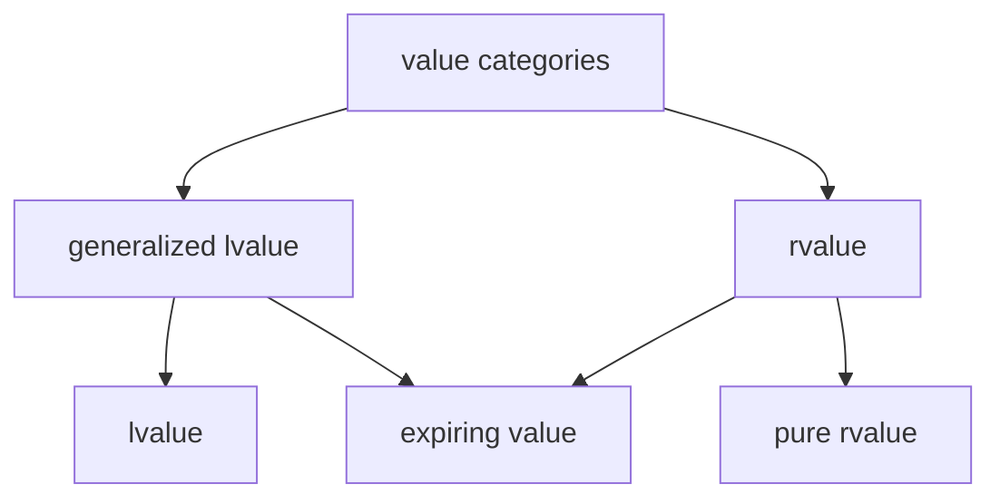

# C/C++ Programming

---
* References
* Function overloading
* Classes
* RAII
* Operator overloading
* Value categories
* Rule-of-5
---
## References
---
```c++
void my_func_1(int x)
{
    // use x
}
```
```c++
void my_func_2(std::string str)
{
    // use str
}
```
### pass-by-value
---
```c++
void my_func(std::vector<int> ints)
{
    // use items in ints
}
```
```c++
std::vector ints{1, 2, 3, 4, 5}; // imagine a huge list
my_func(ints);
```
Creates a copy, expensive for large types.
---
```c++
void my_func(std::vector<int> const& ints)
{
    // use items in ints
}
```
```c++
std::vector ints{1, 2, 3, 4, 5}; // imagine a huge list
my_func(ints);
```
* Pass the vector by const reference.
* Creates an alias instead of making a copy. 👍

Note:
* As always, add const to show we don't intend to make modifications.
---
```c++
void my_func(std::vector<int> ints)
{
    ints.push_back(6); // only modifies local copy
}
```
```c++
std::vector ints{1, 2, 3, 4, 5};
my_func(ints);
```
```c++
// ints still {1, 2, 3, 4, 5}
```
Not possible to modify the original.
---
```c++
void my_func(std::vector<int>& ints)
{
    ints.push_back(6);
}
```
```c++
std::vector ints{1, 2, 3, 4, 5};
my_func(ints);
```
* Pass the vector by reference.
* Function argument is an alias, so we are adding directly to the original. 👍
---
```c++
void my_func(int a, int b, int& sum)
{
    sum = a + b;
}
```
```c++
int sum{};
my_func(4, 5, sum);
```
This makes me sad... 😭
---
```c++
void my_func(int a, int b, int& sum)
{
    if (b != 0)
    {
        sum = a + b;
    }
}
```
```c++
int sum;                    // forgot to initialize
my_func(5, 0, sum);         // function does not set sum
std::println("{}", sum);    // 💥🐈🐕🌩
```
This is why.
---
```c++
int my_func(int a, int b)
{
    if (b != 0)
    {
        return a + b;
    }
    return 0; // I have to return something here
}
```
```c++
auto sum = my_func(4, 5);
```
Use return values instead of output arguments!
---
```c++ []
int a{5};           // define an integer a with value 5
int& b{a};          // b is an alias for a
b = 15;             // a is updated to the value 15
int const& c{b};    // c is a read-only alias for b
c = 30;             // not allowed, can't write to c
```
References are not restricted to function arguments.
---
### Best practice
---
* Use pass-by-value to pass very small objects.
* Use pass-by-const-reference to pass large objects you don't need to modify. <!-- .element: class="fragment" data-fragment-index="1" -->
* Return a result rather than modifying an object through a reference argument. <!-- .element: class="fragment" data-fragment-index="2" -->
* Use pass-by-reference only when you have to. <!-- .element: class="fragment" data-fragment-index="3" -->
---
## Function overloading
---
## Classes
---
## RAII
Resource Allocation Is Initialization.
---
```c++
import std;
```
```c++
class MyType
{
public:
    MyType() { std::println("MyType::MyType()"); }
    ~MyType() { std::println("MyType::~MyType()"); }
};
```
```c++
int main()
{
    MyType my_value{};
}
```

Note:
* Constructor is called when object is created.
* Destructor is automatically called when object goes out of scope.
---
This is very useful when we are managing resources!
---
```c++
int main()
{
    auto file = open("file.txt", "r");

    // 1) do something with file
    // 2) something goes wrong, exception

    close(file); // 3) not called
}
```
---
```c++
class File
{
public:
    File(std::string name) : file_{open(name, "r")} {}
    ~File() { close(file_); }

private:
    FileHandle file_;
};
```
```c++
int main()
{
    File file{"file.txt"};

    // file automatically closed at end of scope
    // exception safe
}
```
---
## Operator overloading
---
## Value Categories
---

---
## Rule of 5
