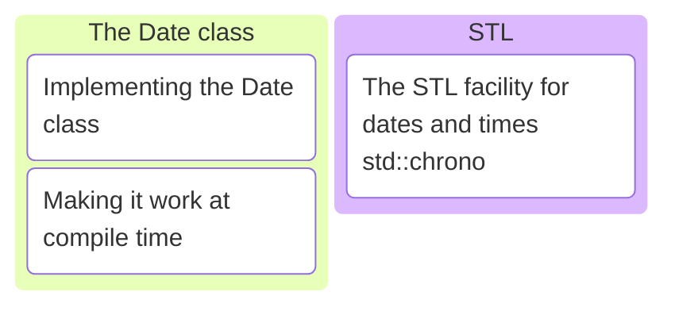

# C/C++ Programming

## Labo 4

---



---

## Devcontainer

<https://gitlab.apstudent.be/cpp-programming/devcontainer-labo-4>

---

* Same as labo 3 devcontainer.
* Library with `datetime` module and partial implementation of `Date` class is included.
* Extra option `DEPENDENCIES` to add libraries to an executable. See [README.md](https://gitlab.apstudent.be/cpp-programming/devcontainer-labo-4/-/blob/main/README.md) file in git repository.

---

```cmake
cpprog_add_executable(
    TARGET datetime_demo
    CXX_SOURCES
    "main.cpp"
    DEPENDENCIES
    datetime
)
```

---

## Exercises

See digitap.
