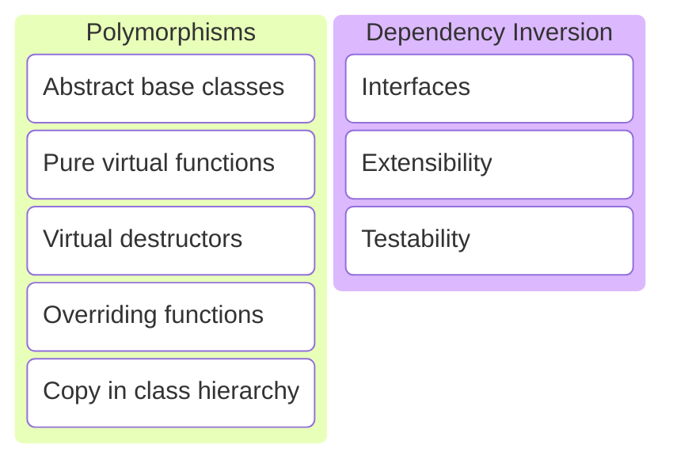

# C/C++ Programming


---



---

## Polymorphisms

---

```c++
class Animal
{
public:
    Animal(std::string name) : name_{name} {}

    void speak() const
    {
        std::println("{} makes a sound.", name_);
    }

private:
    std::string name_{};
};
```

---

```c++
Animal dog{"dog"};
dog.speak();
```

```c++
Animal cat{"cat"};
cat.speak();
```

```text
dog makes a sound.
cat makes a sound.
```

---

Different animals make different sounds.

---

```c++
class Animal {
public:
    Animal(std::string name) : name_{name} {}
    virtual ~Animal() = default;

    void speak() const {
        std::println("{} says {}.", name_, speak_impl());
    }

private:
    std::string name_{};

    virtual std::string speak_impl() const = 0;
};
```

Note:

* Virtual keyword to indicate this is a method that can be modified by subclasses.
* `= 0` since we don't provide a default implementation, subclasses have to implement the method.
* Private because it should not be possible to call the speak_impl() method on an Animal.

---

```c++
Animal dog{"dog"}; // error
```

Cannot instantiate abstract class.

---

* Animal is an abstract class.
* Virtual destructor is required!
* speak_impl() is a pure virtual function.
* Specific animals need to provide a speak_impl() implementation.

Note:

* If a class has a virtual function, it also needs a virtual destructor.

---

```c++
class Dog : public Animal
{
public:
    Dog() : Animal("dog") {}

private:
    std::string speak_impl() const override
    {
        return "bark";
    }
};
```

Note:

* Override keyword makes it explicit we want to implement the speak_impl method.
* If speak_impl was not virtual in Animal, this would cause a compiler error.

---

```c++
class Cat : public Animal
{
public:
    Cat() : Animal("cat") {}

private:
    std::string speak_impl() const override
    {
        return "meow";
    }
};
```

---

```c++
class Bear : public Animal
{
public:
    Bear() : Animal("bear") {}

private:
    std::string speak_impl() const override
    {
        return "roar";
    }
};
```

---

```c++
class Hamster : public Animal
{
public:
    Hamster() : Animal("hamster") {}

private:
    std::string speak_impl() const override
    {
        return "squeak";
    }
};
```

---

```c++
Dog dog{};
dog.speak();
```

```c++
Cat cat{};
cat.speak();
```

```c++
Bear bear{};
bear.speak();
```

```c++
Hamster hamster{};
hamster.speak();
```

```text
dog says bark.
cat says meow.
bear says roar.
hamster says squeak.
```

---

```c++
void speak(Animal const& animal)
{
    animal.speak();
}
```

```c++
Dog dog{};
speak(dog);
```

```c++
Cat cat{};
speak(cat);
```

```text
dog says bark.
cat says meow.
```

Polymorphism.

Note:

* Cannot instantiate an abstract class.
* But we can make a (const) reference.
* The reference will accept any class that implements the abstract class.
* <https://compiler-explorer.com/z/axo4bMs1M>

---

### Rule-of-5

---

Classes with a virtual function also need a virtual destructor!

---

So we also need to add the other special member functions.

---

* Copy constructor.
* Copy assignment operator.
* Move constructor.
* Move assignment operator.

---

Should we allow copying Animal objects?

---

```c++
Cat cat{};
Dog dog{cat}; // uses copy constructor from Animal
```

No, that would make it possible to assign cats to dogs, which does not make sense.

---

So we disable the special member functions!

---

```c++ [7-10]
class Animal
{
public:
    Animal(std::string name) : name_{name} {}
    virtual ~Animal() = default;

    Animal(Animal const&) = delete;
    Animal& operator=(Animal const&) = delete;
    Animal(Animal&&) = delete;
    Animal& operator=(Animal&&) = delete;

    void speak() const
    {
        std::println("{} says {}.", name_, speak_impl());
    }

private:
    std::string name_{};

    virtual std::string speak_impl() const = 0;
};
```

---

It never makes sense to implement copy in an inheritance hierarchy!

---

### Best practices

---

#### Need a virtual function?

* Add a virtual destructor.
* Disable copy and move.

---

#### Make sure your hierarchies make sense

* A cat, dog, ... are animals.
* A book is not, don't create a Book class that implements Animal.

---

## Dependency Inversion

A common use-case for polymorphisms.

---

```c++
class PayPal {
public:
    void process_payment(std::string recipient, double amount) { /*...*/ }
};
```

```c++
class PaymentService {
public:
    void pay(std::string recipient, double amount) {
        paypal_.process_payment(recipient, amount);
    }

private:
    PayPal paypal_;
};
```

Note:

* Is this a good design?
* Good: Payment implementation detail in PayPal class.
* Bad: What if we want to add Payconiq?
* Bad: What if we want to test the PaymentService class?

---

### Good

* Implementation details in the PayPal class.

---

### Bad

* Hard dependency of PaymentService on PayPal.
* Difficult to test the PaymentService class.
* Hard to support different payment methods.

Note:

* We can't unittest the PaymentService class in isolation.
* We would need to use the development PayPal server and test PaymentService and PayPal together.

---

Depend on abstractions instead!

---

Create an interface for the payment method.

---

```c++
class PaymentProcessor
{
public:
    virtual ~PaymentProcessor() = default;

    PaymentProcessor(PaymentProcessor const&) = delete;
    PaymentProcessor& operator=(PaymentProcessor const&) = delete;
    PaymentProcessor(PaymentProcessor&&) = delete;
    PaymentProcessor& operator=(PaymentProcessor&&) = delete;

    virtual void process_payment(std::string recipient, double amount) = 0;
};
```

```c++
class PayPal : public PaymentProcessor
{
public:
    void process_payment(std::string recipient, double amount) override { /*...*/ }
};
```

Note:

* PaymentProcessor only has pure virtual functions, so it is an interface.
* PayPal implements the interface.
* We can now also create Payconiq, ... classes that implement the interface.

---

```c++
class PaymentService
{
public:
    PaymentService(PaymentProcessor& processor) : processor_{processor} {}

    void pay(std::string recipient, double amount)
    {
        processor_.get().process_payment(recipient, amount);
    }

private:
    std::reference_wrapper<PaymentProcessor> processor_;
};
```

Note:

* Why std::reference_wrapper?
* A reference is a constant, it cannot be changed.
* This would make PaymentService not copy-able and move-able.
* We want to avoid constant members.
* std::reference_wrapper makes all this possible again.

---


```c++
PayPal paypal{};
PaymentService service{paypal};
service.pay("me", 100'000'000'000);
```

Note:

* We could've just as easily created a Payconiq object and inject it into the payment service.

---

PaymentService now depends on PaymentProcessor (an abstraction) instead of PayPal (a concrete class). This is called dependency inversion.

---

Dependency inversion makes it easy to...

---

Implement new types of payment processors. For example Payconiq.

---

Test the PaymentService class by creating a fake PaymentProcessor we can manipulate in the unit-tests.

---

## Best practices

---

* Depend on abstractions instead of concrete classes.
* Avoid const members in classes.

---

## Exercises
