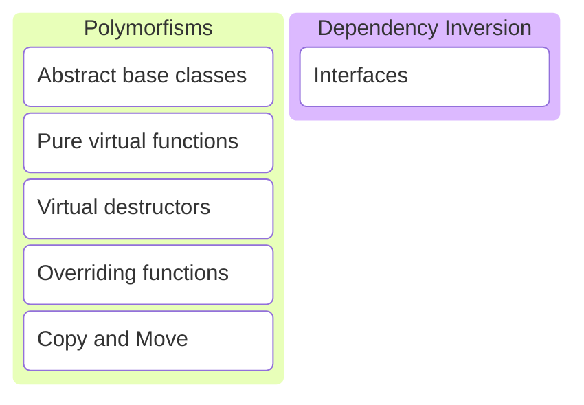

# C/C++ Programming

---

---
## Polymorfisms
---
```c++
class Animal
{
public:
    Animal(std::string name) : name_{std::move(name)} {}

    void speak() const
    {
        std::println("{} makes a sound.", name_);
    }

private:
    std::string name_{};
};
```
---
```c++
Animal dog{"dog"};
dog.speak();
```
```c++
Animal cat{"cat"};
cat.speak();
```
```text
dog makes a sound.
cat makes a sound.
```
---
Different animals make different sounds.
---
```c++
class Animal {
public:
    Animal(std::string name) : name_{std::move(name)} {}
    virtual ~Animal() = default;

    void speak() const {
        std::println("{} says {}.", name_, speak_impl());
    }

private:
    std::string name_{};

    virtual std::string speak_impl() const = 0;
};
```
---
```c++
Animal dog{"dog"}; // error
```
Cannot instantiate abstract class.
---
* Animal is an abstract class.
* Virtual destructor is required!
* speak_impl() is a pure virtual function.
* Specific animals need to provide a speak_impl() implementation.

Note:
* If a class has a virtual function, it also needs a virtual destructor.
---
```c++
class Dog : public Animal
{
public:
    Dog() : Animal("dog") {}

private:
    std::string speak_impl() const override
    {
        return "bark";
    }
};
```
---
```c++
class Cat : public Animal
{
public:
    Cat() : Animal("cat") {}

private:
    std::string speak_impl() const override
    {
        return "meow";
    }
};
```
---
```c++
class Bear : public Animal
{
public:
    Bear() : Animal("bear") {}

private:
    std::string speak_impl() const override
    {
        return "roar";
    }
};
```
---
```c++
class Hamster : public Animal
{
public:
    Hamster() : Animal("hamster") {}

private:
    std::string speak_impl() const override
    {
        return "squeak";
    }
};
```
---
```c++
Dog dog{};
dog.speak();
```
```c++
Cat cat{};
cat.speak();
```
```c++
Bear bear{};
bear.speak();
```
```c++
Hamster hamster{};
hamster.speak();
```
```text
dog says bark.
cat says meow.
bear says roar.
hamster says squeak.
```
---
```c++
void speak(Animal const& animal)
{
    animal.speak();
}
```
```c++
Dog dog{};
speak(dog);
```
```c++
Cat cat{};
speak(cat);
```
```text
dog says bark.
cat says meow.
```
Polymorfism.

Note:
* Cannot instantiate an abstract class.
* But we can make a (const) reference.
* The reference will accept any class that implements the abstract class.
* <https://compiler-explorer.com/z/axo4bMs1M>
---
## Rule-of-5
---
Classes with a virtual function also need a virtual destructor!
---
So we also need to add the other special member functions.
---
* Copy constructor.
* Copy assignment operator.
* Move constructor.
* Move assignment operator.
---
Should we allow copying Animal objects?
---
```c++
Cat cat{};
Dog dog{cat}; // uses copy constructor from Animal
```
No, that would open the possibility to assign Cats to Dogs etc, which does not make sense.
---
So we disable the special member functions!
---
```c++ [7-10]
class Animal
{
public:
    Animal(std::string name) : name_{std::move(name)} {}
    virtual ~Animal() = default;

    Animal(Animal const&) = delete;
    Animal& operator=(Animal const&) = delete;
    Animal(Animal&&) = delete;
    Animal& operator=(Animal&&) = delete;

    void speak() const
    {
        std::println("{} says {}.", name_, speak_impl());
    }

private:
    std::string name_{};

    virtual std::string speak_impl() const = 0;
};
```
---
It (almost) never makes sense to implement copy when polymorfisms are involved!
---
Best practices
---
Need a virtual function?
* Also add a virtual destructor.
* Disable copy and move operators.
---
## Dependency Inversion
