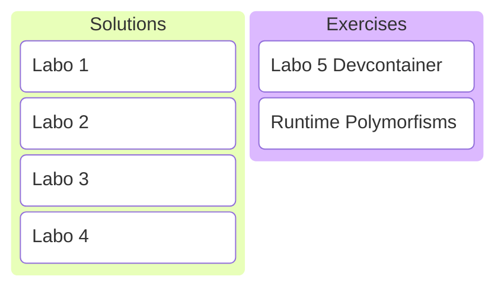

# C/C++ Programming
## Labo 5
---

---
## Solutions Labo 1-4
---
<https://gitlab.apstudent.be/cpp-programming/cpp-programming-solutions>
---
## Runtime Polymorfisms
---
### Devcontainer
TODO
---
### Exercises
See digitap.
