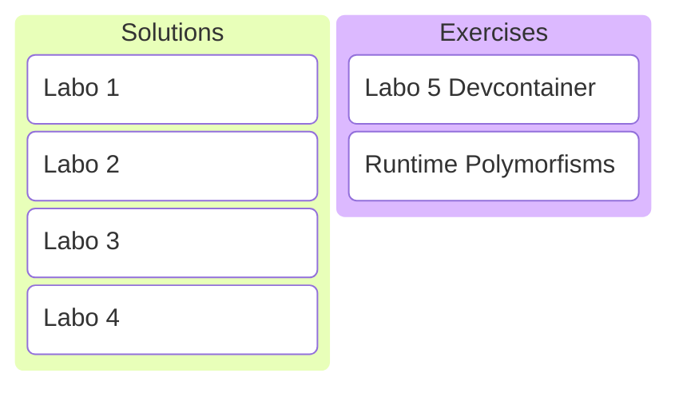

# C/C++ Programming
## Labo 5
---

---
## Solutions Labo 1-4
---
<https://gitlab.apstudent.be/cpp-programming/cpp-programming-solutions>
---
* static constexpr
* std::size_t
* static_cast
* std::optional
* designated initializers
---
### static constexpr
---
```c++
void counter()
{
    static int count{0};
    std::println("{}", ++count);
}
```
```c++
counter(); // prints 1
counter(); // prints 2
counter(); // prints 3
```
Static variables in a function.

Note:
* Static variables are shared between function calls.
---
```c++
class Counter
{
public:
    Counter() { std::println("{}", ++counter); }

private:
    inline static int counter{0};
};
```
```c++
Counter c1{}; // prints 1
Counter c2{}; // prints 2
Counter c3{}; // prints 3
```
Static member variables in a class.

Note:
* Static member variables are shared between instances.
* Either inline or initialization outside of class is required.

```c++
class Counter
{
    static int counter;
};

int Counter::counter{0};
```
---
```c++
class Counter
{
public:
    Counter() { std::println("{}", ++counter); }

    static int count() { return counter; }

private:
    inline static int counter{0};
};
```
```c++
Counter c1{};                         // prints 1
Counter c2{};                         // prints 2
std::println("{}", Counter::count()); // prints 2
```
Static functions in a class.

Note:
* Static functions in a class are called directly on the type instead of on a specific instance.
---
Compile time constants are shared between function calls or class instances. Make them static.
---
```c++
double circle_area(double radius)
{
    static constexpr double pi{3.14};
    return pi * radius * radius;
}
```
```c++
class Circle
{
private:
    static constexpr double pi{3.14};
};
```
---
```c++
// not in function or class, no static!
constexpr double pi{3.14};

double circle_area(double radius)
{
    return pi * radius * radius;
}

double circle_circumference(double radius)
{
    return 2 * pi * radius;
}
```
---
### std::size_t
---
std::size_t is used in the STL as index for operator[] and as result of the .size() member function of containers.
---
```c++
std::vector my_vec{1, 2, 3, 4, 5};
```
```c++
auto vec_size = my_vec.size();      // type is std::size_t
```
```c++
std::size_t index{2};
auto third_element = my_vec[index]; // expects std::size_t
```
---
```c++
// print items in reverse
for (auto i{my_vec.size()-1}; i >= 0; --i)
{
    std::println("{}", my_vec[i]);
}
```
std::size_t is an unsigned integer.

Note:
* What is the issue with this code?
* Infinite loop: -1 does not exist, instead wraps around to largest positive number.
---
Best practice: Always use int for arithmetic.
---
```c++
std::vector my_vec{1, 2, 3, 4, 5};
```
```c++
for (int i{my_vec.size()}; i >= 0; --i) // compiler warning
{
    std::println("{}", my_vec[i]); // compiler warning
}
```

Note:
* my_vec.size() returns std::size_t
* my_vec[] expectd std::size_t
---
STL existed long before best practice of always using int was introduced.
---
* std::ssize() to get container size as signed value.
* No real solution for operator[].

Note:
* Can't change operator[] because backwards compatibility would be broken.
---
Best practice
---
* Always use int for arithmetic.
* Use std::ssize(container) to get container size.
* Avoid operator[] if possible (use algorithms).
---
```c++
std::vector my_vec{1, 2, 3, 4, 5};
```
```c++
// print items in reverse
for (auto const& value : std::ranges::reverse(my_vec))
{
    std::println("{}", value);
}
```
No direct indexing required.
---
But what if I have to use direct indexing?
---
### static_cast
---
Convert from one type to another without checking.
---
```c++
std::vector my_vec{1, 2, 3, 4, 5};
```
```c++
// print items in reverse
for (int i{std::ssize(my_vec)}; i >= 0; --i)
{
    std::println("{}", my_vec[static_cast<std::size_t>(i)]);
}
```
---
You are telling the compiler it is safe to do the conversion.
---
Don't do this unless you are absolutely certain it is.
---
```c++
int my_int{-1};
```
```c++
auto my_index = static_cast<std::size_t>(my_int);
```
The compiler won't complain!

Note:
* <https://compiler-explorer.com/z/b7oaKTTzK>
---
### std::optional
---
Sometimes a function may or may not return a value.
---
```c++
// look for needle in haystack, return index if found else -1
int my_search(std::vector<int> const& haystack, int needle)
{
    for (int index{0}; auto const& value : haystack)
    {
        if (value == needle)
        {
            return index;
        }

        ++index;
    }

    return -1; // -1 for not found??
}
```
What if the needle is not found in the haystack?
---
```c++
// look for needle in haystack, return index if found
std::optional<int> my_search(std::vector<int> const& haystack, int needle)
{
    for (int index{0}; auto const& value : haystack)
    {
        if (value == needle)
        {
            return index;
        }

        ++index;
    }

    return {};
}
```
Much more expressive!
---
```c++
std::optional<int> my_search(std::vector<int> const& haystack, int needle)
```
```c++
std::vector my_vec{1, 2, 3, 4, 5};
if (auto const result = my_search(my_vec, 5))
{
    std::println("Found at index {}!", *result);
}
else
{
    std::println("Not found!");
}
```
Use in simple if construction.

Note:
* <https://compiler-explorer.com/z/3x7srx7fe>
---
### designated initializers
---
```c++
struct MyType
{
    int first;
    int second;
};
```
```c++
MyType my_value{1, 2};
```
```c++
std::println("{}", my_value.first);  // prints 1
std::println("{}", my_value.second); // prints 2
```
What we used so far.
---
```c++
struct MyType
{
    int first;
    int second;
};
```
```c++
MyType my_value{ .first = 1, .second = 2 };
```
Designated initializers.
---
Be expressive, use designated initializers!
---
## Exercises Runtime Polymorfisms
---
### Devcontainer
TODO
---
### Exercises
See digitap.
