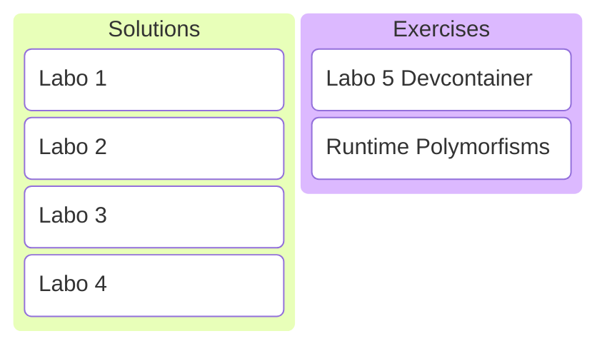

# C/C++ Programming
## Labo 5
---

---
## Solutions Labo 1-4
---
<https://gitlab.apstudent.be/cpp-programming/cpp-programming-solutions>
---
* static constexpr
* std::size_t
* static_cast
* std::optional
* designated initializers
---
### static constexpr
---
```c++
void counter()
{
    static int count{0};
    std::println("{}", ++count);
}
```
```c++
counter(); // prints 1
counter(); // prints 2
counter(); // prints 3
```
Static variables in a function.

Note:
* Static variables are shared between function calls.
---
```c++
class Counter
{
public:
    Counter() { std::println("{}", ++counter); }

private:
    inline static int counter{0};
};
```
```c++
Counter c1{}; // prints 1
Counter c2{}; // prints 2
Counter c3{}; // prints 3
```
Static member variables in a class.

Note:
* Static member variables are shared between instances.
* Either inline or initialization outside of class is required.

```c++
class Counter
{
    static int counter;
};

int Counter::counter{0};
```
---
```c++
class Counter
{
public:
    Counter() { std::println("{}", ++counter); }

    static int count() { return counter; }

private:
    inline static int counter{0};
};
```
```c++
Counter c1{};                         // prints 1
Counter c2{};                         // prints 2
std::println("{}", Counter::count()); // prints 2
```
Static functions in a class.

Note:
* Static functions in a class are called directly on the type instead of on a specific instance.
---
Compile time constants are shared between function calls or class instances. Make them static.
---
```c++
double circle_area(double radius)
{
    static constexpr double pi{3.14};
    return pi * radius * radius;
}
```
```c++
class Circle
{
private:
    static constexpr double pi{3.14};
};
```
---
```c++
// not in function or class, no static!
constexpr double pi{3.14};

double circle_area(double radius)
{
    return pi * radius * radius;
}

double circle_circumference(double radius)
{
    return 2 * pi * radius;
}
```
---
### std::size_t
---
### static_cast
---
### std::optional
---
### designated initializers
---
## Exercises Runtime Polymorfisms
---
### Devcontainer
TODO
---
### Exercises
See digitap.
