# C/C++ Programming


---

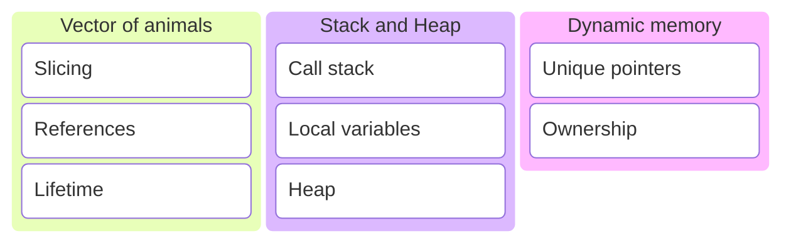

---

## The previous session

---

We created a polymorfistic animal hierarchy.

---

```c++
class Animal
{
public:
    Animal(std::string name) : name_{name} {}
    virtual ~Animal() = default;

    Animal(Animal const&) = delete;
    Animal& operator=(Animal const&) = delete;
    Animal(Animal&&) = delete;
    Animal& operator=(Animal&&) = delete;

    void speak() const
    {
        std::println("{} says {}.", name_, speak_impl());
    }

private:
    std::string name_{};

    virtual std::string speak_impl() const = 0;
};
```

With an Animal abstract base class.

---

```c++
class Dog : public Animal
{
public:
    Dog() : Animal("dog") {}

private:
    std::string speak_impl() const override
    {
        return "bark";
    }
};
```

```c++
class Cat     : public Animal { /*...*/ };
class Bear    : public Animal { /*...*/ };
class Hamster : public Animal { /*...*/ };
```

And concrete classes that implement it.

---

```c++
void speak(Animal const& animal)
{
    animal.speak();
}
```

```c++
Dog dog{};
Cat cat{};

speak(dog);
speak(cat);
```

And used these concrete classes as argument for a function that expects a reference to the base class.

---

Let's make a list of animals.

---

## Vector of Animals

---

```c++
// make a list of animals
std::vector<Animal> animals{
    Dog{},
    Bear{},
    Bear{},
    Cat{},
    Dog{},
    Hamster{},
    Bear{}
};
```

```c++
// walk through the list
for (auto const& animal : animals)
{
    animal.get().speak();
}
```

Does this work? <!-- .element: class="fragment" data-fragment-index="1" -->

Note:

* <https://compiler-explorer.com/z/YKde8oP7v>

---

```sh []
<source>:79:9: error: call to deleted constructor of 'const Animal'
   79 |         Dog{},
      |         ^~~~~
<source>:13:5: note: 'Animal' has been explicitly marked deleted here
   13 |     Animal(Animal&&) = delete;
      |     ^
<source>:80:9: error: call to deleted constructor of 'const Animal'
   80 |         Bear{},
      |         ^~~~~~
<source>:13:5: note: 'Animal' has been explicitly marked deleted here
   13 |     Animal(Animal&&) = delete;
      |     ^
<source>:81:9: error: call to deleted constructor of 'const Animal'
   81 |         Bear{},
      |         ^~~~~~
<source>:13:5: note: 'Animal' has been explicitly marked deleted here
   13 |     Animal(Animal&&) = delete;
      |     ^
<source>:82:9: error: call to deleted constructor of 'const Animal'
   82 |         Cat{},
      |         ^~~~~
<source>:13:5: note: 'Animal' has been explicitly marked deleted here
   13 |     Animal(Animal&&) = delete;
      |     ^
<source>:83:9: error: call to deleted constructor of 'const Animal'
   83 |         Dog{},
      |         ^~~~~
<source>:13:5: note: 'Animal' has been explicitly marked deleted here
   13 |     Animal(Animal&&) = delete;
      |     ^
<source>:84:9: error: call to deleted constructor of 'const Animal'
   84 |         Hamster{},
      |         ^~~~~~~~~
<source>:13:5: note: 'Animal' has been explicitly marked deleted here
   13 |     Animal(Animal&&) = delete;
      |     ^
<source>:85:9: error: call to deleted constructor of 'const Animal'
   85 |         Bear{}
      |         ^~~~~~
<source>:13:5: note: 'Animal' has been explicitly marked deleted here
   13 |     Animal(Animal&&) = delete;
      |     ^
/opt/compiler-explorer/gcc-14.2.0/lib/gcc/x86_64-linux-gnu/14.2.0/../../../../include/c++/14.2.0/bits/stl_vector.h:678:43: note: passing argument to parameter '__l' here
  678 |       vector(initializer_list<value_type> __l,
      |                                           ^
7 errors generated.
Compiler returned: 1
```

No, it does not work!

---

```c++
struct A     { int a; }
struct B : A { int b; } // inherits int a from A
```

```c++
B b{1, 2};              // int a = 1, int b = 2
A a = b;                // only A part copied
```

* This is called slicing.
* Another reason to disable copy. 😉 <!-- .element: class="fragment" data-fragment-index="1" -->

---

```c++
Dog dog{};
```

```c++
Animal const& animal = dog;
```

```c++
animal.speak();
```

Use references!

---

Let's make a vector of references to animal objects.

---

```c++
// create some animals
Dog d1{};
Dog d2{};
Cat c1{};
Bear b1{};
Bear b2{};
Bear b3{};
Hamster h1{};
```

```c++
// add them to a list
std::vector<Animal&> animals{
    d2, b1, b2, c1, d1, h1, b3
};
```
<!-- .element: class="fragment" data-fragment-index="1" -->

```c++
// walk through the list
for (auto const& animal : animals)
{
    animal.get().speak();
}
```
<!-- .element: class="fragment" data-fragment-index="2" -->
Does this work? <!-- .element: class="fragment" data-fragment-index="3" -->

Note:

* <https://compiler-explorer.com/z/j6coWEeqe>

---

```sh []
In file included from <source>:1:
In file included from /opt/compiler-explorer/gcc-14.2.0/lib/gcc/x86_64-linux-gnu/14.2.0/../../../../include/c++/14.2.0/print:41:
In file included from /opt/compiler-explorer/gcc-14.2.0/lib/gcc/x86_64-linux-gnu/14.2.0/../../../../include/c++/14.2.0/format:47:
In file included from /opt/compiler-explorer/gcc-14.2.0/lib/gcc/x86_64-linux-gnu/14.2.0/../../../../include/c++/14.2.0/locale:41:
In file included from /opt/compiler-explorer/gcc-14.2.0/lib/gcc/x86_64-linux-gnu/14.2.0/../../../../include/c++/14.2.0/bits/locale_classes.h:40:
In file included from /opt/compiler-explorer/gcc-14.2.0/lib/gcc/x86_64-linux-gnu/14.2.0/../../../../include/c++/14.2.0/string:43:
In file included from /opt/compiler-explorer/gcc-14.2.0/lib/gcc/x86_64-linux-gnu/14.2.0/../../../../include/c++/14.2.0/bits/allocator.h:46:
In file included from /opt/compiler-explorer/gcc-14.2.0/lib/gcc/x86_64-linux-gnu/14.2.0/../../../../include/c++/14.2.0/x86_64-linux-gnu/bits/c++allocator.h:33:
/opt/compiler-explorer/gcc-14.2.0/lib/gcc/x86_64-linux-gnu/14.2.0/../../../../include/c++/14.2.0/bits/new_allocator.h:125:29: error: 'allocate' declared as a pointer to a reference of type 'Animal &'
  125 |       _GLIBCXX_NODISCARD _Tp*
      |                             ^
/opt/compiler-explorer/gcc-14.2.0/lib/gcc/x86_64-linux-gnu/14.2.0/../../../../include/c++/14.2.0/bits/allocator.h:128:30: note: in instantiation of template class 'std::__new_allocator<Animal &>' requested here
  128 |     class allocator : public __allocator_base<_Tp>
      |                              ^
/opt/compiler-explorer/gcc-14.2.0/lib/gcc/x86_64-linux-gnu/14.2.0/../../../../include/c++/14.2.0/ext/alloc_traits.h:44:47: note: in instantiation of template class 'std::allocator<Animal &>' requested here
   44 | template<typename _Alloc, typename = typename _Alloc::value_type>
      |                                               ^
/opt/compiler-explorer/gcc-14.2.0/lib/gcc/x86_64-linux-gnu/14.2.0/../../../../include/c++/14.2.0/bits/stl_vector.h:86:35: note: in instantiation of default argument for '__alloc_traits<std::allocator<Animal &>>' required here
   86 |       typedef typename __gnu_cxx::__alloc_traits<_Alloc>::template
      |                                   ^~~~~~~~~~~~~~~~~~~~~~
/opt/compiler-explorer/gcc-14.2.0/lib/gcc/x86_64-linux-gnu/14.2.0/../../../../include/c++/14.2.0/bits/stl_vector.h:428:30: note: in instantiation of template class 'std::_Vector_base<Animal &, std::allocator<Animal &>>' requested here
  428 |     class vector : protected _Vector_base<_Tp, _Alloc>
      |                              ^
<source>:87:26: note: in instantiation of template class 'std::vector<Animal &>' requested here
   87 |     std::vector<Animal&> animals{
      |                          ^
In file included from <source>:1:
In file included from /opt/compiler-explorer/gcc-14.2.0/lib/gcc/x86_64-linux-gnu/14.2.0/../../../../include/c++/14.2.0/print:41:
In file included from /opt/compiler-explorer/gcc-14.2.0/lib/gcc/x86_64-linux-gnu/14.2.0/../../../../include/c++/14.2.0/format:47:
In file included from /opt/compiler-explorer/gcc-14.2.0/lib/gcc/x86_64-linux-gnu/14.2.0/../../../../include/c++/14.2.0/locale:41:
In file included from /opt/compiler-explorer/gcc-14.2.0/lib/gcc/x86_64-linux-gnu/14.2.0/../../../../include/c++/14.2.0/bits/locale_classes.h:40:
In file included from /opt/compiler-explorer/gcc-14.2.0/lib/gcc/x86_64-linux-gnu/14.2.0/../../../../include/c++/14.2.0/string:43:
In file included from /opt/compiler-explorer/gcc-14.2.0/lib/gcc/x86_64-linux-gnu/14.2.0/../../../../include/c++/14.2.0/bits/allocator.h:46:
In file included from /opt/compiler-explorer/gcc-14.2.0/lib/gcc/x86_64-linux-gnu/14.2.0/../../../../include/c++/14.2.0/x86_64-linux-gnu/bits/c++allocator.h:33:
/opt/compiler-explorer/gcc-14.2.0/lib/gcc/x86_64-linux-gnu/14.2.0/../../../../include/c++/14.2.0/bits/new_allocator.h:156:21: error: '__p' declared as a pointer to a reference of type 'Animal &'
  156 |       deallocate(_Tp* __p, size_type __n __attribute__ ((__unused__)))
      |                     ^
In file included from <source>:1:
In file included from /opt/compiler-explorer/gcc-14.2.0/lib/gcc/x86_64-linux-gnu/14.2.0/../../../../include/c++/14.2.0/print:41:
In file included from /opt/compiler-explorer/gcc-14.2.0/lib/gcc/x86_64-linux-gnu/14.2.0/../../../../include/c++/14.2.0/format:47:
In file included from /opt/compiler-explorer/gcc-14.2.0/lib/gcc/x86_64-linux-gnu/14.2.0/../../../../include/c++/14.2.0/locale:41:
In file included from /opt/compiler-explorer/gcc-14.2.0/lib/gcc/x86_64-linux-gnu/14.2.0/../../../../include/c++/14.2.0/bits/locale_classes.h:40:
In file included from /opt/compiler-explorer/gcc-14.2.0/lib/gcc/x86_64-linux-gnu/14.2.0/../../../../include/c++/14.2.0/string:43:
/opt/compiler-explorer/gcc-14.2.0/lib/gcc/x86_64-linux-gnu/14.2.0/../../../../include/c++/14.2.0/bits/allocator.h:186:20: error: 'allocate' declared as a pointer to a reference of type 'Animal &'
  186 |       constexpr _Tp*
      |                    ^
/opt/compiler-explorer/gcc-14.2.0/lib/gcc/x86_64-linux-gnu/14.2.0/../../../../include/c++/14.2.0/ext/alloc_traits.h:44:47: note: in instantiation of template class 'std::allocator<Animal &>' requested here
   44 | template<typename _Alloc, typename = typename _Alloc::value_type>
      |                                               ^
/opt/compiler-explorer/gcc-14.2.0/lib/gcc/x86_64-linux-gnu/14.2.0/../../../../include/c++/14.2.0/bits/stl_vector.h:86:35: note: in instantiation of default argument for '__alloc_traits<std::allocator<Animal &>>' required here
   86 |       typedef typename __gnu_cxx::__alloc_traits<_Alloc>::template
      |                                   ^~~~~~~~~~~~~~~~~~~~~~
/opt/compiler-explorer/gcc-14.2.0/lib/gcc/x86_64-linux-gnu/14.2.0/../../../../include/c++/14.2.0/bits/stl_vector.h:428:30: note: in instantiation of template class 'std::_Vector_base<Animal &, std::allocator<Animal &>>' requested here
  428 |     class vector : protected _Vector_base<_Tp, _Alloc>
      |                              ^
<source>:87:26: note: in instantiation of template class 'std::vector<Animal &>' requested here
   87 |     std::vector<Animal&> animals{
      |                          ^
In file included from <source>:1:
In file included from /opt/compiler-explorer/gcc-14.2.0/lib/gcc/x86_64-linux-gnu/14.2.0/../../../../include/c++/14.2.0/print:41:
In file included from /opt/compiler-explorer/gcc-14.2.0/lib/gcc/x86_64-linux-gnu/14.2.0/../../../../include/c++/14.2.0/format:47:
In file included from /opt/compiler-explorer/gcc-14.2.0/lib/gcc/x86_64-linux-gnu/14.2.0/../../../../include/c++/14.2.0/locale:41:
In file included from /opt/compiler-explorer/gcc-14.2.0/lib/gcc/x86_64-linux-gnu/14.2.0/../../../../include/c++/14.2.0/bits/locale_classes.h:40:
In file included from /opt/compiler-explorer/gcc-14.2.0/lib/gcc/x86_64-linux-gnu/14.2.0/../../../../include/c++/14.2.0/string:43:
/opt/compiler-explorer/gcc-14.2.0/lib/gcc/x86_64-linux-gnu/14.2.0/../../../../include/c++/14.2.0/bits/allocator.h:201:21: error: '__p' declared as a pointer to a reference of type 'Animal &'
  201 |       deallocate(_Tp* __p, size_t __n)
      |                     ^
In file included from <source>:1:
In file included from /opt/compiler-explorer/gcc-14.2.0/lib/gcc/x86_64-linux-gnu/14.2.0/../../../../include/c++/14.2.0/print:41:
In file included from /opt/compiler-explorer/gcc-14.2.0/lib/gcc/x86_64-linux-gnu/14.2.0/../../../../include/c++/14.2.0/format:47:
In file included from /opt/compiler-explorer/gcc-14.2.0/lib/gcc/x86_64-linux-gnu/14.2.0/../../../../include/c++/14.2.0/locale:41:
In file included from /opt/compiler-explorer/gcc-14.2.0/lib/gcc/x86_64-linux-gnu/14.2.0/../../../../include/c++/14.2.0/bits/locale_classes.h:40:
In file included from /opt/compiler-explorer/gcc-14.2.0/lib/gcc/x86_64-linux-gnu/14.2.0/../../../../include/c++/14.2.0/string:54:
In file included from /opt/compiler-explorer/gcc-14.2.0/lib/gcc/x86_64-linux-gnu/14.2.0/../../../../include/c++/14.2.0/bits/basic_string.h:39:
In file included from /opt/compiler-explorer/gcc-14.2.0/lib/gcc/x86_64-linux-gnu/14.2.0/../../../../include/c++/14.2.0/ext/alloc_traits.h:34:
/opt/compiler-explorer/gcc-14.2.0/lib/gcc/x86_64-linux-gnu/14.2.0/../../../../include/c++/14.2.0/bits/alloc_traits.h:433:26: error: 'pointer' declared as a pointer to a reference of type 'Animal &'
  433 |       using pointer = _Tp*;
      |                          ^
/opt/compiler-explorer/gcc-14.2.0/lib/gcc/x86_64-linux-gnu/14.2.0/../../../../include/c++/14.2.0/ext/alloc_traits.h:47:5: note: in instantiation of template class 'std::allocator_traits<std::allocator<Animal &>>' requested here
   47 |   : std::allocator_traits<_Alloc>
      |     ^
/opt/compiler-explorer/gcc-14.2.0/lib/gcc/x86_64-linux-gnu/14.2.0/../../../../include/c++/14.2.0/bits/stl_vector.h:86:35: note: in instantiation of template class '__gnu_cxx::__alloc_traits<std::allocator<Animal &>>' requested here
   86 |       typedef typename __gnu_cxx::__alloc_traits<_Alloc>::template
      |                                   ^
/opt/compiler-explorer/gcc-14.2.0/lib/gcc/x86_64-linux-gnu/14.2.0/../../../../include/c++/14.2.0/bits/stl_vector.h:428:30: note: in instantiation of template class 'std::_Vector_base<Animal &, std::allocator<Animal &>>' requested here
  428 |     class vector : protected _Vector_base<_Tp, _Alloc>
      |                              ^
<source>:87:26: note: in instantiation of template class 'std::vector<Animal &>' requested here
   87 |     std::vector<Animal&> animals{
      |                          ^
In file included from <source>:1:
In file included from /opt/compiler-explorer/gcc-14.2.0/lib/gcc/x86_64-linux-gnu/14.2.0/../../../../include/c++/14.2.0/print:41:
In file included from /opt/compiler-explorer/gcc-14.2.0/lib/gcc/x86_64-linux-gnu/14.2.0/../../../../include/c++/14.2.0/format:47:
In file included from /opt/compiler-explorer/gcc-14.2.0/lib/gcc/x86_64-linux-gnu/14.2.0/../../../../include/c++/14.2.0/locale:41:
In file included from /opt/compiler-explorer/gcc-14.2.0/lib/gcc/x86_64-linux-gnu/14.2.0/../../../../include/c++/14.2.0/bits/locale_classes.h:40:
In file included from /opt/compiler-explorer/gcc-14.2.0/lib/gcc/x86_64-linux-gnu/14.2.0/../../../../include/c++/14.2.0/string:54:
In file included from /opt/compiler-explorer/gcc-14.2.0/lib/gcc/x86_64-linux-gnu/14.2.0/../../../../include/c++/14.2.0/bits/basic_string.h:39:
In file included from /opt/compiler-explorer/gcc-14.2.0/lib/gcc/x86_64-linux-gnu/14.2.0/../../../../include/c++/14.2.0/ext/alloc_traits.h:34:
/opt/compiler-explorer/gcc-14.2.0/lib/gcc/x86_64-linux-gnu/14.2.0/../../../../include/c++/14.2.0/bits/alloc_traits.h:436:38: error: 'const_pointer' declared as a pointer to a reference of type 'Animal &'
  436 |       using const_pointer = const _Tp*;
      |                                      ^
In file included from <source>:3:
In file included from /opt/compiler-explorer/gcc-14.2.0/lib/gcc/x86_64-linux-gnu/14.2.0/../../../../include/c++/14.2.0/vector:66:
/opt/compiler-explorer/gcc-14.2.0/lib/gcc/x86_64-linux-gnu/14.2.0/../../../../include/c++/14.2.0/bits/stl_vector.h:133:11: error: base specifier must name a class
  133 |         : public _Tp_alloc_type, public _Vector_impl_data
      |           ~~~~~~~^~~~~~~~~~~~~~
/opt/compiler-explorer/gcc-14.2.0/lib/gcc/x86_64-linux-gnu/14.2.0/../../../../include/c++/14.2.0/bits/stl_vector.h:373:20: note: in instantiation of member class 'std::_Vector_base<Animal &, std::allocator<Animal &>>::_Vector_impl' requested here
  373 |       _Vector_impl _M_impl;
      |                    ^
/opt/compiler-explorer/gcc-14.2.0/lib/gcc/x86_64-linux-gnu/14.2.0/../../../../include/c++/14.2.0/bits/stl_vector.h:428:30: note: in instantiation of template class 'std::_Vector_base<Animal &, std::allocator<Animal &>>' requested here
  428 |     class vector : protected _Vector_base<_Tp, _Alloc>
      |                              ^
<source>:87:26: note: in instantiation of template class 'std::vector<Animal &>' requested here
   87 |     std::vector<Animal&> animals{
      |                          ^
In file included from <source>:1:
In file included from /opt/compiler-explorer/gcc-14.2.0/lib/gcc/x86_64-linux-gnu/14.2.0/../../../../include/c++/14.2.0/print:41:
In file included from /opt/compiler-explorer/gcc-14.2.0/lib/gcc/x86_64-linux-gnu/14.2.0/../../../../include/c++/14.2.0/format:47:
In file included from /opt/compiler-explorer/gcc-14.2.0/lib/gcc/x86_64-linux-gnu/14.2.0/../../../../include/c++/14.2.0/locale:41:
In file included from /opt/compiler-explorer/gcc-14.2.0/lib/gcc/x86_64-linux-gnu/14.2.0/../../../../include/c++/14.2.0/bits/locale_classes.h:40:
In file included from /opt/compiler-explorer/gcc-14.2.0/lib/gcc/x86_64-linux-gnu/14.2.0/../../../../include/c++/14.2.0/string:54:
In file included from /opt/compiler-explorer/gcc-14.2.0/lib/gcc/x86_64-linux-gnu/14.2.0/../../../../include/c++/14.2.0/bits/basic_string.h:39:
/opt/compiler-explorer/gcc-14.2.0/lib/gcc/x86_64-linux-gnu/14.2.0/../../../../include/c++/14.2.0/ext/alloc_traits.h:44:47: error: type '_Tp_alloc_type' (aka 'int') cannot be used prior to '::' because it has no members
   44 | template<typename _Alloc, typename = typename _Alloc::value_type>
      |                                               ^
/opt/compiler-explorer/gcc-14.2.0/lib/gcc/x86_64-linux-gnu/14.2.0/../../../../include/c++/14.2.0/bits/stl_vector.h:450:26: note: in instantiation of default argument for '__alloc_traits<_Tp_alloc_type>' required here
  450 |       typedef __gnu_cxx::__alloc_traits<_Tp_alloc_type> _Alloc_traits;
      |                          ^~~~~~~~~~~~~~~~~~~~~~~~~~~~~~
<source>:87:26: note: in instantiation of template class 'std::vector<Animal &>' requested here
   87 |     std::vector<Animal&> animals{
      |                          ^
In file included from <source>:3:
In file included from /opt/compiler-explorer/gcc-14.2.0/lib/gcc/x86_64-linux-gnu/14.2.0/../../../../include/c++/14.2.0/vector:66:
/opt/compiler-explorer/gcc-14.2.0/lib/gcc/x86_64-linux-gnu/14.2.0/../../../../include/c++/14.2.0/bits/stl_vector.h:1261:10: error: 'data' declared as a pointer to a reference of type 'Animal &'
 1261 |       _Tp*
      |          ^
<source>:87:26: note: in instantiation of template class 'std::vector<Animal &>' requested here
   87 |     std::vector<Animal&> animals{
      |                          ^
In file included from <source>:3:
In file included from /opt/compiler-explorer/gcc-14.2.0/lib/gcc/x86_64-linux-gnu/14.2.0/../../../../include/c++/14.2.0/vector:66:
/opt/compiler-explorer/gcc-14.2.0/lib/gcc/x86_64-linux-gnu/14.2.0/../../../../include/c++/14.2.0/bits/stl_vector.h:1266:16: error: 'data' declared as a pointer to a reference of type 'Animal &'
 1266 |       const _Tp*
      |                ^
/opt/compiler-explorer/gcc-14.2.0/lib/gcc/x86_64-linux-gnu/14.2.0/../../../../include/c++/14.2.0/bits/stl_vector.h:1300:7: error: multiple overloads of 'push_back' instantiate to the same signature 'void (Animal &)'
 1300 |       push_back(value_type&& __x)
      |       ^
/opt/compiler-explorer/gcc-14.2.0/lib/gcc/x86_64-linux-gnu/14.2.0/../../../../include/c++/14.2.0/bits/stl_vector.h:1283:7: note: previous declaration is here
 1283 |       push_back(const value_type& __x)
      |       ^
/opt/compiler-explorer/gcc-14.2.0/lib/gcc/x86_64-linux-gnu/14.2.0/../../../../include/c++/14.2.0/bits/stl_vector.h:1395:7: error: multiple overloads of 'insert' instantiate to the same signature 'iterator (const_iterator, Animal &)' (aka '__normal_iterator<int, std::vector<Animal &, std::allocator<Animal &>>> (__normal_iterator<int, std::vector<Animal &, std::allocator<Animal &>>>, Animal &)')
 1395 |       insert(const_iterator __position, value_type&& __x)
      |       ^
/opt/compiler-explorer/gcc-14.2.0/lib/gcc/x86_64-linux-gnu/14.2.0/../../../../include/c++/14.2.0/bits/stl_vector.h:1364:7: note: previous declaration is here
 1364 |       insert(const_iterator __position, const value_type& __x);
      |       ^
12 errors generated.
Compiler returned: 1
```

No, it does not work!

---

We can't store references in a vector. 😕

Note:

* Same reason a why we don't want to use references for class members.
* They are an alias. We can't assign something new to them.

---

But we can use std::reference_wrapper! 👍

Note:

* We already used them to store a reference in a class for dependency inversion!

---

```c++
// create some animals
Dog d1{};
Dog d2{};
Cat c1{};
Bear b1{};
Bear b2{};
Bear b3{};
Hamster h1{};
```

```c++
// add them to a list
std::vector<std::reference_wrapper<Animal const>> animals{
    d2, b1, b2, c1, d1, h1, b3
};
```
<!-- .element: class="fragment" data-fragment-index="1" -->

```c++
// walk through the list
for (auto const& animal : animals)
{
    animal.get().speak();
}
```
<!-- .element: class="fragment" data-fragment-index="2" -->

Note:

* Need std::reference_wrapper to store references in a vector.
* <https://compiler-explorer.com/z/Kqsbva33G>

---

```text
dog says bark.
bear says roar.
bear says roar.
cat says meow.
dog says bark.
hamster says squeak.
bear says roar.
```

Phew, finally something that works! 🎉

---

But what if we don't know which animal to create at compile-time? 🤔

Note:

* For example we ask the user which animal to create.

---

```c++
std::string animal{};
std::print("Which animal do you want to create? ");
std::cin >> animal;
```

---

```c++
std::vector<std::reference_wrapper<Animal const>> animals{};
```

```c++
if (animal == "dog")
{
    Dog dog{};
    animals.push_back(dog);
}
```

```c++
if (animal == "cat")
{
    Cat cat{};
    animals.push_back(cat);
}
```

```c++
// bear, hamster, ...
```

Does this work? <!-- .element: class="fragment" data-fragment-index="1" -->

Note:

* Vector holds references, but animal objects go out-of-scope when if block ends!
* <https://compiler-explorer.com/z/jPEbeGdsT>

---

```sh [2]
=================================================================
==1==ERROR: AddressSanitizer: stack-use-after-scope on address 0x73c7e0309140 at pc 0x633f823d35c8 bp 0x7fff294cced0 sp 0x7fff294ccec8
READ of size 8 at 0x73c7e0309140 thread T0
    #0 0x633f823d35c7 in Animal::speak() const /app/example.cpp:20:44
    #1 0x633f823d35c7 in main /app/example.cpp:113:22
    #2 0x73c7e2029d8f  (/lib/x86_64-linux-gnu/libc.so.6+0x29d8f) (BuildId: 490fef8403240c91833978d494d39e537409b92e)
    #3 0x73c7e2029e3f in __libc_start_main (/lib/x86_64-linux-gnu/libc.so.6+0x29e3f) (BuildId: 490fef8403240c91833978d494d39e537409b92e)
    #4 0x633f822f2524 in _start (/app/output.s+0x2e524)

Address 0x73c7e0309140 is located in stack of thread T0 at offset 320 in frame
    #0 0x633f823d2ebf in main /app/example.cpp:78

  This frame has 6 object(s):
    [32, 64) 'ref.tmp.i' (line 20)
    [96, 128) 'animal' (line 79)
    [160, 200) 'dog' (line 88)
    [240, 280) 'cat' (line 93)
    [320, 360) 'bear' (line 98) <== Memory access at offset 320 is inside this variable
    [400, 440) 'hamster' (line 103)
HINT: this may be a false positive if your program uses some custom stack unwind mechanism, swapcontext or vfork
      (longjmp and C++ exceptions *are* supported)
SUMMARY: AddressSanitizer: stack-use-after-scope /app/example.cpp:20:44 in Animal::speak() const
Shadow bytes around the buggy address:
  0x73c7e0308e80: 00 00 00 00 00 00 00 00 00 00 00 00 00 00 00 00
  0x73c7e0308f00: 00 00 00 00 00 00 00 00 00 00 00 00 00 00 00 00
  0x73c7e0308f80: 00 00 00 00 00 00 00 00 00 00 00 00 00 00 00 00
  0x73c7e0309000: f1 f1 f1 f1 00 00 00 00 f2 f2 f2 f2 00 00 00 00
  0x73c7e0309080: f2 f2 f2 f2 f8 f8 f8 f8 f8 f2 f2 f2 f2 f2 f8 f8
=>0x73c7e0309100: f8 f8 f8 f2 f2 f2 f2 f2[f8]f8 f8 f8 f8 f2 f2 f2
  0x73c7e0309180: f2 f2 f8 f8 f8 f8 f8 f3 f3 f3 f3 f3 00 00 00 00
  0x73c7e0309200: f5 f5 f5 f5 f5 f5 f5 f5 f5 f5 f5 f5 f5 f5 f5 f5
  0x73c7e0309280: f5 f5 f5 f5 f5 f5 f5 f5 f5 f5 f5 f5 f5 f5 f5 f5
  0x73c7e0309300: f5 f5 f5 f5 f5 f5 f5 f5 f5 f5 f5 f5 f5 f5 f5 f5
  0x73c7e0309380: f5 f5 f5 f5 f5 f5 f5 f5 f5 f5 f5 f5 f5 f5 f5 f5
Shadow byte legend (one shadow byte represents 8 application bytes):
  Addressable:           00
  Partially addressable: 01 02 03 04 05 06 07
  Heap left redzone:       fa
  Freed heap region:       fd
  Stack left redzone:      f1
  Stack mid redzone:       f2
  Stack right redzone:     f3
  Stack after return:      f5
  Stack use after scope:   f8
  Global redzone:          f9
  Global init order:       f6
  Poisoned by user:        f7
  Container overflow:      fc
  Array cookie:            ac
  Intra object redzone:    bb
  ASan internal:           fe
  Left alloca redzone:     ca
  Right alloca redzone:    cb
==1==ABORTING
```

No, it does not work!

Note:

* Address sanitizer detects this!
* Enable by adding compiler option `-fsanitize=address`.

---

```c++
// vector of references to animal objects
std::vector<std::reference_wrapper<Animal const>> animals{};
```

```c++
// create the right type of animal
if (animal == "dog")
{
    Dog dog{};              // create dog object
    animals.push_back(dog); // store reference to dog object
}                           // ‼️dog object ceases to exist‼️
```
<!-- .element: class="fragment" data-fragment-index="1" -->

```c++
// walk through the list
for (auto const& animal : animals)
{
    animal.get().speak();   // oops, attempt to access object
                            // that no longer exists 💣
}
```
<!-- .element: class="fragment" data-fragment-index="2" -->

---

I want animal objects that don't go out of scope!

---

Where are variables stored anyway? 🤔

---

## Stack vs. Heap

---

* Where are variables stored?
* Where are function arguments stored? <!-- .element: class="fragment" data-fragment-index="1" -->
* How does the program know where to return when a function ends? <!-- .element: class="fragment" data-fragment-index="2" -->

---

### The call stack

---

A stack is a LIFO data structure.

Note:

* LIFO = Last In First Out
* New items are added to the top.
* The most recent item is removed first.

---

#### How does the call stack work?

Note:

* Next slide has an example.
* Students try to understand this themselves and explain it to eachother.

---

<!-- .slide: data-transition="none" -->

<div style="display: flex; justify-content: space-evenly;">

```c++ []
int c(int j, int k)
{
    return j + k;
}

int b(int i)
{
    return i * 2;
}

int a()
{
    int x{5};
    return c(b(x), x);
}

int main()
{
    return a();
}
```

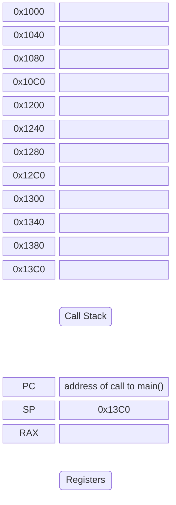

</div>

Note:

* The main function is called from startup code.
* The stack pointer register (SP) keeps track of where we are. It points to the top of the stack.
* The program counter register (PC) keeps track of which instruction we are executing. It points to the current instruction in the assembly code.
* The RAX register is used to store function return values. They are not stored on the stack.
* When the end of a function is reached, its stack frame is removed from the stack. The return value (if any) is set in RAX. And the program counter is updated to the return address that was stored on the stack.
* We use line numbers here for the program counter. In reality it holds the address of the current instruction in the assembly code.

--

<!-- .slide: data-transition="none" -->

<div style="display: flex; justify-content: space-evenly;">

```c++ [17]
int c(int j, int k)
{
    return j + k;
}

int b(int i)
{
    return i * 2;
}

int a()
{
    int x{5};
    return c(b(x), x);
}

int main()
{
    return a();
}
```

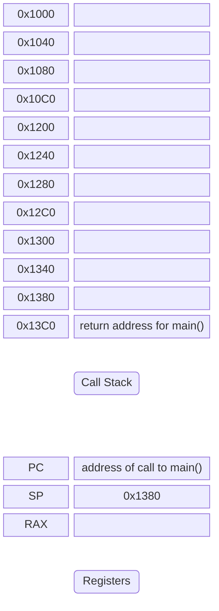

</div>

Note:

* After the main function ends, code in the startup function should resume.
* The address of the next instruction in that startup function is the return address for main() that is stored on the stack.

--

<!-- .slide: data-transition="none" -->

<div style="display: flex; justify-content: space-evenly;">

```c++ [19]
int c(int j, int k)
{
    return j + k;
}

int b(int i)
{
    return i * 2;
}

int a()
{
    int x{5};
    return c(b(x), x);
}

int main()
{
    return a();
}
```


</div>

Note:

* Call function a().
* Its return address (address of return instruction on line 19) is stored on the stack.

--

<!-- .slide: data-transition="none" -->

<div style="display: flex; justify-content: space-evenly;">

```c++ [13]
int c(int j, int k)
{
    return j + k;
}

int b(int i)
{
    return i * 2;
}

int a()
{
    int x{5};
    return c(b(x), x);
}

int main()
{
    return a();
}
```

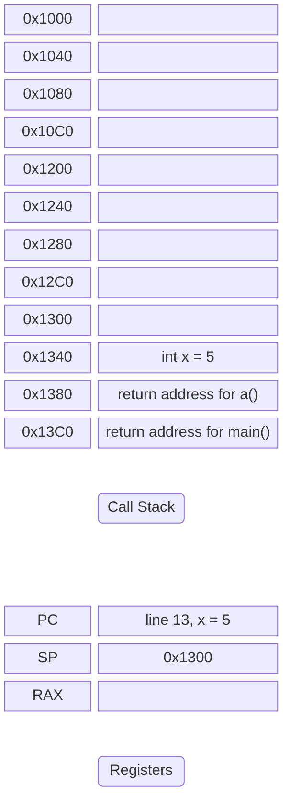

</div>

Note:

* A local variable x is created in function a.
* Local variables are stored on the stack!

--

<!-- .slide: data-transition="none" -->

<div style="display: flex; justify-content: space-evenly;">

```c++ [14]
int c(int j, int k)
{
    return j + k;
}

int b(int i)
{
    return i * 2;
}

int a()
{
    int x{5};
    return c(b(x), x);
}

int main()
{
    return a();
}
```

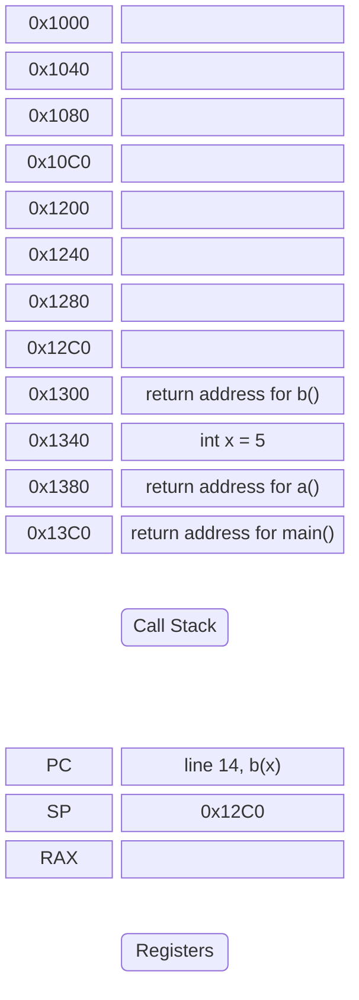

</div>

Note:

* Before c() can be invoked, we need to call b() first.
* Put the return address for b() on the stack.
* That return address will be the address of the call c() instruction on line 14.

--

<!-- .slide: data-transition="none" -->

<div style="display: flex; justify-content: space-evenly;">

```c++ [14,6]
int c(int j, int k)
{
    return j + k;
}

int b(int i)
{
    return i * 2;
}

int a()
{
    int x{5};
    return c(b(x), x);
}

int main()
{
    return a();
}
```

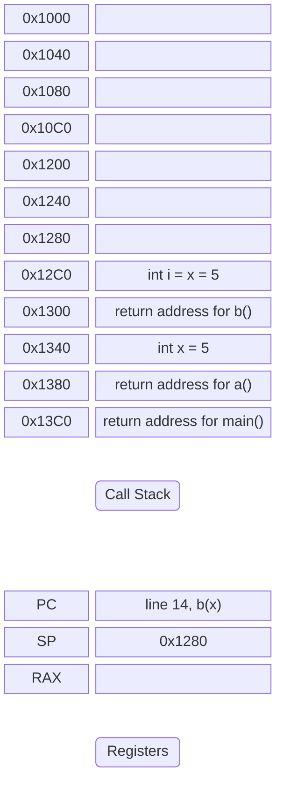

</div>

Note:

* b() takes an integer as argument.
* Function arguments are stored on the stack!

--

<!-- .slide: data-transition="none" -->

<div style="display: flex; justify-content: space-evenly;">

```c++ [8]
int c(int j, int k)
{
    return j + k;
}

int b(int i)
{
    return i * 2;
}

int a()
{
    int x{5};
    return c(b(x), x);
}

int main()
{
    return a();
}
```

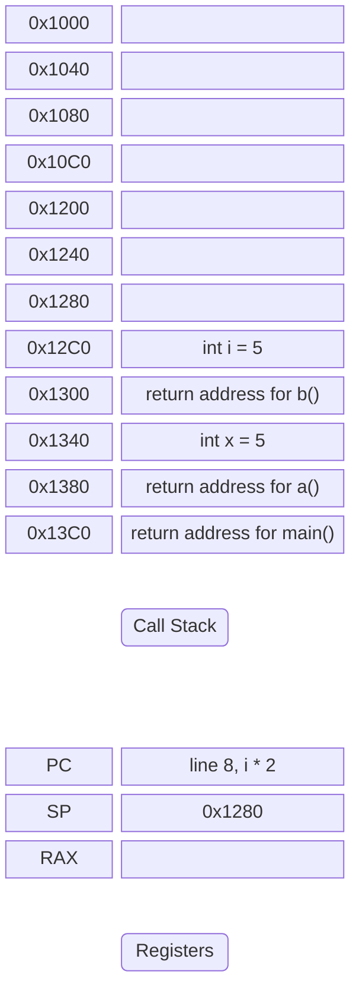

</div>

Note:

* The next step is to calculate the value of i * 2.

--

<!-- .slide: data-transition="none" -->

<div style="display: flex; justify-content: space-evenly;">

```c++ [8]
int c(int j, int k)
{
    return j + k;
}

int b(int i)
{
    return i * 2;
}

int a()
{
    int x{5};
    return c(b(x), x);
}

int main()
{
    return a();
}
```

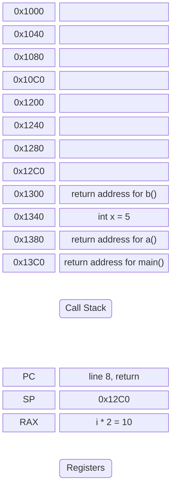

</div>

Note:

* After the calculation is done, i is no longer needed. It is removed from the stack.
* The return instruction is next. The calculated value is stored in register RAX.

--

<!-- .slide: data-transition="none" -->

<div style="display: flex; justify-content: space-evenly;">

```c++ [9]
int c(int j, int k)
{
    return j + k;
}

int b(int i)
{
    return i * 2;
}

int a()
{
    int x{5};
    return c(b(x), x);
}

int main()
{
    return a();
}
```


</div>

Note:

* The end of function b() is reached.
* Its return address is removed from the stack and assigned to the program counter.

--

<!-- .slide: data-transition="none" -->

<div style="display: flex; justify-content: space-evenly;">

```c++ [14]
int c(int j, int k)
{
    return j + k;
}

int b(int i)
{
    return i * 2;
}

int a()
{
    int x{5};
    return c(b(x), x);
}

int main()
{
    return a();
}
```

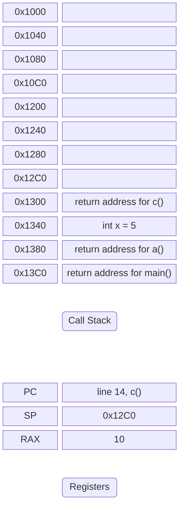

</div>

Note:

* The next step is to invoke c().
* Its return address (address of the return instruction on line 14) is stored on the stack.

--

<!-- .slide: data-transition="none" -->

<div style="display: flex; justify-content: space-evenly;">

```c++ [14,1]
int c(int j, int k)
{
    return j + k;
}

int b(int i)
{
    return i * 2;
}

int a()
{
    int x{5};
    return c(b(x), x);
}

int main()
{
    return a();
}
```

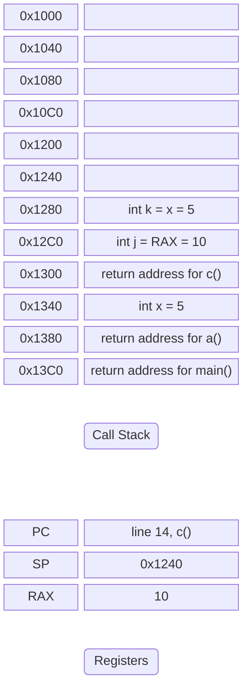

</div>

Note:

* c() takes two arguments.
* Both are stored on the stack.

--

<!-- .slide: data-transition="none" -->

<div style="display: flex; justify-content: space-evenly;">

```c++ [3]
int c(int j, int k)
{
    return j + k;
}

int b(int i)
{
    return i * 2;
}

int a()
{
    int x{5};
    return c(b(x), x);
}

int main()
{
    return a();
}
```

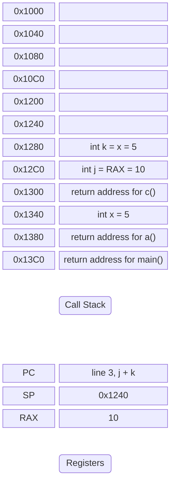

</div>

Note:

* Calculate the result of j + k.

--

<!-- .slide: data-transition="none" -->

<div style="display: flex; justify-content: space-evenly;">

```c++ [3]
int c(int j, int k)
{
    return j + k;
}

int b(int i)
{
    return i * 2;
}

int a()
{
    int x{5};
    return c(b(x), x);
}

int main()
{
    return a();
}
```


</div>

Note:

* The variables j and k are no longer needed, they are removed from the stack.
* The return instruction is executed, the result of j + k is assigned to RAX.

--

<!-- .slide: data-transition="none" -->

<div style="display: flex; justify-content: space-evenly;">

```c++ [4]
int c(int j, int k)
{
    return j + k;
}

int b(int i)
{
    return i * 2;
}

int a()
{
    int x{5};
    return c(b(x), x);
}

int main()
{
    return a();
}
```

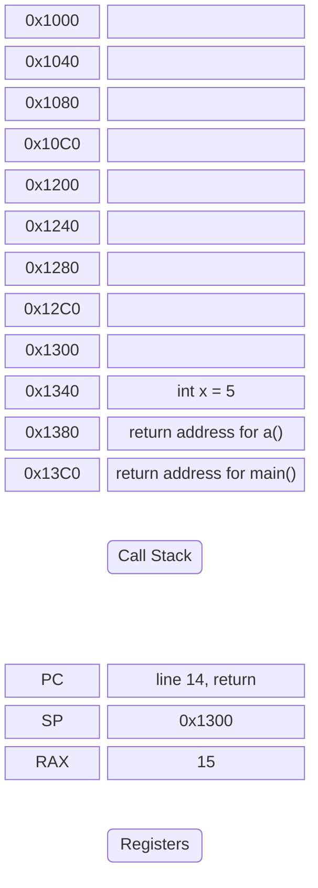

</div>

Note:

* The end of the c() function is reached.
* Its return address is removed from the stack and assigned to the program counter.

--

<!-- .slide: data-transition="none" -->

<div style="display: flex; justify-content: space-evenly;">

```c++ [14]
int c(int j, int k)
{
    return j + k;
}

int b(int i)
{
    return i * 2;
}

int a()
{
    int x{5};
    return c(b(x), x);
}

int main()
{
    return a();
}
```

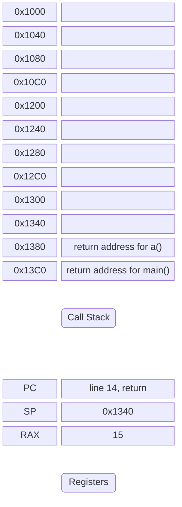

</div>

Note:

* The return instruction on line 14 is the next instruction to execute.
* Local variable x is no longer needed and is removed from the stack.
* The result of the call to c() is assigned to the RAX register.

--

<!-- .slide: data-transition="none" -->

<div style="display: flex; justify-content: space-evenly;">

```c++ [15]
int c(int j, int k)
{
    return j + k;
}

int b(int i)
{
    return i * 2;
}

int a()
{
    int x{5};
    return c(b(x), x);
}

int main()
{
    return a();
}
```

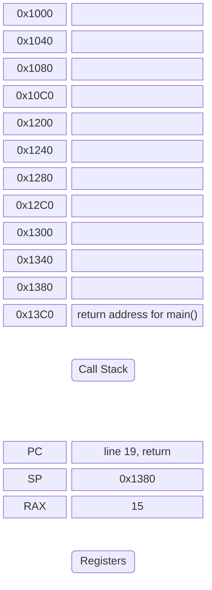

</div>

Note:

* The end of a() is reached.
* Its return address is removed from the stack and assigned to the program counter.

--

<!-- .slide: data-transition="none" -->

<div style="display: flex; justify-content: space-evenly;">

```c++ [19]
int c(int j, int k)
{
    return j + k;
}

int b(int i)
{
    return i * 2;
}

int a()
{
    int x{5};
    return c(b(x), x);
}

int main()
{
    return a();
}
```


</div>

Note:

* The final instruction in the demo program is the return instruction on line 19.
* The result of invoking a() is stored in the RAX register.

--

<!-- .slide: data-transition="none" -->

<div style="display: flex; justify-content: space-evenly;">

```c++ [20]
int c(int j, int k)
{
    return j + k;
}

int b(int i)
{
    return i * 2;
}

int a()
{
    int x{5};
    return c(b(x), x);
}

int main()
{
    return a();
}
```

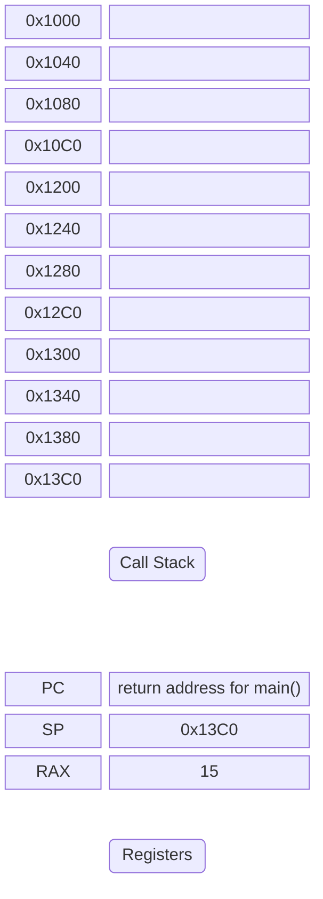

</div>

Note:

* The end of the main() function is reached.
* Its return address is removed from the stack and assigned to the program counter.
* The startup code will terminate the application.

---

A **stack frame** for a function is the portion of the stack that belongs to that function.

---

A stack frame typically contains:

* Return address.
* Function arguments.
* Local variables.
* (Saved registers.)

---

When a function is called, a new stack frame is pushed onto the stack.

---

When the function exits, its stack frame is popped off, restoring the previous function's context.

---

Only a limited amount of memory is reserved for the call stack.

---

| Platform    | Stack size    |
|:------------|--------------:|
| Linux/macOS | 8 MiB         |
| Windows     | 4 MiB         |
| Android     | 1 MiB         |
| FreeRTOS    | 128 B - 8 KiB |

Note:

* Typical stack sizes.
* Can be configured in the os or using a compiler flag.

---

A **stack overflow** occurs when the stack runs out of memory.

---

```c++ []
int fibonacci(int n)
{
    if (n <= 1) { return n; }
    return fibonacci(n-1) + fibonacci(n-2);
}

int main()
{
    return fibonacci(100'000);
}
```

```sh [3]
AddressSanitizer:DEADLYSIGNAL
=================================================================
==4609==ERROR: AddressSanitizer: stack-overflow on address 0x7fff7a319ff0 (pc 0x56499fbc3d0c bp 0x7fff7a31a010 sp 0x7fff7a319fc0 T0)
```

Note:

* Stack overflow because of deep recursion.
* So many stack frames that it no longers fits in the stack memory.
* <https://compiler-explorer.com/z/3KGG4d88r>

---

```c++ []
using std;

int main()
{
    std::array<double, 10'000'000> a_lot_of_numbers{};

    for (auto const& number : a_lot_of_numbers)
    {
        std::println("{}", number);
    }
}
```

```sh [3]
AddressSanitizer:DEADLYSIGNAL
=================================================================
==1==ERROR: AddressSanitizer: stack-overflow on address 0x7ffd339b8108 (pc 0x5617600a805d bp 0x000000000001 sp 0x7ffd339b8110 T0)
    #0 0x5617600a805d in main /app/example.cpp:6:36
    #1 0x774586829d8f  (/lib/x86_64-linux-gnu/libc.so.6+0x29d8f) (BuildId: 490fef8403240c91833978d494d39e537409b92e)
    #2 0x774586829e3f in __libc_start_main (/lib/x86_64-linux-gnu/libc.so.6+0x29e3f) (BuildId: 490fef8403240c91833978d494d39e537409b92e)
    #3 0x56175ffc0534 in _start (/app/output.s+0x2f534)

SUMMARY: AddressSanitizer: stack-overflow /app/example.cpp:6:36 in main
==1==ABORTING
```

Note:

* Stack overflow because of large amount of data.
* One huge stack frame that does not fit.
* 10.000.000 * sizeof(double) = 80MB
* <https://compiler-explorer.com/z/n8qbs9vd8>

---

The call stack is not a suitable place to store large amounts of data!

---

### The Heap

aka the free store

---

The heap is a region of memory for dynamic memory allocation. It allows programs to allocate memory at runtime.

---

Heap memory is limited only by system resources (available RAM).

---

The heap is not automatically managed. Memory is allocated and deallocated explicitly by the program.

---

A memory leak occurs when a program does not deallocate memory it has allocated.

---

Luckily C++ has RAII to automatically manage resources!

---

```c++ []
using std;

int main()
{
    auto int_on_the_heap = std::make_unique<int>(5);

    std::println("Heap says hello {}!", *int_on_the_heap);

    *int_on_the_heap = 10;

    std::println("New value is {}", *int_on_the_heap);
}
```

```text
Heap says hello 5
New value is 10
```

Note:

* std::make_unique creates a std::unique_ptr.
* std::unique_ptr automatically frees its memory when it goes out of scope.
* The arguments passed to std::make_unique are forwarded to the constructor. In this case an int with value 5 is created.
* Access the underlying value using the dereference operator `*`.
* <https://compiler-explorer.com/z/18WGxq98M>

---

```c++
// create an array of 10 million doubles
auto a_lot_of_numbers =
  std::make_unique<std::array<double, 10'000'000>>();
```

```c++
// set all the items to pi
std::ranges::fill(*a_lot_of_numbers, std::numbers::pi);
```

```c++
// print the array
for (auto const& number : *a_lot_of_numbers)
{
    std::print("{} ", number);
}
```

Note:

* Plenty of room in RAM to allocate 80 MB worth of doubles.
* <https://compiler-explorer.com/z/oKd8aYdze>

---

```c++
std::vector<double> a_lot_of_numbers(
    10'000'000, std::numbers::pi
);
```

```c++
for (auto const& number : a_lot_of_numbers)
{
    std::print("{} ", number);
}
```

Or use a container such as std::vector!

Note:

* Previous slide and this slide are pretty much the same.

---

It's possible for the heap to get fragmented!

---

<!-- .slide: data-transition="none" -->

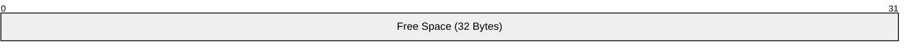

Start with an empty heap of 32 Bytes.

--

<!-- .slide: data-transition="none" -->

```mermaid
packet-beta
0-31: "Free Space (32 Bytes)"
```

Allocate 16 Bytes.

--

<!-- .slide: data-transition="none" -->

```mermaid
packet-beta
0-15: "Block 1 (16 Bytes)"
16-31: "Free Space (16 Bytes)"
```

16 Bytes used, 16 Bytes free

--

<!-- .slide: data-transition="none" -->

```mermaid
packet-beta
0-15: "Block 1 (16 Bytes)"
16-31: "Free Space (16 Bytes)"
```

Allocate 8 Bytes.

--

<!-- .slide: data-transition="none" -->

```mermaid
packet-beta
0-15: "Block 1 (16 Bytes)"
16-23: "Block 2 (8 Bytes)"
24-31: "Free Space (8 Bytes)"
```

24 Bytes used, 8 Bytes free

--

<!-- .slide: data-transition="none" -->

```mermaid
packet-beta
0-15: "Block 1 (16 Bytes)"
16-23: "Block 2 (8 Bytes)"
24-31: "Free Space (8 Bytes)"
```

Free Block 1.

--

<!-- .slide: data-transition="none" -->

```mermaid
packet-beta
0-15: "Free Space (16 Bytes)"
16-23: "Block 2 (8 Bytes)"
24-31: "Free Space (8 Bytes)"
```

8 Bytes used, 24 Bytes free

--

<!-- .slide: data-transition="none" -->

```mermaid
packet-beta
0-15: "Free Space (16 Bytes)"
16-23: "Block 2 (8 Bytes)"
24-31: "Free Space (8 Bytes)"
```

Allocate 4 Bytes.

--

<!-- .slide: data-transition="none" -->

```mermaid
packet-beta
0-3: "Block 3 (4 Bytes)"
4-15: "Free Space (12 Bytes)"
16-23: "Block 2 (8 Bytes)"
24-31: "Free Space (8 Bytes)"
```

12 Bytes used, 20 Bytes free

--

<!-- .slide: data-transition="none" -->

```mermaid
packet-beta
0-3: "Block 3 (4 Bytes)"
4-15: "Free Space (12 Bytes)"
16-23: "Block 2 (8 Bytes)"
24-31: "Free Space (8 Bytes)"
```

Allocate 4 Bytes.

--

<!-- .slide: data-transition="none" -->

```mermaid
packet-beta
0-3: "Block 3 (4 Bytes)"
4-7: "Block 4 (4 Bytes)"
8-15: "Free Space (8 Bytes)"
16-23: "Block 2 (8 Bytes)"
24-31: "Free Space (8 Bytes)"
```

16 Bytes used, 16 Bytes free

--

<!-- .slide: data-transition="none" -->

```mermaid
packet-beta
0-3: "Block 3 (4 Bytes)"
4-7: "Block 4 (4 Bytes)"
8-15: "Free Space (8 Bytes)"
16-23: "Block 2 (8 Bytes)"
24-31: "Free Space (8 Bytes)"
```

Allocate 12 Bytes.

--

<!-- .slide: data-transition="none" -->

```mermaid
packet-beta
0-3: "Block 3 (4 Bytes)"
4-7: "Block 4 (4 Bytes)"
8-15: "Free Space (8 Bytes)"
16-23: "Block 2 (8 Bytes)"
24-31: "Free Space (8 Bytes)"
```

There's still 16 Bytes of free space on the heap.

--

<!-- .slide: data-transition="none" -->

```mermaid
packet-beta
0-3: "Block 3 (4 Bytes)"
4-7: "Block 4 (4 Bytes)"
8-15: "Free Space (8 Bytes)"
16-23: "Block 2 (8 Bytes)"
24-31: "Free Space (8 Bytes)"
```

But it's fragmented into two blocks of 8 Bytes.

--

<!-- .slide: data-transition="none" -->

```mermaid
packet-beta
0-3: "Block 3 (4 Bytes)"
4-7: "Block 4 (4 Bytes)"
8-15: "Free Space (8 Bytes)"
16-23: "Block 2 (8 Bytes)"
24-31: "Free Space (8 Bytes)"
```

The allocation fails! <!-- .element: class="fragment highlight-red" data-fragment-index="1" -->

---

Be mindful about heap fragmentation!

---

The longer your program runs, the more fragmented memory will become.

---

It's probably not something to worry about when writing an application for a system with gigabytes of memory.

---

But it is a very real concern for embedded applications that keep running for many years on a microcontroller with only a few kilobytes of memory.

Note:

* And also the reason why in such applications the heap is often not used!

---

### Best practices

---

* Use the stack for small local variables.
* Use the heap for large data and runtime variables. <!-- .element: class="fragment" data-fragment-index="1" -->
* Be careful when writing recursive functions. <!-- .element: class="fragment" data-fragment-index="2" -->
* By mindful about heap fragmentation. <!-- .element: class="fragment" data-fragment-index="3" -->

---

## Dynamic memory for polymorfisms

Deciding at runtime which object to create.

---

```c++ []
// Interface A
struct A
{
    virtual ~A() = default;
    virtual void print() const = 0;
};

// Implementations B and C
struct B : A { void print() const override { std::println("B"); } };
struct C : A { void print() const override { std::println("C"); } };
```

```c++ []
std::unique_ptr<A> some_sort_of_a{}; // starts out empty!

if (/*some runtime condition*/) {
    some_sort_of_a = std::make_unique<B>();
} else {
    some_sort_of_a = std::make_unique<C>();
}

some_sort_of_a->print(); // prints B or prints C
```
<!-- .element: class="fragment" data-fragment-index="1" -->

Note:

* A unique_ptr<> to concrete class can be stored in a unique_ptr<> to base class.
* This is how we can use polymorfisms for objects created at runtime.
* <https://compiler-explorer.com/z/G8vYKj9eb>
* Be careful not to dereference some_sort_of_a if it is empty!

```c++
if (some_sort_of_a)
{
    // points to something valid
    // it is safe to call the print() method
}
```

---

This is why virtual destructors are important! 😉

---

```c++
struct A {
    A() { std::println("A::A()"); }
    ~A() { std::println("A::~A()"); }
};
struct B : A {
    B() { std::println("B::B()"); }
    ~B() { std::println("B::~B()"); }
};
```

```c++
int main() {
    std::unique_ptr<A> ptr = std::make_unique<B>();
}
```
<!-- .element: class="fragment" data-fragment-index="1" -->

```text
A::A()
B::B()
A::~A()
```
<!-- .element: class="fragment" data-fragment-index="2" -->

Note:

* We construct a B object (which first calls the parent constructor A() and then runs B's contructor).
* When the object goes out-of-scope, we expect the destructor of B to be called (which should first run its own code and then call the ~A() destructor).
* But since we call the destructor through a pointer to A and the A destructor is not virtual, only ~A() is called.
* <https://compiler-explorer.com/z/8fzGvdxas>

---

```c++
struct A {
    A() { std::println("A::A()"); }
    virtual ~A() { std::println("A::~A()"); }
};
struct B : A {
    B() { std::println("B::B()"); }
    ~B() { std::println("B::~B()"); }
};
```

```c++
int main() {
    std::unique_ptr<A> ptr = std::make_unique<B>();
}
```
<!-- .element: class="fragment" data-fragment-index="1" -->

```text
A::A()
B::B()
B::~B()
A::~A()
```
<!-- .element: class="fragment" data-fragment-index="2" -->

Note:

* We added virtual to A's destructor.
* B's destructor is now correctly called!
* <https://compiler-explorer.com/z/18P1Kb918>
* <https://compiler-explorer.com/z/c4ef9GaTs>

---

Don't forget to add a virtual destructor to base classes with at least one virtual method‼️

---

### Vector runtime Animal objects

---

```c++
class Animal
{
public:
    virtual ~Animal() = default;

    void speak() const { /* uses speak_impl() */ }

    // ...

private:
    virtual std::string speak_impl() const = 0;
};
```

```c++
class Dog     : public Animal { /*...*/ };
class Cat     : public Animal { /*...*/ };
class Bear    : public Animal { /*...*/ };
class Hamster : public Animal { /*...*/ };
```

Note:

* The example we were using.

---

```c++
std::vector<❓> animals{};
```

```c++
if (animal == "dog")
{
    // create dog object
    animals.push_back(/*dog object*/);
}
```

```c++
// cat, bear, hamster, ...
```

```c++
for (auto const& animal : animals)
{
    // call speak() on animal
}
```

Note:

* What we want to be able to do.

---

Animal objects should stay alive as long as the vector.

---

Make vector the owner of animal objects.

---

```c++
std::vector<std::unique_ptr<Animal>> animals{};
```

```c++
if (animal == "dog")
{
    animals.push_back(std::make_unique<Dog>());
}

if (animal == "cat")
{
    animals.push_back(std::make_unique<Cat>());
}

// bear, hamster, ...
```
<!-- .element: class="fragment" data-fragment-index="1" -->

```c++
for (auto const& animal : animals)
{
    animal->speak();
}
```
<!-- .element: class="fragment" data-fragment-index="2" -->

Note:

* <https://compiler-explorer.com/z/1xacj6Kb9>

---

```c++
void speak(❓ animal)
{
    animal->speak();
}
```

```c++
std::vector<std::unique_ptr<Animal>> animals{};
```

```c++
for (auto const& animal : animals)
{
    speak(/* animal */);
}
```

What if I want to call a function instead?

---

```c++
void speak(std::unique_ptr<Animal> animal)
{
    animal->speak();
}
```

```c++
for (auto const& animal : animals)
{
    speak(animal);
}
```

Does this work? <!-- .element: class="fragment" data-fragment-index="1" -->

---

```sh []
<source>:115:15: error: call to deleted constructor of 'std::unique_ptr<Animal>'
  115 |         speak(animal);
      |               ^~~~~~
/opt/compiler-explorer/gcc-14.2.0/lib/gcc/x86_64-linux-gnu/14.2.0/../../../../include/c++/14.2.0/bits/unique_ptr.h:516:7: note: 'unique_ptr' has been explicitly marked deleted here
  516 |       unique_ptr(const unique_ptr&) = delete;
      |       ^
<source>:78:36: note: passing argument to parameter 'animal' here
   78 | void speak(std::unique_ptr<Animal> animal)
      |                                    ^
1 error generated.
Compiler returned: 1
```

No it does not work!

Note:

* We are trying to make a copy of the unique pointer.
* It would not have been unique if it were possible to make a copy!
* <https://compiler-explorer.com/z/sjhcP3zbc>

---

A unique_ptr would not be unique if it can be copied!

---

```c++
void speak(std::unique_ptr<Animal> animal)
{
    animal->speak();
}
```

```c++
for (auto&& animal : animals)
{
    speak(std::move(animal)); // transfer ownership
}
```

Does this work? <!-- .element: class="fragment" data-fragment-index="1" -->

---

```sh []
ASM generation compiler returned: 0
Execution build compiler returned: 0
Program returned: 0
  Which animal do you want to create?
  bear says roar.
```

It appears to...

Note:

* <https://compiler-explorer.com/z/hrvrfajf9>

---

```c++
void speak(std::unique_ptr<Animal> animal)
{
    animal->speak();
}
```

```c++
for (auto&& animal : animals)
{
    speak(std::move(animal)); // transfer ownership
}
```

```c++
// use animals again
for (auto const& animal : animals)
{
    animal->speak();
}
```

But how about this? <!-- .element: class="fragment" data-fragment-index="1" -->

---

```sh [3]
AddressSanitizer:DEADLYSIGNAL
=================================================================
==1==ERROR: AddressSanitizer: SEGV on unknown address 0x000000000000 (pc 0x624c8a2ca29f bp 0x7ffcab51e9f0 sp 0x7ffcab51e920 T0)
==1==The signal is caused by a READ memory access.
==1==Hint: address points to the zero page.
    #0 0x624c8a2ca29f in Animal::speak() const /app/example.cpp:21:44
    #1 0x624c8a2ca29f in main /app/example.cpp:120:17
    #2 0x70d22e829d8f  (/lib/x86_64-linux-gnu/libc.so.6+0x29d8f) (BuildId: 490fef8403240c91833978d494d39e537409b92e)
    #3 0x70d22e829e3f in __libc_start_main (/lib/x86_64-linux-gnu/libc.so.6+0x29e3f) (BuildId: 490fef8403240c91833978d494d39e537409b92e)
    #4 0x624c8a1e1534 in _start (/app/output.s+0x2f534)

==1==Register values:
rax = 0x0000000000000000  rbx = 0x00007ffcab51e920  rcx = 0x00000d9a45901200  rdx = 0x0000000000000002
rdi = 0x00006cd22c809060  rsi = 0x000070d22e7e70d0  rbp = 0x00007ffcab51e9f0  rsp = 0x00007ffcab51e920
 r8 = 0x0000000000000028   r9 = 0x00006f122da20000  r10 = 0x00007fffffffff01  r11 = 0x0000000000000001
r12 = 0x00006cf22da20010  r13 = 0x0000000000000000  r14 = 0x00000d9ec5b3c002  r15 = 0x00006cf22da20010
AddressSanitizer can not provide additional info.
SUMMARY: AddressSanitizer: SEGV /app/example.cpp:21:44 in Animal::speak() const
==1==ABORTING
```

No it does not!

Note:

* <https://compiler-explorer.com/z/cYPqK71c9>

---

```c++
void speak(std::unique_ptr<Animal> animal)
{
    animal->speak();
} // unique_ptr goes out of scope, object destroyed
```
<!-- .element: class="fragment" data-fragment-index="2" -->

```c++
for (auto&& animal : animals)
{
    // transfer ownership to speak()
    // replaced by empty unique_ptr in vector

    speak(std::move(animal));
}
```

```c++
// use animals again
for (auto const& animal : animals)
{
    animal->speak(); // dereference empty unique_ptr 💣
}
```
<!-- .element: class="fragment" data-fragment-index="1" -->

---

Vector should keep the ownership!

---

```c++
void speak(Animal const& animal)
{
    animal.speak();
}
```

```c++
for (auto const& animal : animals)
{
    speak(*animal);
}
```

Keep it simple. Pass by reference.

Note:

* <https://compiler-explorer.com/z/r1vq77ezP>

---

### Best practices

---

* If a function or class only needs to use the object, just pass it by reference.
* Only use std::move() on std::unique_ptr<> to transfer ownership! <!-- .element: class="fragment" data-fragment-index="1" -->

---

## Exercises
