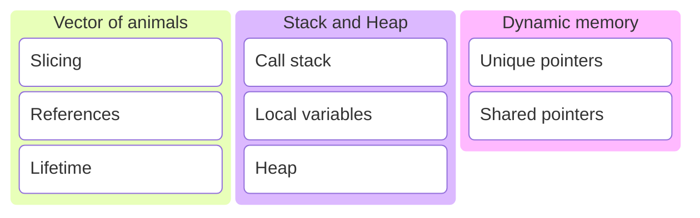
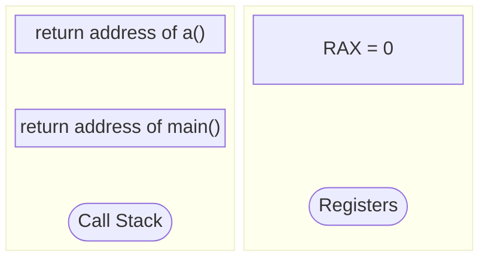
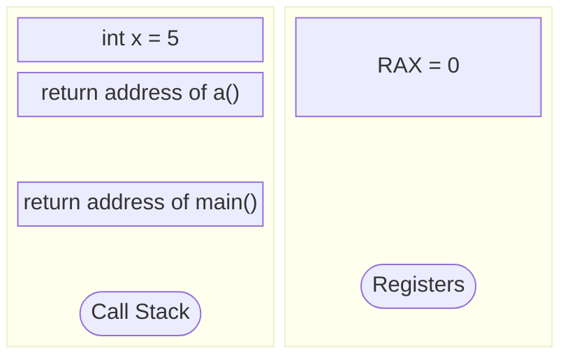
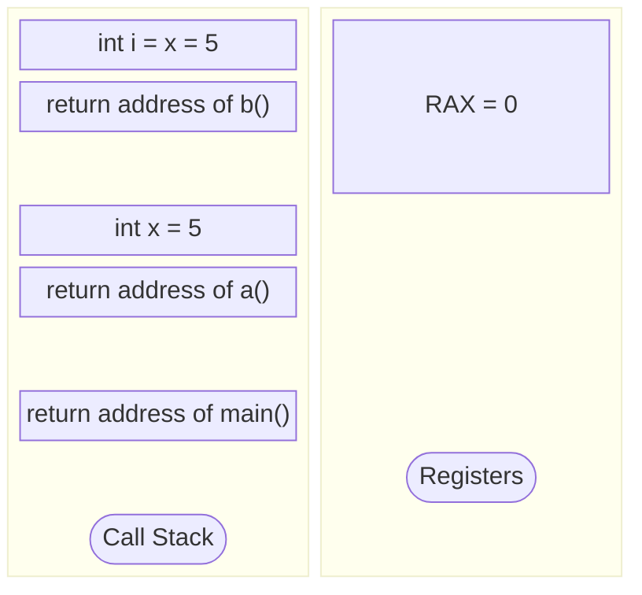
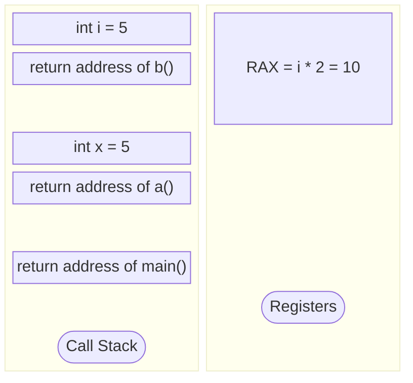
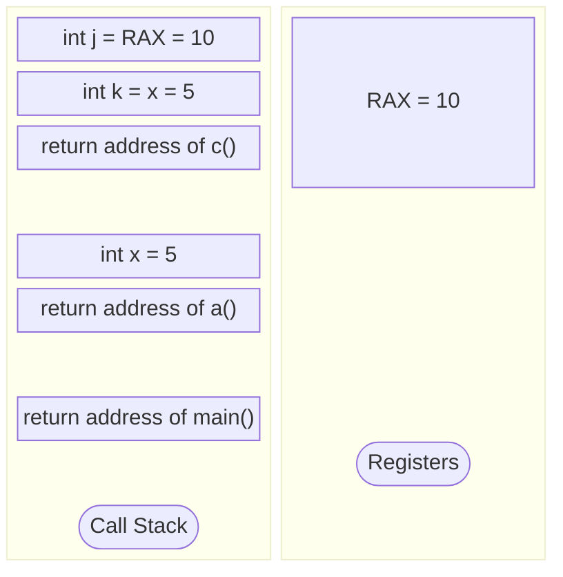
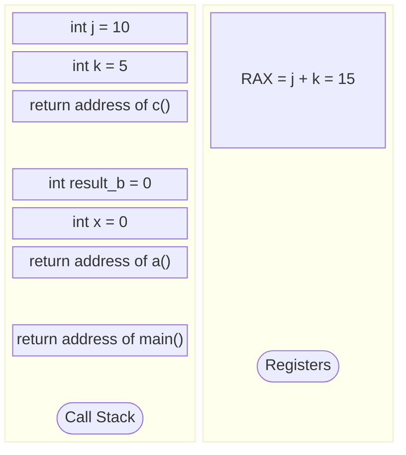
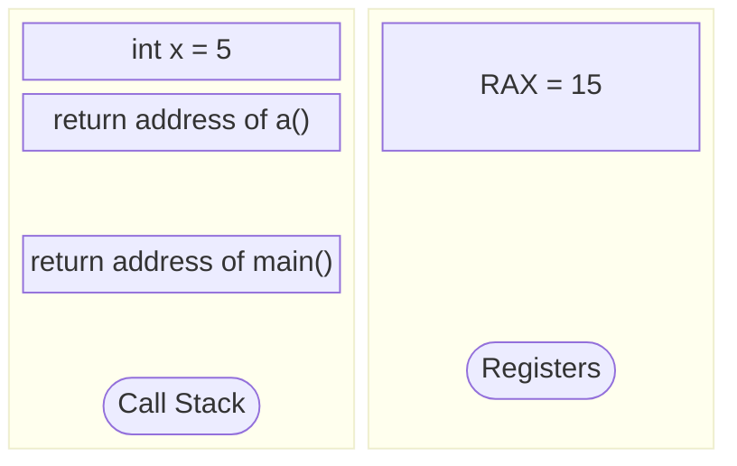
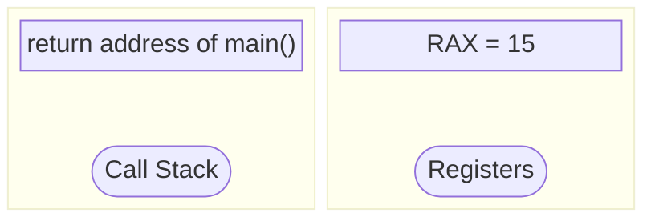
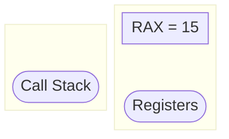

# C/C++ Programming

---

---
## The previous session...
---
We created a polymorfistic animal hierarchy.
---
```c++
class Animal
{
public:
    Animal(std::string name) : name_{name} {}
    virtual ~Animal() = default;

    Animal(Animal const&) = delete;
    Animal& operator=(Animal const&) = delete;
    Animal(Animal&&) = delete;
    Animal& operator=(Animal&&) = delete;

    void speak() const
    {
        std::println("{} says {}.", name_, speak_impl());
    }

private:
    std::string name_{};

    virtual std::string speak_impl() const = 0;
};
```
With an Animal abstract base class.
---
```c++
class Dog : public Animal
{
public:
    Dog() : Animal("dog") {}

private:
    std::string speak_impl() const override
    {
        return "bark";
    }
};
```
```c++
class Cat     : public Animal { /*...*/ };
class Bear    : public Animal { /*...*/ };
class Hamster : public Animal { /*...*/ };
```
And concrete classes that implement it.
---
```c++
void speak(Animal const& animal)
{
    animal.speak();
}
```
```c++
Dog dog{};
Cat cat{};

speak(dog);
speak(cat);
```
And used these concrete classes as argument for a function that expects a reference to the base class.
---
## Vector of Animals
---
Let's make a list of animals.
---
```c++
// make a list of animals
std::vector<Animal> animals{
    Dog{},
    Bear{},
    Bear{},
    Cat{},
    Dog{},
    Hamster{},
    Bear{}
};
```
```c++
// walk through the list
for (auto const& animal : animals)
{
    animal.get().speak();
}
```
Does this work? <!-- .element: class="fragment" data-fragment-index="1" -->

Note:
* <https://compiler-explorer.com/z/YKde8oP7v>
---
```sh []
<source>:79:9: error: call to deleted constructor of 'const Animal'
   79 |         Dog{},
      |         ^~~~~
<source>:13:5: note: 'Animal' has been explicitly marked deleted here
   13 |     Animal(Animal&&) = delete;
      |     ^
<source>:80:9: error: call to deleted constructor of 'const Animal'
   80 |         Bear{},
      |         ^~~~~~
<source>:13:5: note: 'Animal' has been explicitly marked deleted here
   13 |     Animal(Animal&&) = delete;
      |     ^
<source>:81:9: error: call to deleted constructor of 'const Animal'
   81 |         Bear{},
      |         ^~~~~~
<source>:13:5: note: 'Animal' has been explicitly marked deleted here
   13 |     Animal(Animal&&) = delete;
      |     ^
<source>:82:9: error: call to deleted constructor of 'const Animal'
   82 |         Cat{},
      |         ^~~~~
<source>:13:5: note: 'Animal' has been explicitly marked deleted here
   13 |     Animal(Animal&&) = delete;
      |     ^
<source>:83:9: error: call to deleted constructor of 'const Animal'
   83 |         Dog{},
      |         ^~~~~
<source>:13:5: note: 'Animal' has been explicitly marked deleted here
   13 |     Animal(Animal&&) = delete;
      |     ^
<source>:84:9: error: call to deleted constructor of 'const Animal'
   84 |         Hamster{},
      |         ^~~~~~~~~
<source>:13:5: note: 'Animal' has been explicitly marked deleted here
   13 |     Animal(Animal&&) = delete;
      |     ^
<source>:85:9: error: call to deleted constructor of 'const Animal'
   85 |         Bear{}
      |         ^~~~~~
<source>:13:5: note: 'Animal' has been explicitly marked deleted here
   13 |     Animal(Animal&&) = delete;
      |     ^
/opt/compiler-explorer/gcc-14.2.0/lib/gcc/x86_64-linux-gnu/14.2.0/../../../../include/c++/14.2.0/bits/stl_vector.h:678:43: note: passing argument to parameter '__l' here
  678 |       vector(initializer_list<value_type> __l,
      |                                           ^
7 errors generated.
Compiler returned: 1
```
No, it does not work!
---
```c++
struct A     { int a; }
struct B : A { int b; } // inherits int a from A
```
```c++
B b{1, 2};              // int a = 1, int b = 2
A a = b;                // only A part copied
```
* This is called slicing.
* Another reason to disable copy. 😉 <!-- .element: class="fragment" data-fragment-index="1" -->
---
```c++
Dog dog{};
```
```c++
Animal const& animal = dog;
```
```c++
animal.speak();
```
Use references!
---
Let's make a vector of references to animal objects.
---
```c++
// create some animals
Dog d1{};
Dog d2{};
Cat c1{};
Bear b1{};
Bear b2{};
Bear b3{};
Hamster h1{};
```

```c++
// add them to a list
std::vector<Animal&> animals{
    d2, b1, b2, c1, d1, h1, b3
};
```
<!-- .element: class="fragment" data-fragment-index="1" -->

```c++
// walk through the list
for (auto const& animal : animals)
{
    animal.get().speak();
}
```
<!-- .element: class="fragment" data-fragment-index="2" -->
Does this work? <!-- .element: class="fragment" data-fragment-index="3" -->

Note:
* <https://compiler-explorer.com/z/j6coWEeqe>
---
```sh []
In file included from <source>:1:
In file included from /opt/compiler-explorer/gcc-14.2.0/lib/gcc/x86_64-linux-gnu/14.2.0/../../../../include/c++/14.2.0/print:41:
In file included from /opt/compiler-explorer/gcc-14.2.0/lib/gcc/x86_64-linux-gnu/14.2.0/../../../../include/c++/14.2.0/format:47:
In file included from /opt/compiler-explorer/gcc-14.2.0/lib/gcc/x86_64-linux-gnu/14.2.0/../../../../include/c++/14.2.0/locale:41:
In file included from /opt/compiler-explorer/gcc-14.2.0/lib/gcc/x86_64-linux-gnu/14.2.0/../../../../include/c++/14.2.0/bits/locale_classes.h:40:
In file included from /opt/compiler-explorer/gcc-14.2.0/lib/gcc/x86_64-linux-gnu/14.2.0/../../../../include/c++/14.2.0/string:43:
In file included from /opt/compiler-explorer/gcc-14.2.0/lib/gcc/x86_64-linux-gnu/14.2.0/../../../../include/c++/14.2.0/bits/allocator.h:46:
In file included from /opt/compiler-explorer/gcc-14.2.0/lib/gcc/x86_64-linux-gnu/14.2.0/../../../../include/c++/14.2.0/x86_64-linux-gnu/bits/c++allocator.h:33:
/opt/compiler-explorer/gcc-14.2.0/lib/gcc/x86_64-linux-gnu/14.2.0/../../../../include/c++/14.2.0/bits/new_allocator.h:125:29: error: 'allocate' declared as a pointer to a reference of type 'Animal &'
  125 |       _GLIBCXX_NODISCARD _Tp*
      |                             ^
/opt/compiler-explorer/gcc-14.2.0/lib/gcc/x86_64-linux-gnu/14.2.0/../../../../include/c++/14.2.0/bits/allocator.h:128:30: note: in instantiation of template class 'std::__new_allocator<Animal &>' requested here
  128 |     class allocator : public __allocator_base<_Tp>
      |                              ^
/opt/compiler-explorer/gcc-14.2.0/lib/gcc/x86_64-linux-gnu/14.2.0/../../../../include/c++/14.2.0/ext/alloc_traits.h:44:47: note: in instantiation of template class 'std::allocator<Animal &>' requested here
   44 | template<typename _Alloc, typename = typename _Alloc::value_type>
      |                                               ^
/opt/compiler-explorer/gcc-14.2.0/lib/gcc/x86_64-linux-gnu/14.2.0/../../../../include/c++/14.2.0/bits/stl_vector.h:86:35: note: in instantiation of default argument for '__alloc_traits<std::allocator<Animal &>>' required here
   86 |       typedef typename __gnu_cxx::__alloc_traits<_Alloc>::template
      |                                   ^~~~~~~~~~~~~~~~~~~~~~
/opt/compiler-explorer/gcc-14.2.0/lib/gcc/x86_64-linux-gnu/14.2.0/../../../../include/c++/14.2.0/bits/stl_vector.h:428:30: note: in instantiation of template class 'std::_Vector_base<Animal &, std::allocator<Animal &>>' requested here
  428 |     class vector : protected _Vector_base<_Tp, _Alloc>
      |                              ^
<source>:87:26: note: in instantiation of template class 'std::vector<Animal &>' requested here
   87 |     std::vector<Animal&> animals{
      |                          ^
In file included from <source>:1:
In file included from /opt/compiler-explorer/gcc-14.2.0/lib/gcc/x86_64-linux-gnu/14.2.0/../../../../include/c++/14.2.0/print:41:
In file included from /opt/compiler-explorer/gcc-14.2.0/lib/gcc/x86_64-linux-gnu/14.2.0/../../../../include/c++/14.2.0/format:47:
In file included from /opt/compiler-explorer/gcc-14.2.0/lib/gcc/x86_64-linux-gnu/14.2.0/../../../../include/c++/14.2.0/locale:41:
In file included from /opt/compiler-explorer/gcc-14.2.0/lib/gcc/x86_64-linux-gnu/14.2.0/../../../../include/c++/14.2.0/bits/locale_classes.h:40:
In file included from /opt/compiler-explorer/gcc-14.2.0/lib/gcc/x86_64-linux-gnu/14.2.0/../../../../include/c++/14.2.0/string:43:
In file included from /opt/compiler-explorer/gcc-14.2.0/lib/gcc/x86_64-linux-gnu/14.2.0/../../../../include/c++/14.2.0/bits/allocator.h:46:
In file included from /opt/compiler-explorer/gcc-14.2.0/lib/gcc/x86_64-linux-gnu/14.2.0/../../../../include/c++/14.2.0/x86_64-linux-gnu/bits/c++allocator.h:33:
/opt/compiler-explorer/gcc-14.2.0/lib/gcc/x86_64-linux-gnu/14.2.0/../../../../include/c++/14.2.0/bits/new_allocator.h:156:21: error: '__p' declared as a pointer to a reference of type 'Animal &'
  156 |       deallocate(_Tp* __p, size_type __n __attribute__ ((__unused__)))
      |                     ^
In file included from <source>:1:
In file included from /opt/compiler-explorer/gcc-14.2.0/lib/gcc/x86_64-linux-gnu/14.2.0/../../../../include/c++/14.2.0/print:41:
In file included from /opt/compiler-explorer/gcc-14.2.0/lib/gcc/x86_64-linux-gnu/14.2.0/../../../../include/c++/14.2.0/format:47:
In file included from /opt/compiler-explorer/gcc-14.2.0/lib/gcc/x86_64-linux-gnu/14.2.0/../../../../include/c++/14.2.0/locale:41:
In file included from /opt/compiler-explorer/gcc-14.2.0/lib/gcc/x86_64-linux-gnu/14.2.0/../../../../include/c++/14.2.0/bits/locale_classes.h:40:
In file included from /opt/compiler-explorer/gcc-14.2.0/lib/gcc/x86_64-linux-gnu/14.2.0/../../../../include/c++/14.2.0/string:43:
/opt/compiler-explorer/gcc-14.2.0/lib/gcc/x86_64-linux-gnu/14.2.0/../../../../include/c++/14.2.0/bits/allocator.h:186:20: error: 'allocate' declared as a pointer to a reference of type 'Animal &'
  186 |       constexpr _Tp*
      |                    ^
/opt/compiler-explorer/gcc-14.2.0/lib/gcc/x86_64-linux-gnu/14.2.0/../../../../include/c++/14.2.0/ext/alloc_traits.h:44:47: note: in instantiation of template class 'std::allocator<Animal &>' requested here
   44 | template<typename _Alloc, typename = typename _Alloc::value_type>
      |                                               ^
/opt/compiler-explorer/gcc-14.2.0/lib/gcc/x86_64-linux-gnu/14.2.0/../../../../include/c++/14.2.0/bits/stl_vector.h:86:35: note: in instantiation of default argument for '__alloc_traits<std::allocator<Animal &>>' required here
   86 |       typedef typename __gnu_cxx::__alloc_traits<_Alloc>::template
      |                                   ^~~~~~~~~~~~~~~~~~~~~~
/opt/compiler-explorer/gcc-14.2.0/lib/gcc/x86_64-linux-gnu/14.2.0/../../../../include/c++/14.2.0/bits/stl_vector.h:428:30: note: in instantiation of template class 'std::_Vector_base<Animal &, std::allocator<Animal &>>' requested here
  428 |     class vector : protected _Vector_base<_Tp, _Alloc>
      |                              ^
<source>:87:26: note: in instantiation of template class 'std::vector<Animal &>' requested here
   87 |     std::vector<Animal&> animals{
      |                          ^
In file included from <source>:1:
In file included from /opt/compiler-explorer/gcc-14.2.0/lib/gcc/x86_64-linux-gnu/14.2.0/../../../../include/c++/14.2.0/print:41:
In file included from /opt/compiler-explorer/gcc-14.2.0/lib/gcc/x86_64-linux-gnu/14.2.0/../../../../include/c++/14.2.0/format:47:
In file included from /opt/compiler-explorer/gcc-14.2.0/lib/gcc/x86_64-linux-gnu/14.2.0/../../../../include/c++/14.2.0/locale:41:
In file included from /opt/compiler-explorer/gcc-14.2.0/lib/gcc/x86_64-linux-gnu/14.2.0/../../../../include/c++/14.2.0/bits/locale_classes.h:40:
In file included from /opt/compiler-explorer/gcc-14.2.0/lib/gcc/x86_64-linux-gnu/14.2.0/../../../../include/c++/14.2.0/string:43:
/opt/compiler-explorer/gcc-14.2.0/lib/gcc/x86_64-linux-gnu/14.2.0/../../../../include/c++/14.2.0/bits/allocator.h:201:21: error: '__p' declared as a pointer to a reference of type 'Animal &'
  201 |       deallocate(_Tp* __p, size_t __n)
      |                     ^
In file included from <source>:1:
In file included from /opt/compiler-explorer/gcc-14.2.0/lib/gcc/x86_64-linux-gnu/14.2.0/../../../../include/c++/14.2.0/print:41:
In file included from /opt/compiler-explorer/gcc-14.2.0/lib/gcc/x86_64-linux-gnu/14.2.0/../../../../include/c++/14.2.0/format:47:
In file included from /opt/compiler-explorer/gcc-14.2.0/lib/gcc/x86_64-linux-gnu/14.2.0/../../../../include/c++/14.2.0/locale:41:
In file included from /opt/compiler-explorer/gcc-14.2.0/lib/gcc/x86_64-linux-gnu/14.2.0/../../../../include/c++/14.2.0/bits/locale_classes.h:40:
In file included from /opt/compiler-explorer/gcc-14.2.0/lib/gcc/x86_64-linux-gnu/14.2.0/../../../../include/c++/14.2.0/string:54:
In file included from /opt/compiler-explorer/gcc-14.2.0/lib/gcc/x86_64-linux-gnu/14.2.0/../../../../include/c++/14.2.0/bits/basic_string.h:39:
In file included from /opt/compiler-explorer/gcc-14.2.0/lib/gcc/x86_64-linux-gnu/14.2.0/../../../../include/c++/14.2.0/ext/alloc_traits.h:34:
/opt/compiler-explorer/gcc-14.2.0/lib/gcc/x86_64-linux-gnu/14.2.0/../../../../include/c++/14.2.0/bits/alloc_traits.h:433:26: error: 'pointer' declared as a pointer to a reference of type 'Animal &'
  433 |       using pointer = _Tp*;
      |                          ^
/opt/compiler-explorer/gcc-14.2.0/lib/gcc/x86_64-linux-gnu/14.2.0/../../../../include/c++/14.2.0/ext/alloc_traits.h:47:5: note: in instantiation of template class 'std::allocator_traits<std::allocator<Animal &>>' requested here
   47 |   : std::allocator_traits<_Alloc>
      |     ^
/opt/compiler-explorer/gcc-14.2.0/lib/gcc/x86_64-linux-gnu/14.2.0/../../../../include/c++/14.2.0/bits/stl_vector.h:86:35: note: in instantiation of template class '__gnu_cxx::__alloc_traits<std::allocator<Animal &>>' requested here
   86 |       typedef typename __gnu_cxx::__alloc_traits<_Alloc>::template
      |                                   ^
/opt/compiler-explorer/gcc-14.2.0/lib/gcc/x86_64-linux-gnu/14.2.0/../../../../include/c++/14.2.0/bits/stl_vector.h:428:30: note: in instantiation of template class 'std::_Vector_base<Animal &, std::allocator<Animal &>>' requested here
  428 |     class vector : protected _Vector_base<_Tp, _Alloc>
      |                              ^
<source>:87:26: note: in instantiation of template class 'std::vector<Animal &>' requested here
   87 |     std::vector<Animal&> animals{
      |                          ^
In file included from <source>:1:
In file included from /opt/compiler-explorer/gcc-14.2.0/lib/gcc/x86_64-linux-gnu/14.2.0/../../../../include/c++/14.2.0/print:41:
In file included from /opt/compiler-explorer/gcc-14.2.0/lib/gcc/x86_64-linux-gnu/14.2.0/../../../../include/c++/14.2.0/format:47:
In file included from /opt/compiler-explorer/gcc-14.2.0/lib/gcc/x86_64-linux-gnu/14.2.0/../../../../include/c++/14.2.0/locale:41:
In file included from /opt/compiler-explorer/gcc-14.2.0/lib/gcc/x86_64-linux-gnu/14.2.0/../../../../include/c++/14.2.0/bits/locale_classes.h:40:
In file included from /opt/compiler-explorer/gcc-14.2.0/lib/gcc/x86_64-linux-gnu/14.2.0/../../../../include/c++/14.2.0/string:54:
In file included from /opt/compiler-explorer/gcc-14.2.0/lib/gcc/x86_64-linux-gnu/14.2.0/../../../../include/c++/14.2.0/bits/basic_string.h:39:
In file included from /opt/compiler-explorer/gcc-14.2.0/lib/gcc/x86_64-linux-gnu/14.2.0/../../../../include/c++/14.2.0/ext/alloc_traits.h:34:
/opt/compiler-explorer/gcc-14.2.0/lib/gcc/x86_64-linux-gnu/14.2.0/../../../../include/c++/14.2.0/bits/alloc_traits.h:436:38: error: 'const_pointer' declared as a pointer to a reference of type 'Animal &'
  436 |       using const_pointer = const _Tp*;
      |                                      ^
In file included from <source>:3:
In file included from /opt/compiler-explorer/gcc-14.2.0/lib/gcc/x86_64-linux-gnu/14.2.0/../../../../include/c++/14.2.0/vector:66:
/opt/compiler-explorer/gcc-14.2.0/lib/gcc/x86_64-linux-gnu/14.2.0/../../../../include/c++/14.2.0/bits/stl_vector.h:133:11: error: base specifier must name a class
  133 |         : public _Tp_alloc_type, public _Vector_impl_data
      |           ~~~~~~~^~~~~~~~~~~~~~
/opt/compiler-explorer/gcc-14.2.0/lib/gcc/x86_64-linux-gnu/14.2.0/../../../../include/c++/14.2.0/bits/stl_vector.h:373:20: note: in instantiation of member class 'std::_Vector_base<Animal &, std::allocator<Animal &>>::_Vector_impl' requested here
  373 |       _Vector_impl _M_impl;
      |                    ^
/opt/compiler-explorer/gcc-14.2.0/lib/gcc/x86_64-linux-gnu/14.2.0/../../../../include/c++/14.2.0/bits/stl_vector.h:428:30: note: in instantiation of template class 'std::_Vector_base<Animal &, std::allocator<Animal &>>' requested here
  428 |     class vector : protected _Vector_base<_Tp, _Alloc>
      |                              ^
<source>:87:26: note: in instantiation of template class 'std::vector<Animal &>' requested here
   87 |     std::vector<Animal&> animals{
      |                          ^
In file included from <source>:1:
In file included from /opt/compiler-explorer/gcc-14.2.0/lib/gcc/x86_64-linux-gnu/14.2.0/../../../../include/c++/14.2.0/print:41:
In file included from /opt/compiler-explorer/gcc-14.2.0/lib/gcc/x86_64-linux-gnu/14.2.0/../../../../include/c++/14.2.0/format:47:
In file included from /opt/compiler-explorer/gcc-14.2.0/lib/gcc/x86_64-linux-gnu/14.2.0/../../../../include/c++/14.2.0/locale:41:
In file included from /opt/compiler-explorer/gcc-14.2.0/lib/gcc/x86_64-linux-gnu/14.2.0/../../../../include/c++/14.2.0/bits/locale_classes.h:40:
In file included from /opt/compiler-explorer/gcc-14.2.0/lib/gcc/x86_64-linux-gnu/14.2.0/../../../../include/c++/14.2.0/string:54:
In file included from /opt/compiler-explorer/gcc-14.2.0/lib/gcc/x86_64-linux-gnu/14.2.0/../../../../include/c++/14.2.0/bits/basic_string.h:39:
/opt/compiler-explorer/gcc-14.2.0/lib/gcc/x86_64-linux-gnu/14.2.0/../../../../include/c++/14.2.0/ext/alloc_traits.h:44:47: error: type '_Tp_alloc_type' (aka 'int') cannot be used prior to '::' because it has no members
   44 | template<typename _Alloc, typename = typename _Alloc::value_type>
      |                                               ^
/opt/compiler-explorer/gcc-14.2.0/lib/gcc/x86_64-linux-gnu/14.2.0/../../../../include/c++/14.2.0/bits/stl_vector.h:450:26: note: in instantiation of default argument for '__alloc_traits<_Tp_alloc_type>' required here
  450 |       typedef __gnu_cxx::__alloc_traits<_Tp_alloc_type> _Alloc_traits;
      |                          ^~~~~~~~~~~~~~~~~~~~~~~~~~~~~~
<source>:87:26: note: in instantiation of template class 'std::vector<Animal &>' requested here
   87 |     std::vector<Animal&> animals{
      |                          ^
In file included from <source>:3:
In file included from /opt/compiler-explorer/gcc-14.2.0/lib/gcc/x86_64-linux-gnu/14.2.0/../../../../include/c++/14.2.0/vector:66:
/opt/compiler-explorer/gcc-14.2.0/lib/gcc/x86_64-linux-gnu/14.2.0/../../../../include/c++/14.2.0/bits/stl_vector.h:1261:10: error: 'data' declared as a pointer to a reference of type 'Animal &'
 1261 |       _Tp*
      |          ^
<source>:87:26: note: in instantiation of template class 'std::vector<Animal &>' requested here
   87 |     std::vector<Animal&> animals{
      |                          ^
In file included from <source>:3:
In file included from /opt/compiler-explorer/gcc-14.2.0/lib/gcc/x86_64-linux-gnu/14.2.0/../../../../include/c++/14.2.0/vector:66:
/opt/compiler-explorer/gcc-14.2.0/lib/gcc/x86_64-linux-gnu/14.2.0/../../../../include/c++/14.2.0/bits/stl_vector.h:1266:16: error: 'data' declared as a pointer to a reference of type 'Animal &'
 1266 |       const _Tp*
      |                ^
/opt/compiler-explorer/gcc-14.2.0/lib/gcc/x86_64-linux-gnu/14.2.0/../../../../include/c++/14.2.0/bits/stl_vector.h:1300:7: error: multiple overloads of 'push_back' instantiate to the same signature 'void (Animal &)'
 1300 |       push_back(value_type&& __x)
      |       ^
/opt/compiler-explorer/gcc-14.2.0/lib/gcc/x86_64-linux-gnu/14.2.0/../../../../include/c++/14.2.0/bits/stl_vector.h:1283:7: note: previous declaration is here
 1283 |       push_back(const value_type& __x)
      |       ^
/opt/compiler-explorer/gcc-14.2.0/lib/gcc/x86_64-linux-gnu/14.2.0/../../../../include/c++/14.2.0/bits/stl_vector.h:1395:7: error: multiple overloads of 'insert' instantiate to the same signature 'iterator (const_iterator, Animal &)' (aka '__normal_iterator<int, std::vector<Animal &, std::allocator<Animal &>>> (__normal_iterator<int, std::vector<Animal &, std::allocator<Animal &>>>, Animal &)')
 1395 |       insert(const_iterator __position, value_type&& __x)
      |       ^
/opt/compiler-explorer/gcc-14.2.0/lib/gcc/x86_64-linux-gnu/14.2.0/../../../../include/c++/14.2.0/bits/stl_vector.h:1364:7: note: previous declaration is here
 1364 |       insert(const_iterator __position, const value_type& __x);
      |       ^
12 errors generated.
Compiler returned: 1
```
No, it does not work!
---
We can't store references in a vector. 😕

Note:
* Same reason a why we don't want to use references for class members.
* They are an alias. We can't assign something new to them.
---
But we can use std::reference_wrapper! 👍

Note:
* We already used them to store a reference in a class for dependency inversion!
---
```c++
// create some animals
Dog d1{};
Dog d2{};
Cat c1{};
Bear b1{};
Bear b2{};
Bear b3{};
Hamster h1{};
```

```c++
// add them to a list
std::vector<std::reference_wrapper<Animal const>> animals{
    d2, b1, b2, c1, d1, h1, b3
};
```
<!-- .element: class="fragment" data-fragment-index="1" -->

```c++
// walk through the list
for (auto const& animal : animals)
{
    animal.get().speak();
}
```
<!-- .element: class="fragment" data-fragment-index="2" -->

Note:
* Need std::reference_wrapper to store references in a vector.
* <https://compiler-explorer.com/z/Kqsbva33G>
---
```text
dog says bark.
bear says roar.
bear says roar.
cat says meow.
dog says bark.
hamster says squeak.
bear says roar.
```
Phew, finally something that works! 🥳
---
But what if we don't know which animal to create at compile-time? 🤔

Note:
* For example we ask the user which animal to create.
---
```c++
std::string animal{};
std::print("Which animal do you want to create? ");
std::cin >> animal;
```
---
```c++
std::vector<std::reference_wrapper<Animal const>> animals{};
```
```c++
if (animal == "dog")
{
    Dog dog{};
    animals.push_back(dog);
}
```
```c++
if (animal == "cat")
{
    Cat cat{};
    animals.push_back(cat);
}
```
```c++
// bear, hamster, ...
```
Does this work? <!-- .element: class="fragment" data-fragment-index="1" -->

Note:
* Vector holds references, but animal objects go out-of-scope when if block ends!
* <https://compiler-explorer.com/z/jPEbeGdsT>
---
```sh [2]
=================================================================
==1==ERROR: AddressSanitizer: stack-use-after-scope on address 0x73c7e0309140 at pc 0x633f823d35c8 bp 0x7fff294cced0 sp 0x7fff294ccec8
READ of size 8 at 0x73c7e0309140 thread T0
    #0 0x633f823d35c7 in Animal::speak() const /app/example.cpp:20:44
    #1 0x633f823d35c7 in main /app/example.cpp:113:22
    #2 0x73c7e2029d8f  (/lib/x86_64-linux-gnu/libc.so.6+0x29d8f) (BuildId: 490fef8403240c91833978d494d39e537409b92e)
    #3 0x73c7e2029e3f in __libc_start_main (/lib/x86_64-linux-gnu/libc.so.6+0x29e3f) (BuildId: 490fef8403240c91833978d494d39e537409b92e)
    #4 0x633f822f2524 in _start (/app/output.s+0x2e524)

Address 0x73c7e0309140 is located in stack of thread T0 at offset 320 in frame
    #0 0x633f823d2ebf in main /app/example.cpp:78

  This frame has 6 object(s):
    [32, 64) 'ref.tmp.i' (line 20)
    [96, 128) 'animal' (line 79)
    [160, 200) 'dog' (line 88)
    [240, 280) 'cat' (line 93)
    [320, 360) 'bear' (line 98) <== Memory access at offset 320 is inside this variable
    [400, 440) 'hamster' (line 103)
HINT: this may be a false positive if your program uses some custom stack unwind mechanism, swapcontext or vfork
      (longjmp and C++ exceptions *are* supported)
SUMMARY: AddressSanitizer: stack-use-after-scope /app/example.cpp:20:44 in Animal::speak() const
Shadow bytes around the buggy address:
  0x73c7e0308e80: 00 00 00 00 00 00 00 00 00 00 00 00 00 00 00 00
  0x73c7e0308f00: 00 00 00 00 00 00 00 00 00 00 00 00 00 00 00 00
  0x73c7e0308f80: 00 00 00 00 00 00 00 00 00 00 00 00 00 00 00 00
  0x73c7e0309000: f1 f1 f1 f1 00 00 00 00 f2 f2 f2 f2 00 00 00 00
  0x73c7e0309080: f2 f2 f2 f2 f8 f8 f8 f8 f8 f2 f2 f2 f2 f2 f8 f8
=>0x73c7e0309100: f8 f8 f8 f2 f2 f2 f2 f2[f8]f8 f8 f8 f8 f2 f2 f2
  0x73c7e0309180: f2 f2 f8 f8 f8 f8 f8 f3 f3 f3 f3 f3 00 00 00 00
  0x73c7e0309200: f5 f5 f5 f5 f5 f5 f5 f5 f5 f5 f5 f5 f5 f5 f5 f5
  0x73c7e0309280: f5 f5 f5 f5 f5 f5 f5 f5 f5 f5 f5 f5 f5 f5 f5 f5
  0x73c7e0309300: f5 f5 f5 f5 f5 f5 f5 f5 f5 f5 f5 f5 f5 f5 f5 f5
  0x73c7e0309380: f5 f5 f5 f5 f5 f5 f5 f5 f5 f5 f5 f5 f5 f5 f5 f5
Shadow byte legend (one shadow byte represents 8 application bytes):
  Addressable:           00
  Partially addressable: 01 02 03 04 05 06 07
  Heap left redzone:       fa
  Freed heap region:       fd
  Stack left redzone:      f1
  Stack mid redzone:       f2
  Stack right redzone:     f3
  Stack after return:      f5
  Stack use after scope:   f8
  Global redzone:          f9
  Global init order:       f6
  Poisoned by user:        f7
  Container overflow:      fc
  Array cookie:            ac
  Intra object redzone:    bb
  ASan internal:           fe
  Left alloca redzone:     ca
  Right alloca redzone:    cb
==1==ABORTING
```
No, it does not work!

Note:
* Address sanitizer detects this!
* Enable by adding compiler option `-fsanitize=address`.
---
```c++
// vector of references to animal objects
std::vector<std::reference_wrapper<Animal const>> animals{};
```

```c++
// create the right type of animal
if (animal == "dog")
{
    Dog dog{};              // create dog object
    animals.push_back(dog); // store reference to dog object
}                           // ‼️dog object ceases to exist‼️
```
<!-- .element: class="fragment" data-fragment-index="1" -->

```c++
// walk through the list
for (auto const& animal : animals)
{
    animal.get().speak();   // oops, attempt to access object
                            // that no longer exists 💥
}
```
<!-- .element: class="fragment" data-fragment-index="2" -->
---
I want animal objects that don't go out of scope!
---
Where are variables stored anyway? 🤔
---
## Stack vs. Heap
---
### The call stack
---

<div style="display: flex;">

```c++ [14]
int c(int j, int k) {
    return j + k;
}

int b(int i) {
    return i * 2;
}

int a() {
    int x{5};
    return c(b(x), x);
}

int main() {
    return a();
}
```


</div>

---

<div style="display: flex;">

```c++ [14-15,9]
int c(int j, int k) {
    return j + k;
}

int b(int i) {
    return i * 2;
}

int a() {
    int x{5};
    return c(b(x), x);
}

int main() {
    return a();
}
```



</div>

---

<div style="display: flex;">

```c++ [14-15,9-10]
int c(int j, int k) {
    return j + k;
}

int b(int i) {
    return i * 2;
}

int a() {
    int x{5};
    return c(b(x), x);
}

int main() {
    return a();
}
```



</div>

---

<div style="display: flex;">

```c++ [14-15,9-11,5]
int c(int j, int k) {
    return j + k;
}

int b(int i) {
    return i * 2;
}

int a() {
    int x{5};
    return c(b(x), x);
}

int main() {
    return a();
}
```



</div>

---

<div style="display: flex;">

```c++ [14-15,9-11,5-6]
int c(int j, int k) {
    return j + k;
}

int b(int i) {
    return i * 2;
}

int a() {
    int x{5};
    return c(b(x), x);
}

int main() {
    return a();
}
```



</div>

---

<div style="display: flex;">

```c++ [14-15,9-11,7]
int c(int j, int k) {
    return j + k;
}

int b(int i) {
    return i * 2;
}

int a() {
    int x{5};
    return c(b(x), x);
}

int main() {
    return a();
}
```


</div>

---

<div style="display: flex;">

```c++ [14-15,9-11,1]
int c(int j, int k) {
    return j + k;
}

int b(int i) {
    return i * 2;
}

int a() {
    int x{5};
    return c(b(x), x);
}

int main() {
    return a();
}
```



</div>

---

<div style="display: flex;">

```c++ [14-15,9-11,1-2]
int c(int j, int k) {
    return j + k;
}

int b(int i) {
    return i * 2;
}

int a() {
    int x{5};
    return c(b(x), x);
}

int main() {
    return a();
}
```



</div>

---

<div style="display: flex;">

```c++ [14-15,9-11,3]
int c(int j, int k) {
    return j + k;
}

int b(int i) {
    return i * 2;
}

int a() {
    int x{5};
    return c(b(x), x);
}

int main() {
    return a();
}
```



</div>

---

<div style="display: flex;">

```c++ [14-15,9-11]
int c(int j, int k) {
    return j + k;
}

int b(int i) {
    return i * 2;
}

int a() {
    int x{5};
    return c(b(x), x);
}

int main() {
    return a();
}
```


</div>

---

<div style="display: flex;">

```c++ [14-15,12]
int c(int j, int k) {
    return j + k;
}

int b(int i) {
    return i * 2;
}

int a() {
    int x{5};
    return c(b(x), x);
}

int main() {
    return a();
}
```



</div>

---

<div style="display: flex;">

```c++ [16]
int c(int j, int k) {
    return j + k;
}

int b(int i) {
    return i * 2;
}

int a() {
    int x{5};
    return c(b(x), x);
}

int main() {
    return a();
}
```



</div>
