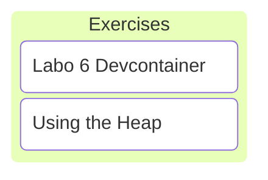

# C/C++ Programming

## Labo 6

---

---

## Exercises Dynamic Memory

---

### Devcontainer

<https://gitlab.apstudent.be/cpp-programming/devcontainer-labo-4>

Note:

* Reuse labo 4 devcontainer.

---

### Exercises

See digitap.
