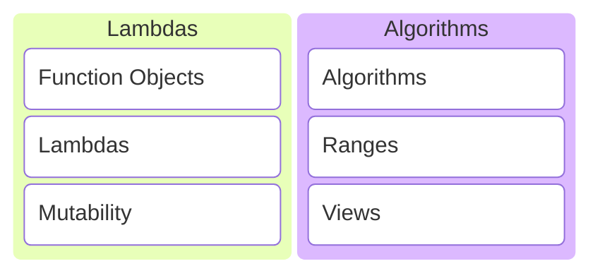
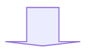

# C/C++ Programming


---



---

## Function Objects

---

A better way to define functions with state.

---

### Example 1

Create a function that returns the next integers each time it is called.

---

```c++ []
int next_int()
{
    static int current_int{0};
    return ++current_int;
}
```

```c++ []
std::println("{}", next_int()); // prints 1
std::println("{}", next_int()); // prints 2
std::println("{}", next_int()); // prints 3
```
<!-- .element: class="fragment" data-fragment-index="1" -->

Note:

* What are the disadvantages of this implementation?

---

Using static makes it hard to:

* Test the function.
* Reset the counter.
* Start from a different number.

Note:

* Hard to test because state is kept around forever.
* I can't reset the current_int counter.

---

Let's create a function object instead.

---

```c++ []
class NextInt
{
public:
    // overload operator()
    int operator()() { return ++current_; }

private:
    int current_{0};
};
```

```c++ []
NextInt next_int{};
std::println("{}", next_int()); // prints 1
std::println("{}", next_int()); // prints 2
std::println("{}", next_int()); // prints 3
```
<!-- .element: class="fragment" data-fragment-index="1" -->

Note:

* Overload operator().
* You decide the return type and function arguments.
* Objects can be called as if they were functions.

---

```c++ []
class NextInt
{
public:
    NextInt() = default;
    explicit NextInt(int start) : current_{start-1} {}

    int operator()() { return ++current_; }

private:
    int current_{0};
};
```
<!-- .element: class="fragment" data-fragment-index="1" -->

```c++ []
NextInt next_int{5};
std::println("{}", next_int()); // prints 5
std::println("{}", next_int()); // prints 6
std::println("{}", next_int()); // prints 7
```
<!-- .element: class="fragment" data-fragment-index="2" -->

Easy to extend to start from a certain number.

---

### Example 2

Count the items in a list that are smaller than a number provided by the user.

---

```c++ []
// make a list

std::vector some_list{};
std::println("Enter some numbers:");
for (int number{}; std::cin >> number;)
{
    some_list.push_back(number);
}
```

```c++ []
// ask a number

int max{};
std::print("Give a number: ");
std::cin >> max;
```
<!-- .element: class="fragment" data-fragment-index="1" -->

---

```c++ []
class SmallerThan
{
public:
    explicit SmallerThan(int max) : max_{max};

    [[nodiscard]] bool operator()(int value) const
    {
        return value < max_;
    }

private:
    int max_{};
};
```

```c++
int const count = std::ranges::count_if(
    some_list, SmallerThan{max}
);
```
<!-- .element: class="fragment" data-fragment-index="1" -->

Count the numbers in the list smaller than max.

---

This is so cool! 😎

---

But a rather large amount of code to write... 🧐

---

## Lambdas

aka closures

---

A concise way of writing function objects!

---

```c++
int const count = std::ranges::count_if(
    some_list, [max](int value){ return value < max; }
);
```

That's a lot less code to write! 😯 <!-- .element: class="fragment" data-fragment-index="1" -->

Note:

* Count the items in a list that are smaller than a number provided by the user using a lambda.

---

Lambdas are translated to function objects behind the scene by the compiler!

---

```c++
[max](int value){ return value < max; }
```



```c++ []
class __lambda_12345 {
public:
    constexpr explicit __lambda_12345(int const& max)
        : max_{max}
    {}

    constexpr bool operator()(int value) const {
        return value < max_;
    }

private:
    int max_{};
};
```

Note:

* The lambda is converted to a function object by the compiler.
* <https://cppinsights.io/s/550c83cf>
* Q: What stands out? A: operator() is const by default. Return type is deduced automatically.

---

### Structure of a lambda

---

```c++
[/* capture list */](/* arguments */) -> /* return type */ {
    /* function body */
}
```


```c++ []
class __lambda_12345
{
public:
    /* return type */ operator()(/* arguments */) const
    {
        /* function body */
    }

private:
    /* capture list */
};
```

Note:

* Writing the return type at the end with an arrow is called a trailing return type.
* It is also allowed to use a trailing return type for regular functions.

```c++
int five() { return 5; }
auto five() -> int { return 5; }
```

---

```c++
auto f1 = [](int x, int y) { /* arguments x, y */ };
```

```c++
auto f2 = []() { /* no function arguments */ };
auto f3 = []   { /* no function arguments */ };
```

The argument list is optional.

---

```c++
auto f1 = []() -> int { return 5; }; /* return type int */
auto f2 = []          { return 5; }; /* return type int */
```

The return type is optional and automatically deduced if not specified.

---

### The capture list

---

```c++
// given some variables
int a{}; bool b{}; std::string c{}; double d{};
```

```c++
auto f1 = []     { /* can't access any of a, b, c, d */    };
```
<!-- .element: class="fragment" data-fragment-index="1" -->

```c++
auto f2 = [=]    { /* copy of a, b, c, d available */      };
```
<!-- .element: class="fragment" data-fragment-index="2" -->

```c++
auto f3 = [&]    { /* reference to a, b, c, d available */ };
```
<!-- .element: class="fragment" data-fragment-index="3" -->

```c++
auto f4 = [&a, b]{ /* only reference to a and copy of b */ };
```
<!-- .element: class="fragment" data-fragment-index="4" -->

```c++
auto f5 = [&, a] { /* copy of a, reference to b, c, d */   };
```
<!-- .element: class="fragment" data-fragment-index="5" -->

```c++
auto f6 = [&e=a] { /* e is a reference to a */             };
```
<!-- .element: class="fragment" data-fragment-index="6" -->

```c++
auto f7 = [e=a*5]{ /* e is an int with value a * 5 */      };
```
<!-- .element: class="fragment" data-fragment-index="7" -->

```c++
auto f8 = [this] { /* capture the this pointer */          };
```
<!-- .element: class="fragment" data-fragment-index="8" -->

Note:

* Only variables that are actually used will be captured in the generated function object.

---

```c++ [6,7,12]
class MyClass
{
public:
    int some_func(int x)
    {
        // need to capture this to access int_
        auto f = [&, this] { return x + int_; };
        return f();
    }

private:
    int int_{5};
};
```

Capturing the this pointer.

Note:

* Just a toy example.
* Since lambdas are objects, the this pointer points to the lambda object by default.

---

### Mutability

---

```c++ []
int next_int()
{
    static int current_int{0};
    return ++current_int;
}
```

```c++ []
std::println("{}", next_int()); // prints 1
std::println("{}", next_int()); // prints 2
std::println("{}", next_int()); // prints 3
```

How to write this as a lambda?

---

```c++
auto next_int = [current=0]{ return ++current; };
```

```c++ []
std::println("{}", next_int());
std::println("{}", next_int());
std::println("{}", next_int());
```

Does this work? <!-- .element: class="fragment" data-fragment-index="1" -->

---

```sh []
<source>:5:41: error: cannot assign to a variable captured
                      by copy in a non-mutable lambda
    5 |     auto next_int = [current=0]{ return ++current; };
      |                                         ^ ~~~~~~~
1 error generated.
Compiler returned: 1
```

No, it does not work!

Note:

* <https://compiler-explorer.com/z/7Eah1T6Yr>

---

```c++
auto next_int = [current=0]{ return ++current; };
```


```c++ [4-9]
class __lambda_12345
{
public:
    int operator()() const
    {
        // attempt to modify a member variable in a const
        // member function
        return ++current_;
    }

private:
    int current_{0};
};
```

---

Lambda operator() is const by default. Member variables cannot be modified!

---

```c++
auto next_int = [current=0] mutable { return ++current; };
```

```c++ []
std::println("{}", next_int()); // prints 1
std::println("{}", next_int()); // prints 2
std::println("{}", next_int()); // prints 3
```

Add the mutable keyword! 👍

Note:

* <https://compiler-explorer.com/z/8Mz8Y871M>

---

```c++
auto next_int = [current=0] mutable { return ++current; };
```


```c++ [4-9]
class __lambda_12345
{
public:
    int operator()() // no longer const because of mutable
    {
        // it is allowed modify a member variable in a
        // non-const member function
        return ++current_;
    }

private:
    int current_{0};
};
```

Note:

* The mutable keyword suppresses the const keyword on the function call operator.

---

### Properties of a lambda

---

* The capture list and function body are required.
* The argument list is optional. <!-- .element: class="fragment" data-fragment-index="1" -->
* The function call operator is const by default. <!-- .element: class="fragment" data-fragment-index="2" -->
* It can be made mutable. <!-- .element: class="fragment" data-fragment-index="3" -->
* The return type is deduced by default. <!-- .element: class="fragment" data-fragment-index="4" -->
* Adding an explicit return type is allowed. <!-- .element: class="fragment" data-fragment-index="5" -->

---

## Algorithms

* <https://en.cppreference.com/w/cpp/algorithm>
* <https://en.cppreference.com/w/cpp/iterator>

---

The algorithms library defines functions for a variety of purposes that operate on ranges of elements.

---

* Searching
* Sorting
* Counting
* Manipulating
* ...

---

### Example 1

Given a list of students (name and student number), sort them by name.

---

```c++
struct Student
{
    std::string name;
    int student_number{};
};
```

```c++
std::vector<Student> students{
    { "Mieke",   1 },
    { "Joske",   2 },
    { "Marieke", 3 },
    { "Jefke",   4 },
    { "Jantje",  5 }
};
```
<!-- .element: class="fragment" data-fragment-index="1" -->

```c++
// somehow sort the vector of students according to name
```
<!-- .element: class="fragment" data-fragment-index="2" -->

```c++
for (auto const& student : students)
{
    std::println("{}", student.name);
}
```
<!-- .element: class="fragment" data-fragment-index="3" -->

---

```c++
// option 1: call sort with a predicate
```

```c++
std::ranges::sort(students,
    [](Student const& first, Student const& second) {
        return first.name < second.name;
    }
);
```

Note:

* <https://compiler-explorer.com/z/od8ETv7rT>
* To sort by id use first.student_number < second.student_number.

---

```c++
// option 2: call sort with a projection
```

```c++
std::ranges::sort(students, {}, &Student::name);
```

Note:

* <https://compiler-explorer.com/z/WTd7W1h3q>
* To sort by id use &Student::student_number.

---

### Example 2

Given a list of students (name and student number), find the first student with student number greater than three and print his
name.

---

```c++
struct Student
{
    std::string name;
    int student_number{};
};
```

```c++
std::vector<Student> students{
    { "Mieke",   1 },
    { "Joske",   2 },
    { "Marieke", 3 },
    { "Jefke",   4 },
    { "Jantje",  5 }
};
```

---

```c++
// find the first student with student number greater than 3
auto const result = std::ranges::find_if(students,
    [](Student const& student) {
        return 3 < student.student_number;
    }
);
```

```c++
// print the name
if (result != std::end(students))
{
    std::println("{}", result->name);
}
else
{
    std::println("No student found!");
}
```
<!-- .element: class="fragment" data-fragment-index="1" -->

```text
Jefke
```
<!-- .element: class="fragment" data-fragment-index="2" -->

Note:

* Find returns an iterator, a pointer to the element in the list.
* Returns std::end(students) if no result is found, which points to one past the end of the list.
* <https://compiler-explorer.com/z/c4c5joxec>

---

### Example 3

Given a list of numbers, calculate the sum.

---

```c++
std::vector<double> some_numbers{
    3.14, 5.5, 2.12, 3.356, 7.887, 9.88, 2.1123, 3.25, 21.253
};
```

```c++
auto const sum = std::accumulate(
    std::begin(some_numbers),       // start of the range
    std::end(some_numbers),         // one past end of range
    0.0,                            // initial value
    std::plus<double>{}             // sum predicate
);
```
<!-- .element: class="fragment" data-fragment-index="1" -->

```c++
std::println("sum = {}", sum);
```
<!-- .element: class="fragment" data-fragment-index="2" -->

```text
sum = 58.4983
```
<!-- .element: class="fragment" data-fragment-index="2" -->

Note:

* Most numeric algorithms don't have a range variant.
* Instead of a range they take a begin and end iterator as argument.

---

```c++
// use STL sum predicate

auto sum = std::plus<double>{};
```


```c++
// or write a lambda

auto sum = [](double total, double value) {
    return total + value;
};
```

---

### Example 4

Given a list of students (name and student number), create a single string with all their names separated by a comma.

---

```c++
struct Student
{
    std::string name;
    int student_number{};
};
```

```c++
std::vector<Student> students{
    { "Mieke",   1 },
    { "Joske",   2 },
    { "Marieke", 3 },
    { "Jefke",   4 },
    { "Jantje",  5 }
};
```

---

```c++
auto const result = std::accumulate(
    std::next(std::begin(students)), // start from second
    std::end(students),              // go until the end
    students[0].name,                // initial value
    [](std::string sum, Student const& student) {
        return std::move(sum) + ", " + student.name;
    }
);
```

```c++
std::println("{}", result);
```
<!-- .element: class="fragment" data-fragment-index="1" -->

```text
Mieke, Joske, Marieke, Jefke, Jantje
```
<!-- .element: class="fragment" data-fragment-index="1" -->

Note:

* We assumed the list of students is not empty.
* Instead of starting with an empty value and accumulating the entire list, we start with the first name as initial value and
  accumulate the remainder of the list.
* This makes it possible to only have a comma between names instead of an extra at the start or end.
* <https://compiler-explorer.com/z/Mz9Tv6TPf>

---

### Example 5

Create a list of all numbers from 0 to 99. Make a copy of this list with only the even numbers.

---

```c++
// create a list of all numbers from 0 to 99
```

```c++
// create a vector of 100 elements with value 0
std::vector<int> numbers(100);
```
<!-- .element: class="fragment" data-fragment-index="1" -->

```c++
// fill the vector with values starting from 0
std::ranges::iota(numbers, 0);
```
<!-- .element: class="fragment" data-fragment-index="2" -->

```c++
// print to check it worked
for (auto const& number : numbers)
{
    std::print("{},", number);
}
```
<!-- .element: class="fragment" data-fragment-index="3" -->

```text
0,1,2,3,4,5,6,7,8,9,10,11,12,13,14,15,16,17,18,19,20,...,99,
```
<!-- .element: class="fragment" data-fragment-index="3" -->

Note:

* Calling the vector constructor that takes a single number as argument creates a vector with that many default initialized
  values. For an integer the default value is zero.

---

```c++
// make a copy of the list, but keep only even numbers
```

```c++
// start with an empty vector
std::vector<int> even_numbers{};
```
<!-- .element: class="fragment" data-fragment-index="1" -->

```c++
// insert the elements into the empty vector
std::ranges::copy_if(
    numbers,
    std::back_inserter(even_numbers),
    [](int number) { return (number % 2) == 0; }
);
```
<!-- .element: class="fragment" data-fragment-index="2" -->

```c++
// print to check it worked
for (auto const& number : even_numbers)
{
    std::print("{},", number);
}
```
<!-- .element: class="fragment" data-fragment-index="3" -->

```text
0,2,4,6,8,10,12,14,16,18,20,22,24,26,28,30,32,34,36,...,98,
```
<!-- .element: class="fragment" data-fragment-index="3" -->

Note:

* We cannot directly copy into the destination vector since it is empty to start with and therefore does not have space to store
  numbers yet.
* Instead we use std::back_inserter to automatically push_back elements into the vector.
* std::back_inserter and variations can be found in the iterators library at <https://en.cppreference.com/w/cpp/iterator>.
* <https://compiler-explorer.com/z/eh3Mx3v6G>

---

### Best practices

---

* Don't reinvent the wheel, use the algorithms library!
* Prefer algorithms in the std::ranges namespace! <!-- .element: class="fragment" data-fragment-index="1" -->

---

## Ranges and Views

<https://en.cppreference.com/w/cpp/ranges>

---

The ranges library is an extension and generalization of the algorithms library that makes it more powerful by making it
composable.

---

## Exercises
