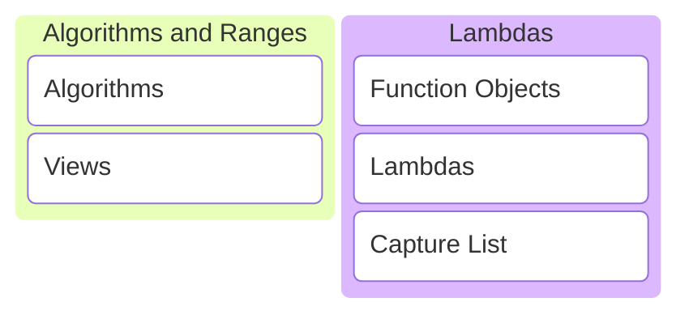

# C/C++ Programming


---



---

## Algorithms and Ranges

<https://en.cppreference.com/w/cpp/algorithm>

---

The algorithms library defines functions for a variety of purposes that operate on ranges of elements.

---

* Searching
* Sorting
* Counting
* Manipulating
* ...

---

### Best practices

---

* Don't reinvent the wheel, use the algorithms library!
* Prefer algorithms in the std::ranges namespace! <!-- .element: class="fragment" data-fragment-index="1" -->

---

## Views

<https://en.cppreference.com/w/cpp/ranges>

---

## Function Objects

---

A better way to define functions with state.

---

### Example 1

Create a function that returns the next integers each time it is called.

---

```c++ []
int next_int()
{
    static int current_int{0};
    return ++current_int;
}
```

```c++ []
std::println("{}", next_int()); // prints 1
std::println("{}", next_int()); // prints 2
std::println("{}", next_int()); // prints 3
```
<!-- .element: class="fragment" data-fragment-index="1" -->

Note:

* What are the disadvantages of this implementation?

---

Using static makes it hard to:

* Test the function.
* Reset the counter.
* Start from a different number.

Note:

* Hard to test because state is kept around forever.
* I can't reset the current_int counter.

---

Let's create a function object instead.

---

```c++ []
class NextInt
{
public:
    // overload operator()
    int operator()() { return ++current_; }

private:
    int current_{0};
};
```

```c++ []
NextInt next_int{};
std::println("{}", next_int()); // prints 1
std::println("{}", next_int()); // prints 2
std::println("{}", next_int()); // prints 3
```
<!-- .element: class="fragment" data-fragment-index="1" -->

Note:

* Overload operator().
* You decide the return type and function arguments.
* Objects can be called as if they were functions.

---

```c++ []
class NextInt
{
public:
    NextInt() = default;
    explicit NextInt(int start) : current_{start-1} {}

    int operator()() { return ++current_; }

private:
    int current_{0};
};
```
<!-- .element: class="fragment" data-fragment-index="1" -->

```c++ []
NextInt next_int{5};
std::println("{}", next_int()); // prints 5
std::println("{}", next_int()); // prints 6
std::println("{}", next_int()); // prints 7
```
<!-- .element: class="fragment" data-fragment-index="2" -->

Easy to extend to start from a certain number.

---

### Example 2

Count the items in a list that are smaller than a number provided by the user.

---

```c++ []
// make a list

std::vector some_list{};
std::println("Enter some numbers:");
for (int number{}; std::cin >> number;)
{
    some_list.push_back(number);
}
```

```c++ []
// ask a number

int max{};
std::print("Give a number: ");
std::cin >> max;
```
<!-- .element: class="fragment" data-fragment-index="1" -->

---

```c++ []
class SmallerThan
{
public:
    explicit SmallerThan(int max) : max_{max};

    [[nodiscard]] bool operator()(int value) const
    {
        return value < max_;
    }

private:
    int max_{};
};
```

```c++
int const count = std::ranges::count_if(
    some_list, SmallerThan{max}
);
```
<!-- .element: class="fragment" data-fragment-index="1" -->

Count the numbers in the list smaller than max.

---

This is so cool! 😎

---

But a rather large amount of code to write... 🧐

---

## Lambdas

---

A concise way of writing function objects!

---

```c++
int const count = std::ranges::count_if(
    some_list, [max](int value){ return value < max; }
);
```

That's a lot less code to write! 😯 <!-- .element: class="fragment" data-fragment-index="1" -->

Note:

* Count the items in a list that are smaller than a number provided by the user using a lambda.

---

Lambdas are translated to function objects behind the scene by the compiler!

---

```c++ []
class __lambda_12345 {
public:
    constexpr explicit __lambda_12345(int const& max)
        : max_{max}
    {}

    constexpr bool operator()(int value) const {
        return value < max_;
    }

private:
    int max_{};
};
```

```c++
[max](int value){ return value < max; }
```

Note:

* The lambda is converted to a function object by the compiler.
* <https://cppinsights.io/s/550c83cf>
* Q: What stands out? A: operator() is const by default. Return type is deduced automatically.

---

### Structure of a lambda

---

```c++
[/* capture list */](/* arguments */) -> /* return type */ {
    /* function body */
}
```

```c++
class __lambda_12345
{
public:
    /* return type */ operator()(/* arguments */) const
    {
        /* function body */
    }

private:
    /* capture list */
};
```

---

```c++
auto f1 = [](int x, int y){ /* arguments x, y */ };
```

```c++
auto f2 = [](){ /* no function arguments */ };
auto f3 = []  { /* no function arguments */ };
```

The argument list is optional.

---

```c++
auto f1 = []() -> int { return 5; }; /* return type int */
auto f2 = []          { return 5; }; /* return type int */
```

The return type is optional and automatically deduced if not specified.

---

### The capture list

---

```c++
// given some variables
int a{}; bool b{}; std::string c{}; double d{};
```

```c++
auto f1 = []     { /* can't access any of a, b, c, d */    };
```
<!-- .element: class="fragment" data-fragment-index="1" -->

```c++
auto f2 = [=]    { /* copy of a, b, c, d available */      };
```
<!-- .element: class="fragment" data-fragment-index="2" -->

```c++
auto f3 = [&]    { /* reference to a, b, c, d available */ };
```
<!-- .element: class="fragment" data-fragment-index="3" -->

```c++
auto f4 = [&a, b]{ /* only reference to a and copy of b */ };
```
<!-- .element: class="fragment" data-fragment-index="4" -->

```c++
auto f5 = [&, a] { /* copy of a, reference to b, c, d */   };
```
<!-- .element: class="fragment" data-fragment-index="5" -->

```c++
auto f6 = [&e=a] { /* e is a reference to a */             };
```
<!-- .element: class="fragment" data-fragment-index="6" -->

```c++
auto f7 = [e=a*5]{ /* e is an int with value a * 5 */      };
```
<!-- .element: class="fragment" data-fragment-index="7" -->

---

### Mutability

---

```c++ []
int next_int()
{
    static int current_int{0};
    return ++current_int;
}
```

```c++ []
std::println("{}", next_int()); // prints 1
std::println("{}", next_int()); // prints 2
std::println("{}", next_int()); // prints 3
```

How to convert this to a lambda?

---

```c++ []
auto next_int = [current=0]{ return ++current; };
```

```c++ []
std::println("{}", next_int());
std::println("{}", next_int());
std::println("{}", next_int());
```

Does this work? <!-- .element: class="fragment" data-fragment-index="1" -->

---

```sh []
<source>:5:41: error: cannot assign to a variable captured
                      by copy in a non-mutable lambda
    5 |     auto next_int = [current=0]{ return ++current; };
      |                                         ^ ~~~~~~~
1 error generated.
Compiler returned: 1
```

No, it does not work!

Note:

* <https://compiler-explorer.com/z/7Eah1T6Yr>

---

Lambda operator() is const by default. Member variables cannot be modified!

---

```c++ []
auto next_int = [current=0] mutable { return ++current; };
```

```c++ []
std::println("{}", next_int()); // prints 1
std::println("{}", next_int()); // prints 2
std::println("{}", next_int()); // prints 3
```

Add the mutable keyword!

Note:

* <https://compiler-explorer.com/z/8Mz8Y871M>

---

### Properties of a lambda

---

* The capture list and function body are required.
* The argument list is optional. <!-- .element: class="fragment" data-fragment-index="1" -->
* The function call operator is const by default. <!-- .element: class="fragment" data-fragment-index="2" -->
* It can be made mutable. <!-- .element: class="fragment" data-fragment-index="3" -->
* The return type is deduced by default. <!-- .element: class="fragment" data-fragment-index="4" -->
* Adding an explicit return type is allowed. <!-- .element: class="fragment" data-fragment-index="5" -->

---

## Exercises
