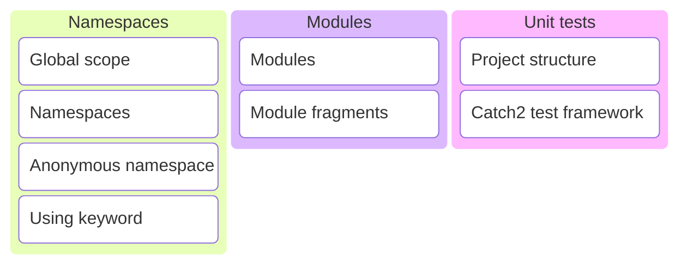

# C/C++ Programming


---



---

So far we added most definitions to the global scope.

---

```c++ [3-7,9-10]
import std;

// function say_hello is defined in the global scope
void say_hello()
{
    std::println("Hello, world!");
}

// variable my_global_var is defined in the global scope
int my_global_var{5};

int main()
{
    say_hello();
}
```

`main.cpp` is a translation unit

---

```c++ []
export module hello;

import std;

export void say_hello()
{
    std::println("Hello, world!");
}
```

```c++ []
// everything exported in module hello is made available
import hello;

int main()
{
    say_hello();
}
```

---

What if two modules both export a function with the same name and arguments? 🤔

---

```c++ []
export module first;

import std;

export void hello()
{
    std::println("First!");
}
```

```c++ []
export module second;

import std;

export void hello()
{
    std::println("Second!");
}
```

Note:

* Both modules export a function named hello with no arguments.

---

```c++ []
import first;
import second;
import std;

int main()
try
{
    hello();
}
catch (std::exception const& e)
{
    std::cerr << e.what() << "\n";
}
```

What will the program print?

<div style="display: flex; justify-content: space-evenly;">
    <div class="fragment semi-fade-out shrink" data-fragment-index="1">a) First!</div>
    <div class="fragment semi-fade-out shrink" data-fragment-index="1">b) Second!</div>
    <div class="fragment highlight-current-blue grow" data-fragment-index="1">c) error</div>
</div>

---

<!-- markdownlint-disable line-length -->
```sh [1-6]
[build] first.cpp:5:13: error: declaration 'hello' attached to named module 'first' cannot be attached to other modules [clang-diagnostic-error]
[build]     5 | export void hello()
[build]       |             ^
[build] second.cpp:5:13: note: also found
[build]     5 | export void hello()
[build]       |             ^
[build] second.cpp:5:13: error: 'hello' has different definitions in different modules; definition in module 'second' first difference is function body [clang-diagnostic-error]
[build]     5 | export void hello()
[build]       |        ~~~~~^~~~~~~
[build]     6 | {
[build]       | ~
[build]     7 |     std::println("Second!");
[build]       |     ~~~~~~~~~~~~~~~~~~~~~~~~
[build]     8 | }
[build]       | ~
[build] first.cpp:5:13: note: but in 'first' found a different body
[build]     5 | export void hello()
[build]       |        ~~~~~^~~~~~~
[build]     6 | {
[build]       | ~
[build]     7 |     std::println("First!");
[build]       |     ~~~~~~~~~~~~~~~~~~~~~~~
[build]     8 | }
[build]       | ~
[build] 190036 warnings and 2 errors generated.
```
<!-- markdownlint-enable line-length -->

Violation of the [One Definition Rule](https://en.cppreference.com/w/cpp/language/definition) (ODR)!

---

How to distinguish symbols with the same name from different libraries?

---

## Namespaces

<https://en.cppreference.com/w/cpp/language/namespace>

---

Namespaces provide a method for preventing name conflicts in large projects.

---

<!-- .slide: data-background-image="./assets/clock.png" data-background-size="contain" data-background-opacity=".5" -->

<countdown time="300" autostart="yes" />

Note:

* Lookup on the Internet what namespaces are and how to use them.

---


### namespaces

--

```c++
namespace a { void hello() { std::println("hello_a"); } }
namespace b { void hello() { std::println("hello_b"); } }
```

```c++
b::hello();
```

What will the program print?

<div style="display: flex; justify-content: space-evenly;">
    <div class="fragment semi-fade-out shrink" data-fragment-index="1">a) hello_a</div>
    <div class="fragment highlight-current-blue grow" data-fragment-index="1">b) hello_b</div>
    <div class="fragment semi-fade-out shrink" data-fragment-index="1">c) error</div>
</div>

Note:

* Directly call the hello function in the b namespace.
* <https://compiler-explorer.com/z/7qebs9eMo>

--

```c++
namespace a { void hello() { std::println("hello_a"); } }
namespace b { void hello() { std::println("hello_b"); } }
```

```c++
using namespace a;
hello();
```

What will the program print?

<div style="display: flex; justify-content: space-evenly;">
    <div class="fragment highlight-current-blue grow" data-fragment-index="1">a) hello_a</div>
    <div class="fragment semi-fade-out shrink" data-fragment-index="1">b) hello_b</div>
    <div class="fragment semi-fade-out shrink" data-fragment-index="1">c) error</div>
</div>

Note:

* Everything in the a namespace is now available in the global scope.
* Calling unqualified hello will call a::hello().
* <https://compiler-explorer.com/z/b14TG9Pqb>

--

```c++
namespace a { void hello() { std::println("hello_a"); } }
namespace b { void hello() { std::println("hello_b"); } }
```

```c++
using b::hello;
hello();
```

What will the program print?

<div style="display: flex; justify-content: space-evenly;">
    <div class="fragment semi-fade-out shrink" data-fragment-index="1">a) hello_a</div>
    <div class="fragment highlight-current-blue grow" data-fragment-index="1">b) hello_b</div>
    <div class="fragment semi-fade-out shrink" data-fragment-index="1">c) error</div>
</div>

Note:

* Bring only the hello function from the b namespace in scope.
* <https://compiler-explorer.com/z/59PfYMs9s>

--

```c++
namespace a { void hello() { std::println("hello_a"); } }
namespace b { void hello() { std::println("hello_b"); } }
```

```c++
using a::hello;
using b::hello;
hello();
```

What will the program print?

<div style="display: flex; justify-content: space-evenly;">
    <div class="fragment semi-fade-out shrink" data-fragment-index="1">a) hello_a</div>
    <div class="fragment semi-fade-out shrink" data-fragment-index="1">b) hello_b</div>
    <div class="fragment highlight-current-blue grow" data-fragment-index="1">c) error</div>
</div>

Note:

* Both hello from a and hello from b are now in scope.
* Compiler does not know which function to call.
* <https://compiler-explorer.com/z/7MqYja1MW>

--

```c++
namespace a {
  void f(int)    { std::println("a::f(int)");    }
  void f(double) { std::println("a::f(double)"); }
}
namespace b {
  void f(int)    { std::println("b::f(int)");    }
  void f(double) { std::println("b::f(double)"); }
  void f(char)   { std::println("b::f(char)");   }
}
```

```c++
using a::f;
using b::f;
f('a');
```

What will the program print?

<div style="display: flex; justify-content: space-evenly;">
    <div class="fragment semi-fade-out shrink" data-fragment-index="1">a) a::f(...)</div>
    <div class="fragment highlight-current-blue grow" data-fragment-index="1">b) b::f(...)</div>
    <div class="fragment semi-fade-out shrink" data-fragment-index="1">c) error</div>
</div>

Note:

* All f functions from both the a and the b namespace are in scope.
* But there is no ambiguity when calling f with a char, there's only one exact match b::f(char).
* <https://compiler-explorer.com/z/h9r4rqo31>

--

```c++
namespace a {
  void f(int)    { std::println("a::f(int)");    }
  void f(double) { std::println("a::f(double)"); }
}
namespace b {
  void f(int)    { std::println("b::f(int)");    }
  void f(double) { std::println("b::f(double)"); }
  void f(char)   { std::println("b::f(char)");   }
}
```

```c++
using a::f;
using b::f;
f(3.14);
```

What will the program print?

<div style="display: flex; justify-content: space-evenly;">
    <div class="fragment semi-fade-out shrink" data-fragment-index="1">a) a::f(...)</div>
    <div class="fragment semi-fade-out shrink" data-fragment-index="1">b) b::f(...)</div>
    <div class="fragment highlight-current-blue grow" data-fragment-index="1">c) error</div>
</div>

Note:

* All f functions from both the a and the b namespace are in scope.
* Call a::f(double) or b::f(double)?
* <https://compiler-explorer.com/z/cGqWzhW5M>

--

```c++
namespace a {
  void f(int)    { std::println("a::f(int)");    }
  void f(double) { std::println("a::f(double)"); }
}
void f(int)      { std::println("f(int)");       }
```

```c++
using namespace a;
// I want to print f(int)
```

How to call `f(int)` in the global namespace?

<div style="display: flex; justify-content: space-evenly;">
    <div class="fragment semi-fade-out shrink" data-fragment-index="1">a) f(5)</div>
    <div class="fragment highlight-current-blue grow" data-fragment-index="1">b) ::f(5)</div>
    <div class="fragment semi-fade-out shrink" data-fragment-index="1">c) not possible</div>
</div>

Note:

* <https://compiler-explorer.com/z/9zYvx74dc>

---

### Summary

---

```c++
namespace a {
    void f();
}

namespace b::c {
    void f();
    void g();
}

namespace d = b::c;
```

Namespace definitions.

---

```c++
namespace a {
    void f();
}

namespace b::c {
    void f();
    void g();
}

namespace d = b::c;
```

```c++
using a::f;
using namespace d;

f(); // a::f()
g(); // b::c::g()
```

Using directives.

---

There's still a problem...

---

```c++ []
// first.cpp

import std;

void hello_impl() { std::println("First!"); }
void hello_1()    { hello_impl();           }
```

```c++ []
// second.cpp

import std;

void hello_impl() { std::println("Second!"); }
void hello_2()    { hello_impl();            }
```

Does this work?

<div style="display: flex; justify-content: space-evenly;">
    <div class="fragment semi-fade-out shrink" data-fragment-index="1">a) Yes</div>
    <div class="fragment semi-fade-out shrink" data-fragment-index="1">b) Compiler error</div>
    <div class="fragment highlight-current-blue grow" data-fragment-index="1">c) Linker error</div>
</div>

Note:

* Two translations units.
* Both have an implementation detail function with the same name and arguments `hello_impl`.
* They live in the global scope.
* So this is again a violation of the One Definition Rule.

---

We need a way to mark a definition as private to a translation unit.

---

```c++ []
// first.cpp

import std;

namespace {
    void hello_impl() { std::println("First!"); }
}

void hello_1() { hello_impl(); }
```

```c++ []
// second.cpp

import std;

namespace {
    void hello_impl() { std::println("Second!"); }
}

void hello_2() { hello_impl(); }
```

The unnamed or anonymous namespace.

---

### Best practices

---

* Prevent name collisions!
* Don't write using namespace some_ns. <!-- .element: class="fragment" data-fragment-index="1" -->
* Use namespaces in larger projects. <!-- .element: class="fragment" data-fragment-index="2" -->
* Place reusable components in a namespace. <!-- .element: class="fragment" data-fragment-index="3" -->
* Place local definitions in an unnamed namespace. <!-- .element: class="fragment" data-fragment-index="4" -->

Note:

* Writing using namespace some_ns undoes what namespaces try to solve.
* The larger the project, the larger the risk of name collisions.
* Code that may be reused in other projects should be placed in a namespace.
* Avoid placing definitions that are only needed in one translation unit in the global scope.

---

Let's build further on this idea and add some improvements!

---

## Modules

<https://en.cppreference.com/w/cpp/language/modules>

---

TODO

* global module fragment
* private module fragment
* module partitions

---

```c++
// helloworld.cpp
export module helloworld;

import std;

export void hello()
{
    std::println("Hello, world!");
}
```

```c++
// main.cpp
import helloworld;

int main()
{
    hello();
}
```

---

```c++
// a.cpp
export module a;

export import :b;
```

```c++
// b.cpp
export module a:b;

import std;

export void hello()
{
    std::println("Hello, world!");
}
```

```c++
// main.cpp
import a;

int main()
{
    hello();
}
```

---

## Unit tests

---


---

TODO

---

## Exercises
