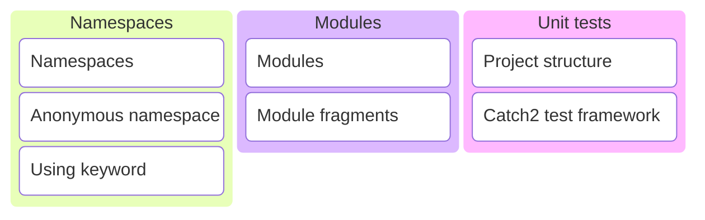

# C/C++ Programming

---

```mermaid
kanban
  column1[Namespaces]
    task1[Namespaces]
    task2[Anonymous namespace]
    task3[Using keyword]
  column2[Modules]
    task4[Modules]
    task5[Module fragments]
  column3[Unit tests]
    task6[Project structure]
    task7[Catch2 test framework]
```

---

## Namespaces

---

TODO

---

## Modules

---

TODO

---

## Unit tests

---

TODO

---

## Exercises
