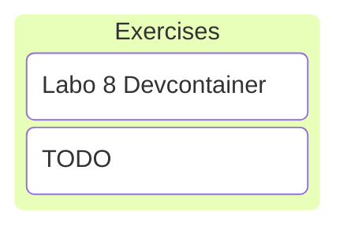

# C/C++ Programming

## Labo 8

---



---

## Exercises TODO

---

### Devcontainer

<https://gitlab.apstudent.be/cpp-programming/devcontainer-labo-8>

---

* Extends labo 4 devcontainer.
* Add second configuration for `Release` builds.
* Add `vcpkg` package manager.
* Add unittest framework `Catch2`.
* Add `cpprog_add_test` function.
* See [README.md](https://gitlab.apstudent.be/cpp-programming/devcontainer-labo-8/-/blob/main/README.md) file in git repository.

---

```cmake
# ./src/ex_1/CMakeLists.txt
```

```cmake
cpprog_add_library(
    TARGET ex_1_lib         # library will be called ex_1_lib
    CXX_MODULES             # module source files here
    "my_module_1.cpp"
    "my_module_2.cpp"
)
```

```cmake
cpprog_add_executable(
    TARGET ex_1             # executable will be called ex_1
    CXX_SOURCES             # old-style source files here
    "ex_1.cpp"
    DEPENDENCIES            # libraries on which it depends
    ex_1_lib
)
```

Split exercises into a library and an executable with only the main function.

Note:

* This makes it possible to create unit tests that depend on the library.

---

```cmake
# ./test/CMakeLists.txt
```

```cmake
cpprog_add_test(
    TARGET test_ex_1        # test will be called text_ex_1
    CXX_SOURCES             # unittest source files
    "my_module_1.test.cpp"
    DEPENDENCIES            # libraries on which it depends
    ex_1_lib
)
```

Tests depend on the library.

---

### Exercises

See digitap.
