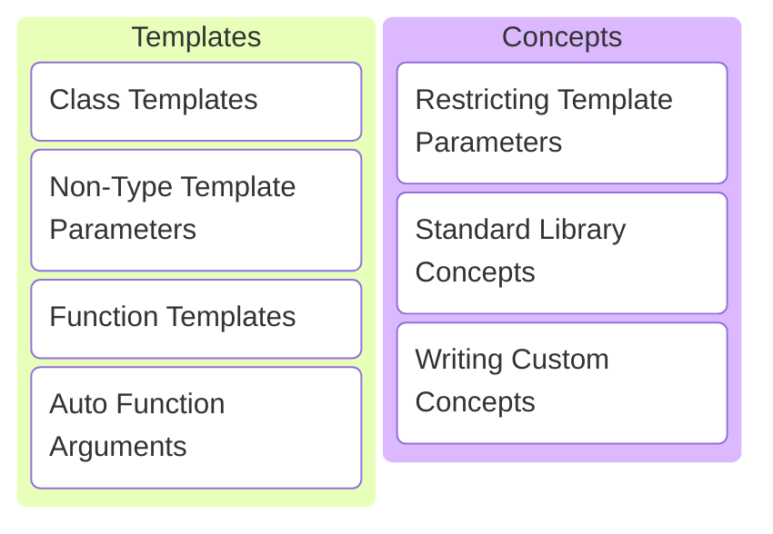

# C/C++ Programming

---

```mermaid
kanban
  column1[Templates]
    task1[Class Templates]
    task2[Non-Type Template Parameters]
    task3[Function Templates]
    task4[Auto Function Arguments]
  column2[Concepts]
    task5[Restricting Template Parameters]
    task6[Standard Library Concepts]
    task7[Writing Custom Concepts]
```

---

TODO
