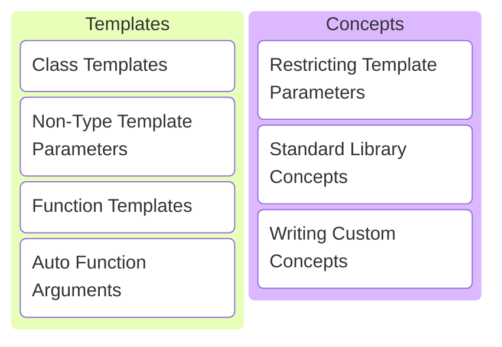
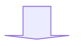
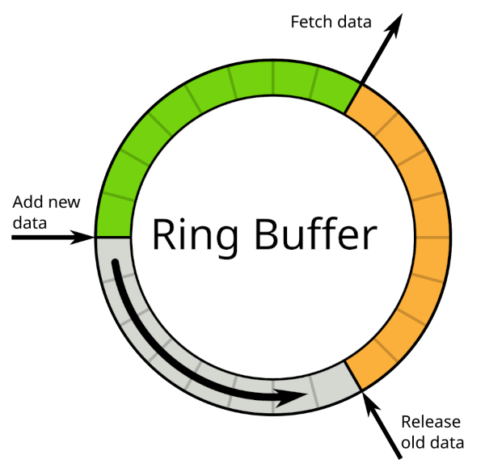
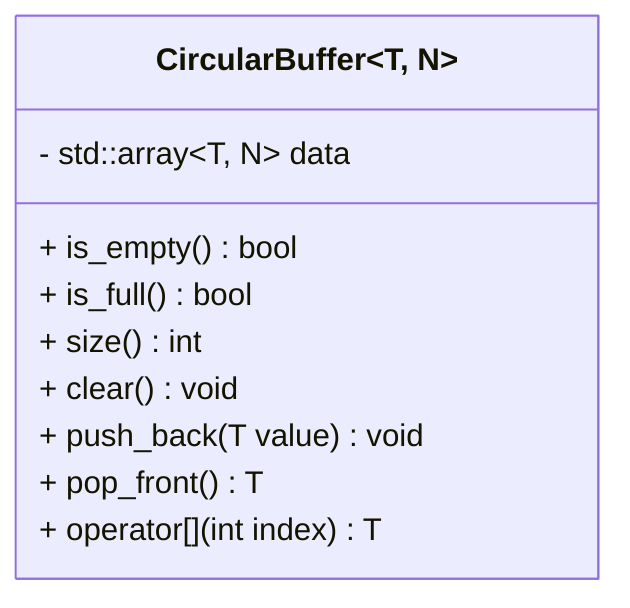
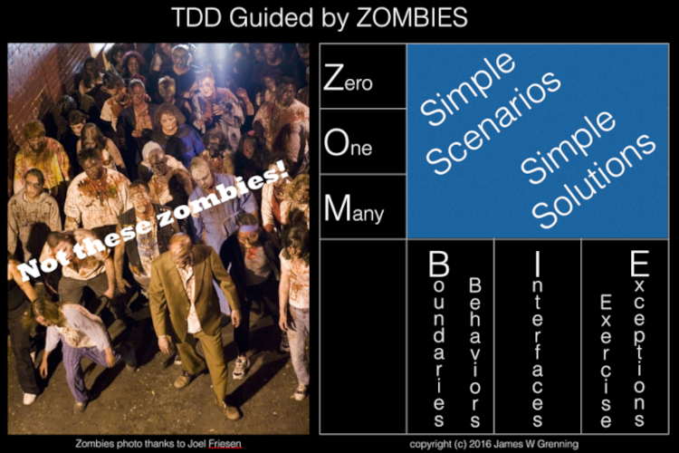

# C/C++ Programming


---



---

## Class Templates

---

The C++ standard library is full of templates.

---

```c++
std::vector<double> doubles{};
std::vector<int> integers{};
std::vector<std::string> strings{};
std::vector<std::unique_ptr<Animal>> animals{};
std::vector<std::vector<char>> char_matrix{};
```

```c++
std::unordered_map<std::string, int> students{};
```

```c++
std::optional<Root> roots{};
```

Note:

* We've been using templates for a while now.
* STL = Standard Template Library.

---

But why?

---

What if std::vector did not have a template argument?

---

```c++ []
class VectorOfIntegers
{
public:
    int operator[](int idx) const { return data_[idx]; }
    int size() const { return size_; }

private:
    int* data_{};
    int size_{};
};
```

```c++ []
class VectorOfDoubles
{
public:
    double operator[](int idx) const { return data_[idx]; }
    int size() const { return size_; }

private:
    double* data_{};
    int size_{};
};
```

Note:

* Implementation is exactly the same, only the type of the elements differs!

---

Generic classes avoid code duplication!

---

```c++ []
template <typename T>
class Vector
{
public:
    T operator[](int idx) const { return data_[idx]; }
    int size() const { return size_; }

private:
    T* data_{};
    int size_{};
};
```

```c++
Vector<int> integers{};
Vector<double> doubles{};
```

Vector as a class template.

Note:

* `template` keyword.
* Template arguments between `<` and `>`.
* `typename` for template arguments that are a type.

---

```c++
Vector<int> integers{};
```



```c++
class Vector_int
{
public:
    int operator[](int idx) const { return data_[idx]; }
    int size() const { return size_; }

private:
    int* data_{};
    int size_{};
};
```

```c++
Vector_int integers{};
```

Note:

* Compiler instantiates template for requested types.
* If class template is not used, no code is generated.
* <https://cppinsights.io/s/a78b48ee>

---

Very useful indeed!

---

Let's design a circular buffer class next.

---



Note:

* Works like a queue.
* Insert data at the end.
* Remove data from the front.
* Access data anywhere.

---

* Insert items at the end.
* Remove items from the front.
* Access any item.
* Let the user decide the value type. <!-- .element: class="fragment" data-fragment-index="1" -->
* Let the user decide the capacity. <!-- .element: class="fragment" data-fragment-index="1" -->

---



---

```c++ []
template <typename T, int N>
class CircularBuffer
{
public:
    [[nodiscard]] bool is_empty() const;
    [[nodiscard]] bool is_full() const;
    [[nodiscard]] int size() const;

    void clear();

    void push_back(T const& value);
    T pop_front();

    [[nodiscard]] T operator[](int index) const;
    [[nodiscard]] T& operator[](int index);

private:
    std::array<T, N> data_{};
    int front_{};
    int back_{};
};
```

N is a Non-Type Template Parameter (NTTP).

Note:

* C++ allows values as template parameters!
* This is particularly useful to create static containers.

---

How to implement the circular buffer?

---



<https://blog.wingman-sw.com/tdd-guided-by-zombies>

Note:

* Try this at home!
* Blog post is a dynamic circular buffer in `c` tested with the `CppUTest` framework.
* Our circular buffer is a static buffer in `c++` tested with the `Catch2` framework.
* Follow the steps, but adjust them accordingly.

---

Let's write a sum function next.

---

```c++
int sum(int a, int b) { return a + b; }
```

```c++
// add sum for doubles?
double sum(double a, double b) { return a + b; }
```
<!-- .element: class="fragment" data-fragment-index="1" -->

```c++
// how about these?
std::int8_t  sum(std::int8_t a,  std::int8_t b ) { return a + b; }
std::int16_t sum(std::int16_t a, std::int16_t b) { return a + b; }
std::int32_t sum(std::int32_t a, std::int32_t b) { return a + b; }
std::int64_t sum(std::int64_t a, std::int64_t b) { return a + b; }
```
<!-- .element: class="fragment" data-fragment-index="2" -->

```c++
// even more?
// std::uint8_t, std::uint16_t, std::uint32_t, std::uint64_t
// float, unsigned, long, unsigned long, long double
// ...
```
<!-- .element: class="fragment" data-fragment-index="3" -->

---

* Do I have to implement sum for every numeric type?
* If I create a new numeric type... I want sum to work! <!-- .element: class="fragment" data-fragment-index="1" -->
* How about strings? They also support addition! <!-- .element: class="fragment" data-fragment-index="2" -->

---

## Function Templates

---

```c++
template <typename T>
T sum(T a, T b)
{
    return a + b;
}
```

```c++
int sum_1 = sum(1, 2);
double sum_2 = sum(3.14, 5.4);
```
<!-- .element: class="fragment" data-fragment-index="1" -->

```c++
std::string hello{"Hello, "};
std::string world{"world!"};
std::string sum_3 = sum(hello, world);
```
<!-- .element: class="fragment" data-fragment-index="1" -->

---

We are allowed to specify the type.

```c++
int sum_1 = sum<int>(1, 2);
double sum_2 = sum<double>(3.14, 5.4);
```

```c++
std::string hello{"Hello, "};
std::string world{"world!"};
std::string sum_3 = sum<std::string>(hello, world);
```

But we don't have to!

---

Function template arguments are deduced by the compiler! 👍

Note:

* If the template argument can be deduced from the function arguments.

---

What if the type does not support addition?

---

```c++
template <typename T>
T sum(T a, T b)
{
    return a + b;
}
```

```c++
class NotAddable {};

NotAddable a{};
NotAddable b{};

sum(a, b); // what happens?
```

---

```sh []
<source>:6:14: error: invalid operands to binary expression ('NotAddable' and 'NotAddable')
    6 |     return a + b;
      |            ~ ^ ~
<source>:14:5: note: in instantiation of function template specialization 'sum<NotAddable>' requested here
   14 |     sum(a, b);
      |     ^
1 error generated.
Compiler returned: 1
```

A compiler error!

Note:

* <https://compiler-explorer.com/z/vT4jeoMzq>

---

> error: invalid operands to binary expression ('NotAddable' and 'NotAddable')

---

Can we do better?

---

## Concepts

---

Concepts can be used to perform compile-time validation of template arguments.
