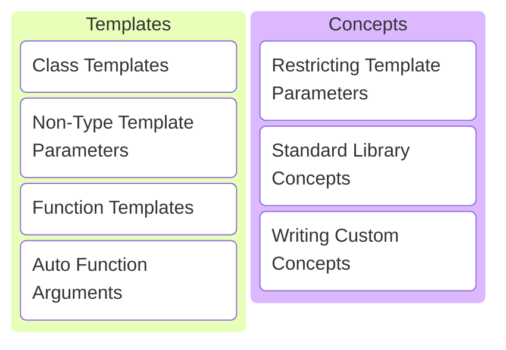
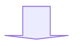

# C/C++ Programming


---



---

## Class Templates

---

```c++
std::vector<double> doubles{};
std::vector<int> integers{};
std::vector<std::string> strings{};
std::vector<std::unique_ptr<Animal>> animals{};
std::vector<std::vector<char>> char_matrix{};
```

```c++
std::unordered_map<std::string, int> students{};
```

```c++
std::optional<Root> roots{};
```

The C++ standard library is full of templates.

Note:

* We've been using templates for a while now.
* STL = Standard Template Library.

---

But why?

---

What if std::vector did not have a template argument?

---

```c++ []
class VectorOfIntegers
{
public:
    int operator[](int idx) const { return data_[idx]; }
    int size() const { return size_; }

private:
    int* data_{};
    int size_{};
};
```

```c++ []
class VectorOfDoubles
{
public:
    double operator[](int idx) const { return data_[idx]; }
    int size() const { return size_; }

private:
    double* data_{};
    int size_{};
};
```

Note:

* Implementation is exactly the same, only the type of the elements differs!

---

Generic classes avoid code duplication!

---

```c++ []
template <typename T>
class Vector
{
public:
    T operator[](int idx) const { return data_[idx]; }
    int size() const { return size_; }

private:
    T* data_{};
    int size_{};
};
```

```c++
Vector<int> integers{};
Vector<double> doubles{};
```

Vector as a class template.

Note:

* `template` keyword.
* Template arguments between `<` and `>`.
* `typename` for template arguments that are a type.

---

```c++
Vector<int> integers{};
```



```c++
class Vector_int
{
public:
    int operator[](int idx) const { return data_[idx]; }
    int size() const { return size_; }

private:
    int* data_{};
    int size_{};
};
```

```c++
Vector_int integers{};
```

Note:

* Compiler instantiates template for requested types.
* If class template is not used, no code is generated.

---

Very useful indeed!

---

Let's design a circular buffer class next.

---


Note:

* Works like a queue.
* Insert data at the end.
* Remove data from the front.
* Access data anywhere.

---

```c++ []
class CircularBuffer
{
public:
    [[nodiscard]] bool is_empty() const;
    [[nodiscard]] bool is_full() const;
    [[nodiscard]] int size() const;

    void clear();

    void push_back(int const& value);
    int pop_front();

    [[nodiscard]] int operator[](int index) const;
    [[nodiscard]] int& operator[](int index);

private:
    std::array<int, 1024> data_{};
    int front_{};
    int back_{};
};
```

How to make this generic?

Note:

* Let the user decide the type. Template parameter instead of int.
* Let the user decide the capacitor. Template parameter instead of 1024.

---

```c++ []
template <typename T, int Size>
class CircularBuffer
{
public:
    [[nodiscard]] bool is_empty() const;
    [[nodiscard]] bool is_full() const;
    [[nodiscard]] int size() const;

    void clear();

    void push_back(T const& value);
    T pop_front();

    [[nodiscard]] T operator[](int index) const;
    [[nodiscard]] T& operator[](int index);

private:
    std::array<T, Size> data_{};
    int front_{};
    int back_{};
};
```

Size is a Non-Type Template Parameter (NTTP).

Note:

* C++ allows values as template parameters!
* This is particularly useful to create static containers.

---

<!-- .slide: data-visibility="hidden" -->

```c++ []
template <typename T, int Size>
class CircularBuffer
{
public:
    [[nodiscard]] bool is_empty() const
    {
        return front_ == back_;
    }

    [[nodiscard]] bool is_full() const
    {
        return (back_ + 1) % Size == front;
    }

    [[nodiscard]] int size() const
    {
        auto result = back - front;
        if (result < 0) { result += capacity; }
        return result;
    }

    void clear()
    {
        back_ = front_;
    }

    void push_back(T const& value)
    {
        cpprog::expect([this]{ return !is_full(); }, "buffer is full");

        data_[back] = value;
        back = (back + 1) % Size;
    }

    T pop_front()
    {
        cpprog::expect([this]{ return !is_empty(); }, "buffer is empty");

        auto const result = data_[front_];
        front = (front + 1) % Size;
        return result;
    }

    [[nodiscard]] T operator[](int index) const
    {
        cpprog::expect([&, this]{ return 0 <= index && index < size(); }, "0 <= index < size()");
        return data_[(front_ + index) % Size];
    }

    [[nodiscard]] T& operator[](int index)
    {
        cpprog::expect([&, this]{ return 0 <= index && index < size(); }, "0 <= index < size()");
        return data_[(front_ + index) % Size];
    }

private:
    std::array<T, Size> data_;
    int front_{};
    int back_{};
};
```
